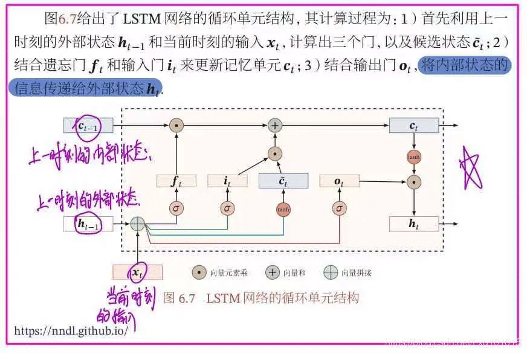
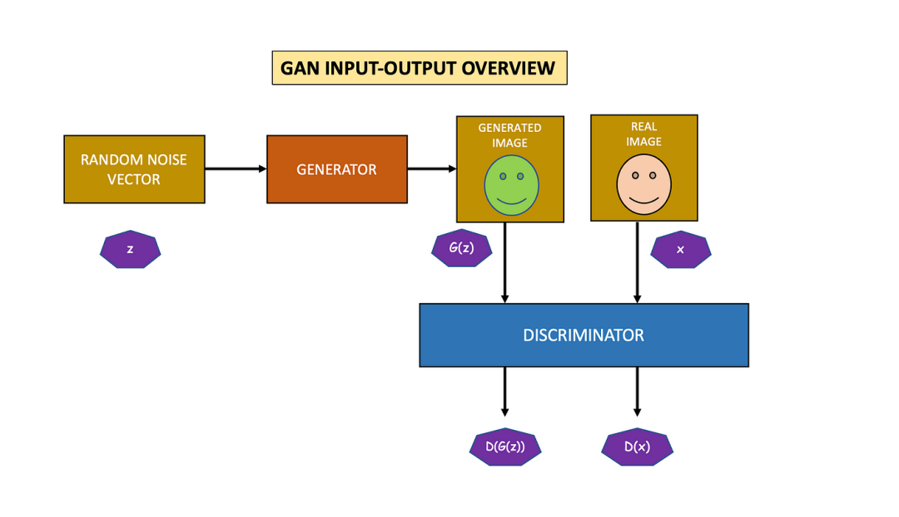

# 深度学习

## 一、神经网络


### 🧠 一、神经网络原理

神经网络是一种**模拟人脑神经元结构**的机器学习模型。
核心思想是：

> 通过多层非线性变换，将输入特征映射到输出结果。

---

#### 1️⃣ 神经元模型（Perceptron）

每个神经元接受输入 $x_1, x_2, \dots, x_n$，计算加权和再加上偏置：

$$
z = \sum_{i=1}^n w_i x_i + b
$$

然后通过**激活函数** $f(z)$ 得到输出：

$$
a = f(z)
$$

常见激活函数：

| 激活函数    | 表达式                                       | 特点                 |
| ------- | ----------------------------------------- | ------------------ |
| Sigmoid | $f(z) = \frac{1}{1+e^{-z}}$               | 平滑、适合二分类，但可能梯度消失   |
| ReLU    | $f(z) = \max(0, z)$                       | 常用、收敛快             |
| Tanh    | $f(z) = \tanh(z)$                         | 输出范围 $(-1,1)$，对称性好 |
| Softmax | $f_i(z) = \frac{e^{z_i}}{\sum_j e^{z_j}}$ | 多分类输出              |

---

#### 2️⃣ 网络结构（Network Architecture）

典型前馈神经网络结构：

$$
\text{Input} \rightarrow \text{Hidden Layers} \rightarrow \text{Output}
$$

每一层的输出作为下一层的输入。

例如一个两层神经网络：

* 输入层：$x \in \mathbb{R}^n$
* 隐藏层：$h = f(W_1 x + b_1)$
* 输出层：$\hat{y} = g(W_2 h + b_2)$

---

### ⚙️ 二、数学推导过程

#### 1️⃣ 前向传播（Forward Propagation）

输入 $x$ 经各层线性变换 + 激活函数：
$$
z^{(l)} = W^{(l)} a^{(l-1)} + b^{(l)} \
a^{(l)} = f^{(l)}(z^{(l)})
$$

最终输出预测：
$$
\hat{y} = a^{(L)}
$$
其中 $L$ 是网络的层数。

---

#### 2️⃣ 损失函数（Loss Function）

##### （1）回归问题

常用均方误差（MSE）：
$$
L = \frac{1}{2m}\sum_{i=1}^{m} (\hat{y}_i - y_i)^2
$$

##### （2）分类问题

常用交叉熵损失（Cross-Entropy）：
$$
L = -\frac{1}{m} \sum_{i=1}^{m} \sum_{k=1}^{K} y_{ik} \log(\hat{y}_{ik})
$$

---

#### 3️⃣ 反向传播（Backpropagation）

目标：最小化损失函数 $L$。
使用 **梯度下降法（Gradient Descent）** 更新参数。

对权重求导：
$$
\frac{\partial L}{\partial W^{(l)}} = \frac{\partial L}{\partial a^{(l)}} \cdot \frac{\partial a^{(l)}}{\partial z^{(l)}} \cdot \frac{\partial z^{(l)}}{\partial W^{(l)}}
$$

更新参数：
$$
W^{(l)} := W^{(l)} - \eta \frac{\partial L}{\partial W^{(l)}}, \quad
b^{(l)} := b^{(l)} - \eta \frac{\partial L}{\partial b^{(l)}}
$$

其中 $\eta$ 为学习率（learning rate）。

---

### 📊 三、评估指标

| 类型 | 指标             | 公式                                                      |
| -- | -------------- | ------------------------------------------------------- |
| 分类 | 准确率（Accuracy）  | $\text{Accuracy} = \frac{TP + TN}{TP + TN + FP + FN}$   |
| 分类 | 精确率（Precision） | $\text{Precision} = \frac{TP}{TP + FP}$                 |
| 分类 | 召回率（Recall）    | $\text{Recall} = \frac{TP}{TP + FN}$                    |
| 分类 | F1 分数          | $F1 = 2 \times \frac{P \times R}{P + R}$                |
| 回归 | 均方误差（MSE）      | $\text{MSE} = \frac{1}{n}\sum(\hat{y} - y)^2$           |
| 回归 | $R^2$          | $R^2 = 1 - \frac{\sum(\hat{y}-y)^2}{\sum(y-\bar{y})^2}$ |

---

### 💻 四、实现代码（PyTorch）

以下示例是一个简单的**两层神经网络**实现二分类任务。

```python
import torch
import torch.nn as nn
import torch.optim as optim
from sklearn.datasets import make_moons
from sklearn.model_selection import train_test_split
from sklearn.preprocessing import StandardScaler

# 1. 数据准备
X, y = make_moons(n_samples=1000, noise=0.2, random_state=42)
scaler = StandardScaler()
X = scaler.fit_transform(X)
X_train, X_test, y_train, y_test = train_test_split(X, y, test_size=0.2, random_state=42)

X_train = torch.FloatTensor(X_train)
y_train = torch.LongTensor(y_train)
X_test = torch.FloatTensor(X_test)
y_test = torch.LongTensor(y_test)

# 2. 模型定义
class NeuralNetwork(nn.Module):
    def __init__(self, input_dim, hidden_dim, output_dim):
        super(NeuralNetwork, self).__init__()
        self.fc1 = nn.Linear(input_dim, hidden_dim)
        self.relu = nn.ReLU()
        self.fc2 = nn.Linear(hidden_dim, output_dim)
    
    def forward(self, x):
        x = self.fc1(x)
        x = self.relu(x)
        x = self.fc2(x)
        return x

model = NeuralNetwork(2, 16, 2)

# 3. 损失函数与优化器
criterion = nn.CrossEntropyLoss()
optimizer = optim.Adam(model.parameters(), lr=0.01)

# 4. 训练过程
for epoch in range(200):
    outputs = model(X_train)
    loss = criterion(outputs, y_train)
    
    optimizer.zero_grad()
    loss.backward()
    optimizer.step()
    
    if (epoch+1) % 20 == 0:
        print(f"Epoch [{epoch+1}/200], Loss: {loss.item():.4f}")

# 5. 评估
with torch.no_grad():
    y_pred = model(X_test)
    acc = (y_pred.argmax(1) == y_test).float().mean()
    print(f"Test Accuracy: {acc:.4f}")
```

---

### 🧩 五、模型优化方法

| 方法                          | 说明                  |
| --------------------------- | ------------------- |
| **学习率调整（LR Scheduler）**     | 控制学习率衰减             |
| **权重初始化**                   | Xavier、He 初始化能改善收敛  |
| **正则化**                     | L2 正则、Dropout 防止过拟合 |
| **Batch Normalization**     | 稳定分布，加速训练           |
| **早停法（Early Stopping）**     | 防止过拟合               |
| **数据增强（Data Augmentation）** | 扩充样本集，提高泛化性         |

---

### ⚠️ 六、注意事项

1. 输入数据需**标准化或归一化**；
2. 避免学习率过大或过小；
3. ReLU 可解决梯度消失，但注意 “ReLU 死亡” 问题；
4. 网络层数过多可能导致过拟合；
5. 使用 GPU 可显著加速训练；
6. 合理选择批大小（batch size）。

---

### ⚖️ 七、优缺点总结

| 优点              | 缺点          |
| --------------- | ----------- |
| 能学习复杂非线性关系      | 需要大量数据和计算资源 |
| 泛化能力强           | 不易解释（黑箱）    |
| 适用范围广（分类、回归、生成） | 超参数调节困难     |
| 可端到端学习          | 容易过拟合       |

---

### 🧭 八、学习建议与进阶路线

| 阶段 | 学习内容                 | 工具                       |
| -- | -------------------- | ------------------------ |
| 入门 | 感知机、前向传播、激活函数        | Numpy                    |
| 进阶 | 反向传播、优化器、正则化         | PyTorch                  |
| 提升 | CNN、RNN、LSTM         | PyTorch / TensorFlow     |
| 高阶 | Transformer、预训练模型    | HuggingFace Transformers |
| 部署 | ONNX、TensorRT、Triton | 深度学习部署框架                 |


## 二、CNN


### 🧠 一、CNN 原理（Convolutional Neural Network）

卷积神经网络（CNN）是一类**专为处理具有网格结构数据（如图像）**设计的神经网络。
传统神经网络对输入特征完全连接，而 CNN 通过 **局部感受野（local receptive field）** 和 **权值共享（weight sharing）**，显著减少参数数量并提升特征提取能力。

---

#### 1️⃣ CNN 的核心思想

1. **卷积层（Convolution Layer）**：提取局部特征
2. **池化层（Pooling Layer）**：降维与防止过拟合
3. **全连接层（Fully Connected Layer）**：整合特征进行分类或回归

典型结构：

$$
\text{Input} \rightarrow [\text{Conv + ReLU + Pool}]^n \rightarrow \text{FC} \rightarrow \text{Output}
$$

---

#### 2️⃣ 卷积操作（Convolution Operation）

以二维卷积为例，给定输入矩阵 $X$ 和卷积核（权重矩阵）$K$：

$$
Y(i,j) = \sum_m \sum_n X(i+m, j+n) \cdot K(m,n)
$$

该操作称为**卷积（Convolution）**。
卷积层通过滑动卷积核在输入上提取局部特征，如边缘、纹理等。

---

#### 3️⃣ 特征图（Feature Map）

每个卷积核可学习一种特征模式。
一个卷积层可以包含多个卷积核，从而生成多个特征图（Feature Map）。

例如输入大小为 $(H, W, C_{\text{in}})$，卷积核大小为 $(k, k, C_{\text{in}}, C_{\text{out}})$，则输出特征图大小为：

$$
H_{\text{out}} = \frac{H - k + 2p}{s} + 1, \quad
W_{\text{out}} = \frac{W - k + 2p}{s} + 1
$$

其中：

* $p$：padding（填充）
* $s$：stride（步幅）

---

#### 4️⃣ 池化层（Pooling Layer）

用于**降维**与**特征不变性提取**。

常见池化方式：

* **最大池化（Max Pooling）**：取窗口内最大值
* **平均池化（Average Pooling）**：取窗口内均值

公式：

$$
Y(i,j) = \max_{m,n} X(i+m, j+n)
$$

---

#### 5️⃣ 激活函数

卷积层输出后通常接 **ReLU**：
$$
f(z) = \max(0, z)
$$

ReLU 解决了梯度消失问题，加快网络收敛。

---

#### 6️⃣ 全连接层（Fully Connected Layer）

卷积层输出的特征展平后输入全连接层进行分类：
$$
z = W \cdot a + b, \quad
\hat{y} = \text{Softmax}(z)
$$

---

### 🧮 二、数学推导与损失函数

##### 1️⃣ 前向传播（Forward Propagation）

对于卷积层：
$$
z_{i,j}^{(l)} = \sum_{m,n,c} a_{m+i, n+j, c}^{(l-1)} \cdot w_{m,n,c}^{(l)} + b^{(l)}
$$
$$
a_{i,j}^{(l)} = f(z_{i,j}^{(l)})
$$

对于全连接层：
$$
a^{(L)} = f(W^{(L)}a^{(L-1)} + b^{(L)})
$$

---

##### 2️⃣ 损失函数（Loss Function）

**分类任务**常用交叉熵损失：
$$
L = -\frac{1}{m}\sum_{i=1}^{m}\sum_{k=1}^{K}y_{ik}\log(\hat{y}_{ik})
$$

---

##### 3️⃣ 反向传播（Backpropagation）

反向传播通过链式法则计算梯度。
对于卷积层中的权重梯度：

$$
\frac{\partial L}{\partial w_{m,n,c}} = \sum_{i,j} \frac{\partial L}{\partial z_{i,j}} \cdot a_{i+m, j+n, c}^{(l-1)}
$$

对于偏置：
$$
\frac{\partial L}{\partial b} = \sum_{i,j} \frac{\partial L}{\partial z_{i,j}}
$$

---

### 📊 三、评估指标

| 任务类型 | 常用指标                                 |
| ---- | ------------------------------------ |
| 分类   | Accuracy, Precision, Recall, F1, AUC |
| 回归   | MSE, RMSE, MAE, $R^2$                |
| 目标检测 | mAP（mean Average Precision）          |
| 图像分割 | IoU（Intersection over Union）         |

---

### 💻 四、实现代码（PyTorch）

以下是一个经典的 CNN 图像分类示例（使用 MNIST 数据集）：

```python
import torch
import torch.nn as nn
import torch.optim as optim
from torchvision import datasets, transforms
from torch.utils.data import DataLoader

# 1. 数据准备
transform = transforms.Compose([
    transforms.ToTensor(),
    transforms.Normalize((0.5,), (0.5,))
])
train_data = datasets.MNIST(root='./data', train=True, transform=transform, download=True)
test_data = datasets.MNIST(root='./data', train=False, transform=transform)
train_loader = DataLoader(train_data, batch_size=64, shuffle=True)
test_loader = DataLoader(test_data, batch_size=1000, shuffle=False)

# 2. 模型定义
class CNN(nn.Module):
    def __init__(self):
        super(CNN, self).__init__()
        self.conv1 = nn.Conv2d(1, 32, 3, 1)   # 28x28 -> 26x26
        self.conv2 = nn.Conv2d(32, 64, 3, 1)  # 26x26 -> 24x24
        self.pool = nn.MaxPool2d(2)           # 24x24 -> 12x12
        self.fc1 = nn.Linear(64*12*12, 128)
        self.fc2 = nn.Linear(128, 10)
        self.relu = nn.ReLU()
    
    def forward(self, x):
        x = self.relu(self.conv1(x))
        x = self.relu(self.conv2(x))
        x = self.pool(x)
        x = torch.flatten(x, 1)
        x = self.relu(self.fc1(x))
        x = self.fc2(x)
        return x

model = CNN()
criterion = nn.CrossEntropyLoss()
optimizer = optim.Adam(model.parameters(), lr=0.001)

# 3. 训练过程
for epoch in range(5):
    for data, target in train_loader:
        optimizer.zero_grad()
        output = model(data)
        loss = criterion(output, target)
        loss.backward()
        optimizer.step()
    print(f"Epoch [{epoch+1}/5], Loss: {loss.item():.4f}")

# 4. 测试评估
correct = 0
total = 0
with torch.no_grad():
    for data, target in test_loader:
        output = model(data)
        _, pred = torch.max(output.data, 1)
        total += target.size(0)
        correct += (pred == target).sum().item()

print(f"Test Accuracy: {100 * correct / total:.2f}%")
```

---

### 🧩 五、模型优化技巧

| 优化方法                    | 说明                                |
| ----------------------- | --------------------------------- |
| **数据增强**                | 翻转、旋转、裁剪等方式扩充数据                   |
| **Dropout**             | 随机丢弃神经元，防止过拟合                     |
| **Batch Normalization** | 稳定训练，提高收敛速度                       |
| **学习率调整**               | 使用调度器（如 StepLR、ReduceLROnPlateau） |
| **权重初始化**               | He 初始化常用于 ReLU                    |
| **迁移学习**                | 使用预训练模型（如 ResNet、VGG）微调           |

---

### ⚠️ 六、注意事项

1. 输入数据需 **归一化**（Normalization）；
2. 小卷积核（如 3×3）通常效果更好；
3. 增加卷积层数可提取更抽象的特征；
4. 避免卷积核数量过大导致计算量暴增；
5. 尽量使用 GPU 加速训练；
6. 使用 Dropout 和 BN 防止过拟合。

---

### ⚖️ 七、优缺点

| 优点            | 缺点        |
| ------------- | --------- |
| 自动提取特征，无需手工设计 | 训练时间长     |
| 参数共享，减少参数量    | 对小数据集易过拟合 |
| 对平移、缩放等具有鲁棒性  | 不易解释（黑箱）  |
| 适合图像、语音、视频任务  | 结构设计依赖经验  |

---

### 📈 八、经典 CNN 架构发展

| 模型        | 年份   | 特点                      |
| --------- | ---- | ----------------------- |
| LeNet-5   | 1998 | 最早的 CNN，手写数字识别          |
| AlexNet   | 2012 | ReLU + Dropout + GPU 训练 |
| VGG       | 2014 | 使用小卷积核堆叠                |
| GoogLeNet | 2014 | 引入 Inception 模块         |
| ResNet    | 2015 | 残差连接解决梯度消失              |
| DenseNet  | 2017 | 特征复用，提高梯度流              |

---

### 🧭 九、学习与进阶路线

| 阶段 | 学习内容                    | 实践方向        |
| -- | ----------------------- | ----------- |
| 入门 | 卷积、池化、激活函数              | MNIST 手写识别  |
| 进阶 | BatchNorm、Dropout、优化器   | CIFAR-10 分类 |
| 提升 | ResNet、VGG、迁移学习         | ImageNet    |
| 高阶 | Faster R-CNN、YOLO、U-Net | 检测与分割       |


## 三、RNN


### 🧠 一、RNN 原理（Recurrent Neural Network）

#### 1️⃣ 基本思想

传统前馈神经网络（如 MLP、CNN）**输入与输出独立**，但对于序列数据（如文本、语音、时间序列）：

> 当前时刻的输出不仅取决于当前输入，还依赖于前面时刻的状态。

因此，RNN 引入了**循环结构（Recurrent Structure）**，能够“记住”前一时刻的信息。

---

#### 2️⃣ 结构图（核心概念）

RNN 的基本单元可表示为：

$$
h_t = f(W_{xh}x_t + W_{hh}h_{t-1} + b_h)
$$

$$
\hat{y}*t = g(W*{hy}h_t + b_y)
$$

其中：

* $x_t$：时刻 $t$ 的输入
* $h_t$：隐藏状态（隐含记忆）
* $\hat{y}_t$：输出
* $W_{xh}$：输入到隐藏层的权重
* $W_{hh}$：隐藏层到隐藏层的权重（循环）
* $W_{hy}$：隐藏层到输出层的权重

---

### ⚙️ 二、数学推导过程

#### 1️⃣ 前向传播（Forward Propagation）

输入序列 $x = [x_1, x_2, ..., x_T]$：

隐藏状态更新：
$$
h_t = f(W_{xh}x_t + W_{hh}h_{t-1} + b_h)
$$

输出：
$$
\hat{y}*t = g(W*{hy}h_t + b_y)
$$

其中 $f$ 通常为 $\tanh$ 或 $\text{ReLU}$，$g$ 常为 $\text{Softmax}$。

---

#### 2️⃣ 损失函数（Loss Function）

对于分类任务，通常使用 **交叉熵损失**：

$$
L = -\frac{1}{T}\sum_{t=1}^{T} y_t \log(\hat{y}_t)
$$

---

#### 3️⃣ 反向传播（Backpropagation Through Time, BPTT）

RNN 的梯度要沿时间展开，反向传播到每个时间步。

梯度计算公式：

$$
\frac{\partial L}{\partial W_{hh}} = \sum_{t=1}^{T} \frac{\partial L_t}{\partial h_t} \cdot \frac{\partial h_t}{\partial W_{hh}}
$$

而由于隐藏状态间存在依赖关系：

$$
\frac{\partial h_t}{\partial W_{hh}} = \frac{\partial h_t}{\partial h_{t-1}} \cdot \frac{\partial h_{t-1}}{\partial W_{hh}} + \frac{\partial h_t}{\partial W_{hh}}
$$

因此，会出现 **梯度消失 / 梯度爆炸** 问题。
解决方案：梯度裁剪（Gradient Clipping）、LSTM、GRU。

---

### 📊 三、评估指标

| 任务类型 | 常用指标                                  |
| ---- | ------------------------------------- |
| 分类任务 | Accuracy, Precision, Recall, F1-score |
| 序列生成 | Perplexity (困惑度)                      |
| 回归任务 | MSE, RMSE                             |
| 语言模型 | BLEU, ROUGE（自然语言生成）                   |

---

### 💻 四、实现代码（PyTorch）

以一个字符序列分类任务为例（RNN 基本结构）：

```python
import torch
import torch.nn as nn
import torch.optim as optim

# 模型定义
class RNNModel(nn.Module):
    def __init__(self, input_dim, hidden_dim, output_dim, num_layers=1):
        super(RNNModel, self).__init__()
        self.rnn = nn.RNN(input_dim, hidden_dim, num_layers, batch_first=True)
        self.fc = nn.Linear(hidden_dim, output_dim)

    def forward(self, x):
        out, _ = self.rnn(x)
        out = out[:, -1, :]  # 取最后时刻的输出
        out = self.fc(out)
        return out

# 模拟数据
X = torch.randn(100, 10, 8)  # (batch, seq_len, input_dim)
y = torch.randint(0, 2, (100,))

# 超参数
input_dim = 8
hidden_dim = 32
output_dim = 2

model = RNNModel(input_dim, hidden_dim, output_dim)
criterion = nn.CrossEntropyLoss()
optimizer = optim.Adam(model.parameters(), lr=0.01)

# 训练
for epoch in range(50):
    optimizer.zero_grad()
    outputs = model(X)
    loss = criterion(outputs, y)
    loss.backward()
    optimizer.step()
    
    if (epoch + 1) % 10 == 0:
        print(f"Epoch [{epoch+1}/50], Loss: {loss.item():.4f}")
```

---

### 🧩 五、RNN 的常见变体

| 模型                 | 特点              | 公式                                                  |
| ------------------ | --------------- | --------------------------------------------------- |
| **LSTM（长短期记忆）**    | 引入“门控机制”防止梯度消失  | $f_t, i_t, o_t, c_t$                                |
| **GRU（门控循环单元）**    | 简化 LSTM 结构，参数更少 | $z_t, r_t$                                          |
| **Bi-RNN（双向 RNN）** | 同时考虑前后信息        | $h_t = [\overrightarrow{h_t}, \overleftarrow{h_t}]$ |

---

### 🧮 六、模型优化方法

| 优化手段                        | 说明             |
| --------------------------- | -------------- |
| **梯度裁剪（Gradient Clipping）** | 限制梯度范数，防止梯度爆炸  |
| **使用 LSTM / GRU**           | 解决长期依赖与梯度消失问题  |
| **Batch Normalization**     | 加速收敛           |
| **Dropout**                 | 防止过拟合          |
| **学习率调整（LR Scheduler）**     | 动态调整学习率        |
| **Embedding 层**             | 对离散输入（如词）做稠密表示 |

---

### ⚠️ 七、注意事项

1. 输入序列需统一长度，可使用 **padding**；
2. 训练时可使用 **PackedSequence** 提升效率；
3. 避免时间步过长，否则梯度传播困难；
4. 适当使用 **Dropout / LayerNorm**；
5. 若是文本任务，推荐使用 **LSTM / GRU**；
6. 建议使用 GPU（CUDA）加速。

---

### ⚖️ 八、优缺点

| 优点          | 缺点                      |
| ----------- | ----------------------- |
| 能捕获序列依赖关系   | 长序列中梯度消失                |
| 参数共享，模型规模较小 | 训练时间长                   |
| 能处理变长输入     | 无法并行计算                  |
| 对时序任务效果好    | 对长依赖建模有限（需 LSTM/GRU 改进） |

---

### 📈 九、典型应用场景

| 应用     | 任务类型  | 示例          |
| ------ | ----- | ----------- |
| 语言建模   | 序列预测  | 下一个词预测      |
| 文本分类   | 分类    | 情感分析        |
| 序列标注   | 标注    | 命名实体识别（NER） |
| 语音识别   | 序列到序列 | 音频转文字       |
| 时间序列预测 | 回归    | 股票/天气预测     |

---

### 🧭 十、学习路线建议

| 阶段 | 内容                    | 实践任务      |
| -- | --------------------- | --------- |
| 入门 | 基本 RNN 理论与结构          | 简单序列分类    |
| 进阶 | LSTM、GRU 理解与实现        | 文本分类      |
| 提升 | 双向 RNN、Seq2Seq        | 机器翻译      |
| 高阶 | Attention、Transformer | 高级 NLP 任务 |


## 四、LSTM




### 🧠 一、LSTM 原理（Long Short-Term Memory）

#### 1️⃣ 为什么需要 LSTM？

在普通 RNN 中：
$$
h_t = f(W_{xh}x_t + W_{hh}h_{t-1})
$$

梯度在时间上传递时容易：

* **梯度消失**（长期依赖信息无法保留）
* **梯度爆炸**（训练不稳定）

🔹 **LSTM** 通过引入“门控机制（Gating Mechanism）”来解决这一问题，
使得网络能够“决定”哪些信息保留、哪些遗忘。

---

#### 2️⃣ LSTM 结构图

LSTM 的每个单元由三个门（Gate）和一个记忆单元（Cell State）组成：

```
            ┌──────────────┐
x_t ───────▶│ 输入门 i_t   │
h_{t-1} ───▶│ 遗忘门 f_t   │───┐
            └──────────────┘   │
                               ▼
                          c_{t-1}
                               │
                               ▼
                        ┌─────────────┐
                        │ 细胞状态 c_t│
                        └─────────────┘
                               │
                               ▼
                        ┌─────────────┐
                        │ 输出门 o_t  │
                        └─────────────┘
                               │
                               ▼
                              h_t
```

---

### ⚙️ 二、LSTM 数学推导过程

在时间步 $t$：

输入：$x_t$、前一隐藏状态 $h_{t-1}$、前一细胞状态 $c_{t-1}$。

---

#### 1️⃣ 门控机制公式

##### （1）遗忘门（Forget Gate）

决定要“忘记”多少旧信息：

$$
f_t = \sigma(W_f \cdot [h_{t-1}, x_t] + b_f)
$$

---

##### （2）输入门（Input Gate）

决定要添加多少新信息：

$$
i_t = \sigma(W_i \cdot [h_{t-1}, x_t] + b_i)
$$

##### （3）候选状态（Candidate Cell）

计算当前输入的候选记忆：

$$
\tilde{c}*t = \tanh(W_c \cdot [h*{t-1}, x_t] + b_c)
$$

---

#### 2️⃣ 状态更新

##### （4）更新细胞状态（Cell State）

将旧记忆与新记忆结合：

$$
c_t = f_t \odot c_{t-1} + i_t \odot \tilde{c}_t
$$

---

##### （5）输出门（Output Gate）

决定输出多少内部记忆：

$$
o_t = \sigma(W_o \cdot [h_{t-1}, x_t] + b_o)
$$

---

##### （6）计算隐藏状态（Hidden State）

$$
h_t = o_t \odot \tanh(c_t)
$$

---

#### 3️⃣ 损失函数

对于分类任务（如文本分类），常使用交叉熵损失：

$$
L = -\sum_{t=1}^{T} y_t \log(\hat{y}_t)
$$

若输出为连续值（回归任务），则使用 MSE：

$$
L = \frac{1}{T} \sum_{t=1}^{T} (y_t - \hat{y}_t)^2
$$

---

#### 4️⃣ 梯度传播（BPTT）

LSTM 仍通过“时间反向传播（Backpropagation Through Time, BPTT）”训练。
不同于 RNN 的梯度连乘，LSTM 的 **细胞状态 $c_t$** 能通过“恒等传递”部分梯度，因此缓解梯度消失。

---

### 📊 三、评估指标

| 任务类型 | 常用指标                                  |
| ---- | ------------------------------------- |
| 分类任务 | Accuracy, Precision, Recall, F1-score |
| 回归任务 | MSE, MAE, RMSE                        |
| 序列预测 | Perplexity, BLEU, ROUGE               |

---

### 💻 四、PyTorch 实现代码

以下是一个 **LSTM 文本分类示例**：

```python
import torch
import torch.nn as nn
import torch.optim as optim

# LSTM 模型定义
class LSTMModel(nn.Module):
    def __init__(self, input_dim, hidden_dim, output_dim, num_layers=1):
        super(LSTMModel, self).__init__()
        self.lstm = nn.LSTM(input_dim, hidden_dim, num_layers, batch_first=True)
        self.fc = nn.Linear(hidden_dim, output_dim)

    def forward(self, x):
        out, (h_n, c_n) = self.lstm(x)
        out = self.fc(out[:, -1, :])  # 取最后时刻输出
        return out

# 模拟数据
X = torch.randn(64, 10, 8)  # (batch, seq_len, input_dim)
y = torch.randint(0, 2, (64,))

# 超参数
model = LSTMModel(input_dim=8, hidden_dim=32, output_dim=2)
criterion = nn.CrossEntropyLoss()
optimizer = optim.Adam(model.parameters(), lr=0.01)

# 训练循环
for epoch in range(30):
    optimizer.zero_grad()
    outputs = model(X)
    loss = criterion(outputs, y)
    loss.backward()
    optimizer.step()

    if (epoch + 1) % 5 == 0:
        print(f"Epoch [{epoch+1}/30], Loss: {loss.item():.4f}")
```

---

### 🧩 五、LSTM 与 RNN 的区别

| 特性     | RNN          | LSTM                     |
| ------ | ------------ | ------------------------ |
| 记忆机制   | 单一隐藏状态 $h_t$ | 拥有细胞状态 $c_t$ 与隐藏状态 $h_t$ |
| 长期依赖能力 | 差（梯度消失）      | 强（通过门控机制控制）              |
| 参数量    | 少            | 多                        |
| 计算开销   | 小            | 大                        |
| 适用场景   | 短序列、简单关系     | 长序列、复杂依赖                 |

---

### 🧮 六、模型优化策略

| 方法                        | 说明                               |
| ------------------------- | -------------------------------- |
| **梯度裁剪**                  | 限制梯度范数，防止梯度爆炸                    |
| **Dropout**               | 避免过拟合（LSTM 内置支持）                 |
| **双向 LSTM**               | 同时捕获前后文信息                        |
| **多层 LSTM**               | 提高特征表达能力                         |
| **BatchNorm / LayerNorm** | 加速收敛、稳定训练                        |
| **学习率调度**                 | 使用 CosineAnnealing / StepLR 等策略  |
| **预训练词向量**                | 使用 Word2Vec、GloVe、BERT Embedding |

---

### ⚠️ 七、注意事项

1. **序列长度过长** 时训练困难，可使用截断 BPTT；
2. **Batch 内序列长度不一** 时，用 `pack_padded_sequence`；
3. 若任务需要双向信息，用 `bidirectional=True`；
4. 输出维度要匹配任务（分类 vs 回归）；
5. 尽量使用 GPU；
6. 避免学习率过大；
7. Dropout 不宜过高（一般 0.3～0.5）。

---

### ⚖️ 八、优缺点总结

| 优点       | 缺点                      |
| -------- | ----------------------- |
| 能捕捉长距离依赖 | 训练慢，参数多                 |
| 解决梯度消失问题 | 对长序列仍有限制                |
| 泛化能力强    | 不支持并行计算（相较 Transformer） |
| 表达能力高    | 调参较复杂                   |

---

### 📈 九、典型应用场景

| 领域   | 任务     | 示例        |
| ---- | ------ | --------- |
| NLP  | 文本分类   | 情感分析      |
| NLP  | 序列生成   | 机器翻译      |
| 语音   | 语音识别   | ASR       |
| 时间序列 | 预测     | 股票、天气、传感器 |
| 医疗   | 生理信号分析 | ECG 心电图预测 |

---

### 🧭 十、学习拓展路径

| 阶段 | 内容               | 推荐学习          |
| -- | ---------------- | ------------- |
| 入门 | LSTM 理论与结构       | 理解三门机制        |
| 进阶 | 多层 / 双向 LSTM     | 文本分类任务        |
| 提升 | Seq2Seq + LSTM   | 机器翻译          |
| 高阶 | Attention + LSTM | 文本生成 / 对话系统   |
| 拓展 | Transformer      | 超越 LSTM 的序列建模 |


## 五、GAN 



### 🧠 一、GAN 原理（Generative Adversarial Network）

#### 1️⃣ 基本思想

GAN 由 **生成器（Generator, G）** 和 **判别器（Discriminator, D）** 组成。

* **生成器 G**：试图从噪声中生成逼真的样本，欺骗判别器；
* **判别器 D**：试图区分输入样本是真实数据还是生成数据。

两者形成一个 **对抗博弈（minimax game）**：

> G 想“骗过” D，而 D 想“识破” G。
> 最终达到一个纳什平衡：G 生成的样本与真实数据几乎无法区分。

---

#### 2️⃣ GAN 结构示意图

```
      随机噪声 z ~ p(z)
               │
               ▼
         ┌─────────────┐
         │  生成器 G   │───▶ 生成样本 G(z)
         └─────────────┘
                 │
     ┌───────────────────────────┐
     │         判别器 D          │
     │  输出：P(真实 or 伪造)   │
     └───────────────────────────┘
                 ▲
         真实样本 x ~ p_data(x)
```

---

### ⚙️ 二、数学推导过程

#### 1️⃣ 目标函数（Minimax 对抗）

GAN 的核心优化目标为：

$$
\min_G \max_D V(D, G) = \mathbb{E}*{x \sim p*{\text{data}}(x)}[\log D(x)] +
\mathbb{E}_{z \sim p_z(z)}[\log(1 - D(G(z)))]
$$

其中：

* $D(x)$ 表示输入为真实样本的概率；
* $G(z)$ 表示生成的伪样本；
* $p_{\text{data}}$ 是真实数据分布；
* $p_z$ 是噪声分布（如高斯分布）。

---

#### 2️⃣ 判别器目标

固定生成器 $G$ 时，判别器 $D$ 的最优解为：

$$
D^*(x) = \frac{p_{\text{data}}(x)}{p_{\text{data}}(x) + p_g(x)}
$$

其中 $p_g(x)$ 是生成器分布。

---

#### 3️⃣ 最优情况下的目标值

将 $D^*(x)$ 代入目标函数，有：

$$
V(G, D^*) = -\log 4 + 2 \cdot \text{JSD}(p_{\text{data}} \parallel p_g)
$$

即，GAN 的训练等价于 **最小化数据分布与生成分布的 Jensen–Shannon 散度（JSD）**。

---

#### 4️⃣ 损失函数形式

训练中通常使用两个损失函数：

* 判别器损失：
  $$
  L_D = -\mathbb{E}*{x \sim p*{\text{data}}}[\log D(x)] - \mathbb{E}_{z \sim p_z}[\log(1 - D(G(z)))]
  $$

* 生成器损失（原始形式）：
  $$
  L_G = -\mathbb{E}_{z \sim p_z}[\log(1 - D(G(z)))]
  $$

> 但实践中常用 **非饱和形式**：
> $$
> L_G = -\mathbb{E}_{z \sim p_z}[\log D(G(z))]
> $$
> 这样可以缓解梯度消失问题。

---

### 📊 三、评估指标

| 指标                                   | 含义                 | 说明      |
| ------------------------------------ | ------------------ | ------- |
| **FID (Fréchet Inception Distance)** | 衡量生成图像与真实图像的特征分布差距 | 越低越好    |
| **IS (Inception Score)**             | 衡量生成样本的多样性与质量      | 越高越好    |
| **Precision / Recall for GANs**      | 衡量真实性与多样性          | 平衡指标    |
| **视觉评估**                             | 人工主观质量             | 常用于图像任务 |

---

### 💻 四、PyTorch 实现代码

以下为一个最小可运行的 **GAN 实例**（MNIST 数据集）：

```python
import torch
import torch.nn as nn
import torch.optim as optim
from torchvision import datasets, transforms

# 1. 定义生成器
class Generator(nn.Module):
    def __init__(self, noise_dim=100, output_dim=784):
        super(Generator, self).__init__()
        self.net = nn.Sequential(
            nn.Linear(noise_dim, 256),
            nn.ReLU(),
            nn.Linear(256, 512),
            nn.ReLU(),
            nn.Linear(512, output_dim),
            nn.Tanh()
        )

    def forward(self, z):
        return self.net(z)

# 2. 定义判别器
class Discriminator(nn.Module):
    def __init__(self, input_dim=784):
        super(Discriminator, self).__init__()
        self.net = nn.Sequential(
            nn.Linear(input_dim, 512),
            nn.LeakyReLU(0.2),
            nn.Linear(512, 256),
            nn.LeakyReLU(0.2),
            nn.Linear(256, 1),
            nn.Sigmoid()
        )

    def forward(self, x):
        return self.net(x)

# 3. 初始化模型与优化器
G = Generator()
D = Discriminator()
criterion = nn.BCELoss()
optimizer_G = optim.Adam(G.parameters(), lr=0.0002)
optimizer_D = optim.Adam(D.parameters(), lr=0.0002)

# 4. 数据加载
transform = transforms.Compose([transforms.ToTensor(), transforms.Normalize((0.5,), (0.5,))])
data_loader = torch.utils.data.DataLoader(
    datasets.MNIST('.', train=True, download=True, transform=transform),
    batch_size=64, shuffle=True
)

# 5. 训练循环
for epoch in range(10):
    for real_imgs, _ in data_loader:
        bs = real_imgs.size(0)
        real_imgs = real_imgs.view(bs, -1)
        z = torch.randn(bs, 100)
        fake_imgs = G(z)

        # 标签
        real_label = torch.ones(bs, 1)
        fake_label = torch.zeros(bs, 1)

        # --- 判别器训练 ---
        optimizer_D.zero_grad()
        real_loss = criterion(D(real_imgs), real_label)
        fake_loss = criterion(D(fake_imgs.detach()), fake_label)
        d_loss = real_loss + fake_loss
        d_loss.backward()
        optimizer_D.step()

        # --- 生成器训练 ---
        optimizer_G.zero_grad()
        g_loss = criterion(D(fake_imgs), real_label)
        g_loss.backward()
        optimizer_G.step()

    print(f"Epoch [{epoch+1}/10]  D Loss: {d_loss.item():.4f}  G Loss: {g_loss.item():.4f}")
```

---

### 🧩 五、常见 GAN 变体

| 模型                         | 特点                | 损失函数改进             |
| -------------------------- | ----------------- | ------------------ |
| **DCGAN**                  | 卷积结构（图像生成）        | 稳定训练               |
| **WGAN**                   | 使用 Wasserstein 距离 | 改善模式崩溃             |
| **WGAN-GP**                | 加入梯度惩罚            | 收敛更稳定              |
| **Conditional GAN (cGAN)** | 条件生成              | $G(z, y), D(x, y)$ |
| **CycleGAN**               | 无需配对样本的图像转换       | 用循环一致性损失           |
| **StyleGAN**               | 控制生成图像风格          | 高质量图像生成            |

---

### 🧮 六、模型优化技巧

| 方法                         | 说明                   |
| -------------------------- | -------------------- |
| **标签平滑（Label Smoothing）**  | 将真实标签从 1 改为 0.9，稳定训练 |
| **特征匹配（Feature Matching）** | 用中间特征层训练生成器          |
| **使用 Wasserstein 损失**      | 缓解梯度消失、模式崩溃          |
| **梯度惩罚（Gradient Penalty）** | 保证 1-Lipschitz 条件    |
| **谱归一化（Spectral Norm）**    | 限制权重范数               |
| **学习率分离**                  | G 的学习率略高于 D          |

---

### ⚠️ 七、注意事项

1. GAN 训练 **极不稳定**；
2. D 太强 ⇒ G 无梯度；D 太弱 ⇒ G 欺骗容易；
3. 初始学习率需小；
4. 需同时监控 D 与 G 的损失；
5. 建议使用 **WGAN / WGAN-GP**；
6. 对图像生成任务，推荐 **DCGAN 架构**；
7. 训练中可动态调整判别器训练次数。

---

### ⚖️ 八、优缺点

| 优点         | 缺点           |
| ---------- | ------------ |
| 生成质量高      | 训练不稳定        |
| 无需显式建模概率密度 | 模式崩溃（生成样本单一） |
| 理论上可生成任意分布 | 评价指标不完美      |
| 应用广泛       | 对超参数敏感       |

---

### 📈 九、典型应用场景

| 领域      | 应用             | 示例              |
| ------- | -------------- | --------------- |
| 图像生成    | 手写数字、人脸生成      | DCGAN, StyleGAN |
| 图像到图像转换 | 马↔斑马、夏↔冬       | CycleGAN        |
| 超分辨率重建  | SRGAN          | 图像清晰化           |
| 数据增强    | 医学影像、语音生成      | cGAN            |
| 文本到图像   | Text2Image GAN | 文本生成图像          |

---

### 🧭 十、学习拓展路线

| 阶段   | 学习目标                | 示例       |
| ---- | ------------------- | -------- |
| 入门   | 理解 GAN 对抗机制         | 训练原始 GAN |
| 进阶   | DCGAN / WGAN-GP 理解  | 图像生成任务   |
| 提升   | 条件生成、CycleGAN       | 风格迁移     |
| 高阶   | StyleGAN, Diffusion | 高分辨率人脸生成 |
| 研究方向 | 理论稳定性、对抗鲁棒性         | GAN 理论分析 |

