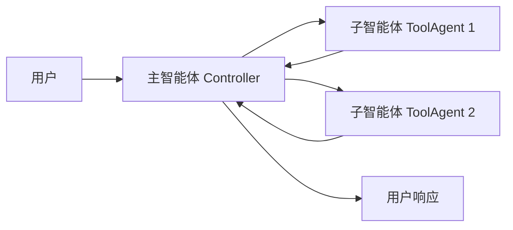
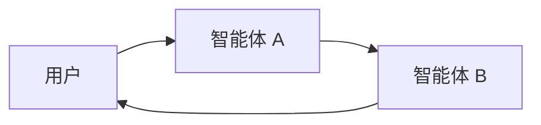

# 🌐 多智能体系统（Multi-Agent Systems）教程

在传统的智能体（Agent）架构中，往往只有一个“超级智能体”来处理所有任务：它要理解问题、规划步骤、调用工具、再综合回答。但随着任务复杂度提升——尤其是需要跨领域推理、上下文爆炸或专业化任务——这种“单体大脑”模型变得低效且笨拙。

**多智能体系统（Multi-Agent System）** 的核心思想是：

> 将复杂问题拆解成多个专精的子智能体（Sub-agents），通过协作与协调来共同完成任务。

---

## 一、为什么需要多智能体

多智能体的优势在于“专业分工”和“结构化协作”。典型应用场景包括：

* **任务过于复杂**：单一智能体拥有太多工具，常常做出错误选择。
* **上下文过长**：单个智能体无法有效追踪庞大的对话或任务状态。
* **需要专业化**：例如一个规划者（Planner）负责任务拆解，一个研究者（Researcher）负责信息检索，一个分析师（Analyst）负责计算与推理。

多智能体架构能让每个子智能体聚焦自己的专业领域，主智能体（Supervisor）则负责总体调度。

---

## 二、两种主要模式

LangChain 的多智能体系统主要有两种协作模式：

| 模式                     | 工作机制                                     | 控制流类型                   | 示例场景          |
| ---------------------- | ---------------------------------------- | ----------------------- | ------------- |
| **Tool Calling（工具调用）** | 主智能体调用其他子智能体作为“工具”使用。子智能体不直接与用户对话，只返回结果。 | **集中式**（Centralized）    | 自动化任务编排、结构化流程 |
| **Handoffs（控制转移）**     | 当前智能体可主动“移交控制权”给另一智能体，用户接着与新智能体交互。       | **去中心化**（Decentralized） | 多领域会话、专家接管对话  |

💡 **提示**：两种模式并非互斥，你可以在同一系统中混合使用——
例如：使用 handoff 实现智能体之间的接力，再在每个智能体内部用 tool calling 调用专业子任务。

---

## 三、Tool Calling 模式详解

在 Tool Calling 模式中，系统结构类似“主控—工具”模型。

### 运行流程

1. 主智能体接收用户输入，判断要调用哪个子智能体。
2. 被调用的子智能体执行任务。
3. 子智能体返回结果。
4. 主智能体汇总结果，决定下一步动作或直接回应用户。



子智能体仅负责执行，不与用户交互。

---

### 最小实现示例

```python
from langchain.tools import tool
from langchain.agents import create_agent

# 定义子智能体
subagent1 = create_agent(model="gpt-4", tools=[...])

# 包装为可被主智能体调用的工具
@tool("subagent1_name", description="子智能体1：处理数据分析任务")
def call_subagent1(query: str):
    result = subagent1.invoke({
        "messages": [{"role": "user", "content": query}]
    })
    return result["messages"][-1].content

# 创建主智能体并注册子智能体工具
agent = create_agent(model="gpt-4", tools=[call_subagent1])
```

执行逻辑：

* 主智能体根据任务描述判断是否需要调用 `subagent1`；
* 子智能体独立运行；
* 返回的结果交由主智能体进一步决策。

---

### 四个可定制点

1. **子智能体名称**：影响主智能体的调用判断。
2. **描述（description）**：指导主智能体在何种情境下调用该子智能体。
3. **输入**：如何将主智能体的上下文转化为子智能体输入。
4. **输出**：返回结果的结构与语义。

---

### 传递上下文的高级方式

有时你需要将主智能体的部分状态（例如历史对话、任务元数据）注入给子智能体。

```python
from langchain.agents import AgentState
from langchain.tools import tool, ToolRuntime

class CustomState(AgentState):
    example_state_key: str

@tool("subagent1_name", description="子智能体1")
def call_subagent1(query: str, runtime: ToolRuntime[None, CustomState]):
    subagent_input = some_logic(query, runtime.state["messages"])
    result = subagent1.invoke({
        "messages": subagent_input,
        "example_state_key": runtime.state["example_state_key"]
    })
    return result["messages"][-1].content
```

---

### 自定义输出格式

若希望返回的不只是文本，还包括中间状态或附加数据，可以使用 `Command` 对象：

```python
from typing import Annotated
from langchain.agents import AgentState
from langchain.tools import InjectedToolCallId
from langgraph.types import Command, ToolMessage

@tool("subagent1_name", description="子智能体1")
def call_subagent1(query: str, tool_call_id: Annotated[str, InjectedToolCallId]) -> Command:
    result = subagent1.invoke({"messages": [{"role": "user", "content": query}]})
    return Command(update={
        "example_state_key": result["example_state_key"],
        "messages": [
            ToolMessage(
                content=result["messages"][-1].content,
                tool_call_id=tool_call_id
            )
        ]
    })
```

这样主智能体就能同步接收到更多上下文状态。

---

## 四、Handoffs 模式

在 Handoffs 模式中，智能体之间可以互相“接力”，用户总是与当前激活的智能体直接交互。

### 流程图



核心机制：

* 当前智能体在执行过程中可决定“我不擅长此任务”，并主动转交控制权；
* 下一个智能体成为“活跃智能体”，直接与用户对话；
* 最终某个智能体决定任务结束。

此模式特别适合：

* 多领域对话（如客服接力）；
* 多阶段创作（如规划者→编写者→审阅者）；
* 高交互性应用（例如模拟专家会议）。

---

## 五、上下文工程（Context Engineering）

多智能体系统的性能，很大程度上取决于**上下文设计**——即决定每个智能体“能看到什么”。

你可以控制：

* 各智能体能访问的对话或状态；
* 各自的提示模板（Prompts）；
* 中间推理是否暴露；
* 输入与输出的格式。

优质的上下文设计能确保每个智能体只处理自己该知道的信息，既能高效协作，又避免信息干扰。

---

## 六、模式选择指南

| 问题             | Tool Calling | Handoffs |
| -------------- | ------------ | -------- |
| 需要集中控制流程？      | ✅ 是          | ❌ 否      |
| 希望子智能体直接与用户对话？ | ❌ 否          | ✅ 是      |
| 想实现专家间的人类式交互？  | ❌ 有限         | ✅ 强      |

---

## 七、总结

多智能体架构的精髓在于：

> 把“智能”拆分成协作网络，而不是堆叠在一个单体模型里。

在实际系统中，你可以：

* 使用 Tool Calling 实现任务自动化；
* 使用 Handoffs 构建多专家互动系统；
* 混合两者，创造一个真正的协作智能生态。

---

下一个可以探索的方向是：
学习如何实现一个 **Supervisor Agent（监督者智能体）** ——它能协调多个子智能体（如邮件助手、日程助手），并在敏感操作中请求人工确认，实现“人机共管”的混合系统。
