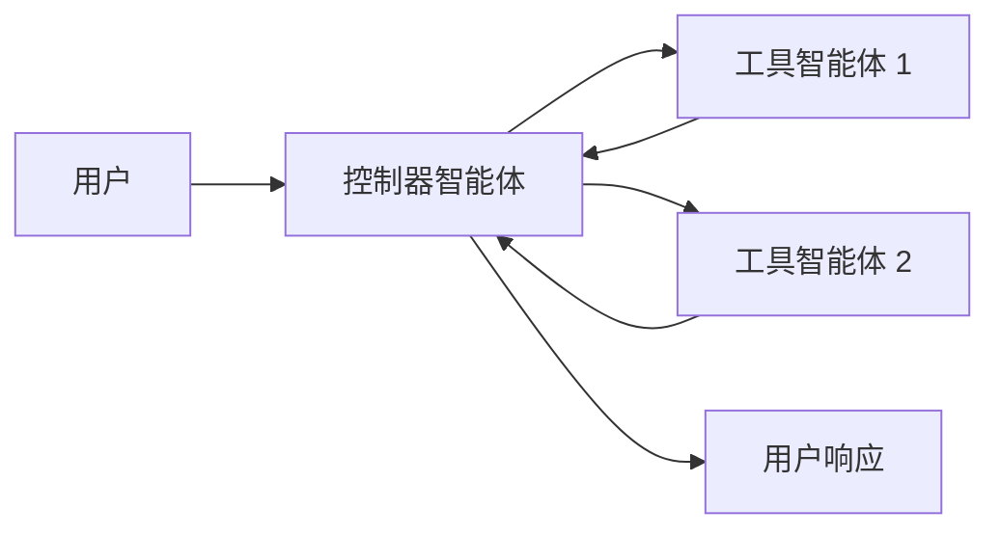
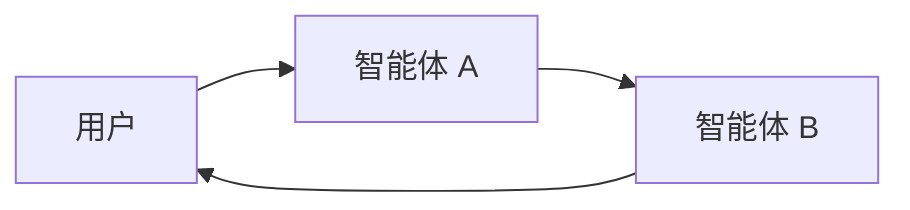

# 多智能体系统构建教程

## 概述

**多智能体系统**将复杂应用分解为多个专门化的智能体，通过协作解决问题。与依赖单一智能体处理每个步骤不同，**多智能体架构**允许你将更小、更专注的智能体组合成协调的工作流。

### 适用场景

多智能体系统在以下情况下特别有用：

- 单一智能体工具过多，难以做出正确的工具选择决策
- 上下文或记忆变得太大，单个智能体无法有效跟踪
- 任务需要**专门化**（例如规划者、研究者、数学专家）

## 多智能体模式

| 模式 | 工作原理 | 控制流 | 示例用例 |
|------|----------|--------|----------|
| [**工具调用**](#工具调用模式) | **监督者**智能体将其他智能体作为*工具*调用。"工具"智能体不直接与用户对话，只运行任务并返回结果 | 集中式：所有路由都通过调用智能体 | 任务编排、结构化工作流 |
| [**控制移交**](#控制移交模式) | 当前智能体决定**转移控制权**给另一个智能体。活动智能体改变，用户可能继续与新智能体直接交互 | 分散式：智能体可以改变活动智能体 | 多领域对话、专家接管 |

### 模式选择指南

| 问题 | 工具调用 | 控制移交 |
|------|----------|----------|
| 需要集中控制工作流？ | ✅ 是 | ❌ 否 |
| 希望智能体直接与用户交互？ | ❌ 否 | ✅ 是 |
| 需要专家间复杂、类人对话？ | ❌ 有限 | ✅ 强大 |

**提示**：你可以混合使用两种模式——使用**控制移交**进行智能体切换，并让每个智能体**将子智能体作为工具调用**以完成专门任务。

## 自定义智能体上下文

多智能体设计的核心是**上下文工程**——决定每个智能体看到什么信息。LangChain 让你可以精细控制：

- 对话或状态的哪些部分传递给每个智能体
- 为子智能体定制的专门提示
- 中间推理的包含/排除
- 每个智能体的自定义输入/输出格式

系统的质量**很大程度上取决于**上下文工程。目标是确保每个智能体都能访问执行任务所需的正确数据，无论是作为工具还是活动智能体。

## 工具调用模式

在**工具调用**模式中，一个智能体（"**控制器**"）将其他智能体视为需要时调用的*工具*。控制器管理编排，而工具智能体执行特定任务并返回结果。

### 工作流程

1. **控制器**接收输入并决定调用哪个工具（子智能体）
2. **工具智能体**基于控制器的指令运行任务
3. **工具智能体**将结果返回给控制器
4. **控制器**决定下一步或结束



**提示**：作为工具使用的智能体通常**不期望**继续与用户对话。它们的角色是执行任务并将结果返回给控制器智能体。如果需要子智能体能够与用户对话，请改用**控制移交**。

### 基础实现

以下是一个最小示例，主智能体通过工具定义访问单个子智能体：

```python
from langchain.tools import tool
from langchain.agents import create_agent

# 创建子智能体
subagent1 = create_agent(model="openai:gpt-4o", tools=[...])

@tool(
    "数据分析专家",
    description="专门处理数据分析和统计问题的专家。当需要分析数据、生成统计报告或进行数据可视化时使用此专家。"
)
def call_data_analyst(query: str):
    """调用数据分析专家处理数据相关问题"""
    result = subagent1.invoke({
        "messages": [{"role": "user", "content": query}]
    })
    return result["messages"][-1].content

# 创建主智能体，包含子智能体作为工具
agent = create_agent(
    model="openai:gpt-4o", 
    tools=[call_data_analyst]
)
```

在此模式中：

1. 当主智能体认为任务匹配子智能体描述时调用子智能体
2. 子智能体独立运行并返回结果
3. 主智能体接收结果并继续编排

### 完整示例：客户服务多智能体系统

```python
from langchain.tools import tool
from langchain.agents import create_agent
from langchain.agents.middleware import HumanInTheLoopMiddleware
from langgraph.checkpoint.memory import InMemorySaver

# 创建专门化子智能体

# 订单处理专家
order_agent = create_agent(
    model="openai:gpt-4o",
    tools=[...],  # 订单相关工具
)

# 技术支持专家
tech_support_agent = create_agent(
    model="openai:gpt-4o", 
    tools=[...],  # 技术相关工具
)

# 账单专家
billing_agent = create_agent(
    model="openai:gpt-4o",
    tools=[...],  # 账单相关工具
)

# 将子智能体包装为工具
@tool(
    "订单专家",
    description="处理订单查询、状态检查、退货和换货请求。当用户询问订单状态、退货政策或物流信息时使用。"
)
def call_order_expert(query: str):
    result = order_agent.invoke({
        "messages": [{"role": "user", "content": query}]
    })
    return result["messages"][-1].content

@tool(
    "技术支持专家", 
    description="解决技术问题、产品使用指导和故障排除。当用户遇到技术困难、需要使用指导或报告bug时使用。"
)
def call_tech_support(query: str):
    result = tech_support_agent.invoke({
        "messages": [{"role": "user", "content": query}]
    })
    return result["messages"][-1].content

@tool(
    "账单专家",
    description="处理付款问题、发票查询、退款请求和订阅管理。当用户询问账单、付款或退款时使用。"
)
def call_billing_expert(query: str):
    result = billing_agent.invoke({
        "messages": [{"role": "user", "content": query}]
    })
    return result["messages"][-1].content

# 创建主协调智能体
supervisor_agent = create_agent(
    model="openai:gpt-4o",
    tools=[call_order_expert, call_tech_support, call_billing_expert],
    middleware=[
        HumanInTheLoopMiddleware(
            interrupt_on={
                "call_billing_expert": True,  # 账单操作需要人工批准
            }
        ),
    ],
    checkpointer=InMemorySaver(),
)

# 使用示例
config = {"configurable": {"thread_id": "customer_123"}}

result = supervisor_agent.invoke(
    {
        "messages": [
            {
                "role": "user", 
                "content": "我的订单#12345还没有收到，而且上个月的账单好像有问题"
            }
        ]
    },
    config=config
)
```

### 控制子智能体的输入

控制主智能体传递给子智能体输入的两个主要方法：

- **修改提示** - 调整主智能体的提示或工具元数据（即子智能体的名称和描述），以更好地指导其何时以及如何调用子智能体
- **上下文注入** - 通过调整工具调用从智能体状态中提取信息，添加无法在静态提示中捕获的输入（例如完整消息历史、先前结果、任务元数据）

```python
from langchain.agents import AgentState
from langchain.tools import tool, ToolRuntime
from langchain_core.messages import BaseMessage

class CustomState(AgentState):
    conversation_context: str
    user_preferences: dict

@tool(
    "个性化推荐专家",
    description="基于用户历史和个人偏好提供个性化产品推荐"
)
def call_recommendation_agent(query: str, runtime: ToolRuntime[None, CustomState]):
    # 从状态中获取上下文信息
    user_context = runtime.state["conversation_context"]
    user_prefs = runtime.state["user_preferences"]
    
    # 构建增强的输入
    enhanced_input = f"""
用户查询: {query}

对话上下文:
{user_context}

用户偏好:
{user_prefs}

请基于以上信息提供个性化推荐。
"""
    
    result = recommendation_agent.invoke({
        "messages": [{"role": "user", "content": enhanced_input}]
    })
    return result["messages"][-1].content
```

### 控制子智能体的输出

两种常见的塑造主智能体从子智能体接收内容的策略：

- **修改提示** - 优化子智能体的提示，明确指定应返回什么内容
- **自定义输出格式化** - 在将结果交还给主智能体之前，在代码中调整或丰富子智能体的响应

```python
from typing import Annotated
from langchain.agents import AgentState
from langchain.tools import InjectedToolCallId
from langchain_core.messages import ToolMessage
from langgraph.types import Command

@tool(
    "研究专家",
    description="进行深入研究并返回结构化分析报告"
)
def call_research_agent(
    query: str,
    tool_call_id: Annotated[str, InjectedToolCallId],
) -> Command:
    result = research_agent.invoke({
        "messages": [{"role": "user", "content": query}]
    })
    
    # 从结果中提取结构化信息
    research_data = extract_research_data(result)
    
    return Command(update={
        # 将研究数据保存到状态供后续使用
        "research_findings": research_data,
        "messages": [
            ToolMessage(
                content=format_research_summary(research_data),
                tool_call_id=tool_call_id
            )
        ]
    })

def extract_research_data(result):
    """从研究结果中提取结构化数据"""
    # 实现数据提取逻辑
    return {
        "key_findings": [...],
        "sources": [...],
        "confidence_score": 0.85
    }

def format_research_summary(research_data):
    """格式化研究摘要"""
    return f"""
研究摘要:
关键发现: {', '.join(research_data['key_findings'])}
可信度: {research_data['confidence_score'] * 100}%
基于 {len(research_data['sources'])} 个信息来源
"""
```

## 控制移交模式

在**控制移交**中，智能体可以直接将控制权传递给彼此。"活动"智能体发生改变，用户与当前拥有控制权的任何智能体交互。

### 工作流程

1. **当前智能体**决定需要另一个智能体的帮助
2. 它将控制权（和状态）传递给**下一个智能体**
3. **新智能体**直接与用户交互，直到决定再次移交或结束



### 实现概念

虽然完整实现细节即将推出，但控制移交模式的核心概念是：

```python
# 概念代码 - 实际实现可能有所不同
class HandoffSystem:
    def __init__(self, agents: Dict[str, Agent]):
        self.agents = agents
        self.current_agent = "default"
    
    def invoke(self, input_message, config=None):
        while True:
            result = self.agents[self.current_agent].invoke(
                input_message, config=config
            )
            
            # 检查是否需要移交
            if should_handoff(result):
                self.current_agent = get_next_agent(result)
                input_message = prepare_handoff_message(result)
            else:
                return result
```

## 高级多智能体架构

### 分层智能体系统

```python
from dataclasses import dataclass
from langchain.agents import create_agent
from langchain.tools import tool

@dataclass
class ProjectContext:
    project_type: str
    complexity: str
    deadline: str

# 第一层：专业智能体
code_review_agent = create_agent(
    model="openai:gpt-4o",
    tools=[...],
)

documentation_agent = create_agent(
    model="openai:gpt-4o", 
    tools=[...],
)

testing_agent = create_agent(
    model="openai:gpt-4o",
    tools=[...],
)

# 第二层：领域协调智能体
@tool("代码审查专家")
def call_code_reviewer(task: str):
    return code_review_agent.invoke({
        "messages": [{"role": "user", "content": task}]
    })["messages"][-1].content

@tool("文档专家")  
def call_documentation_specialist(task: str):
    return documentation_agent.invoke({
        "messages": [{"role": "user", "content": task}]
    })["messages"][-1].content

@tool("测试专家")
def call_testing_specialist(task: str):
    return testing_agent.invoke({
        "messages": [{"role": "user", "content": task}]
    })["messages"][-1].content

development_coordinator = create_agent(
    model="openai:gpt-4o",
    tools=[call_code_reviewer, call_documentation_specialist, call_testing_specialist]
)

# 第三层：项目管理者
@tool("开发协调员")
def call_development_coordinator(project_requirements: str):
    return development_coordinator.invoke({
        "messages": [{"role": "user", "content": project_requirements}]
    })["messages"][-1].content

project_manager = create_agent(
    model="openai:gpt-4o", 
    tools=[call_development_coordinator]
)
```

### 动态智能体路由

```python
from langchain.agents.middleware import wrap_model_call, ModelRequest, ModelResponse
from typing import Callable

class DynamicRouter:
    def __init__(self):
        self.agent_registry = {}
    
    def register_agent(self, name: str, agent, capabilities: list):
        self.agent_registry[name] = {
            'agent': agent,
            'capabilities': capabilities
        }
    
    def find_best_agent(self, query: str, current_context: dict):
        # 实现智能体选择逻辑
        scores = {}
        for name, info in self.agent_registry.items():
            score = self.calculate_match_score(query, info['capabilities'], current_context)
            scores[name] = score
        
        return max(scores, key=scores.get)

# 动态路由中间件
@wrap_model_call
def dynamic_agent_router(
    request: ModelRequest,
    handler: Callable[[ModelRequest], ModelResponse]
) -> ModelResponse:
    router = DynamicRouter()
    
    # 基于查询内容决定使用哪个智能体
    user_message = request.messages[-1].content
    best_agent_name = router.find_best_agent(user_message, request.state)
    
    if best_agent_name != "current_agent":
        # 路由到最佳智能体
        best_agent = router.agent_registry[best_agent_name]['agent']
        result = best_agent.invoke({"messages": request.messages})
        return ModelResponse(messages=result["messages"])
    
    return handler(request)
```

## 最佳实践

### 1. 智能体设计原则

```python
# 好的实践：专注的单一职责智能体
@tool(
    "数据清洗专家",
    description="专门处理数据清洗任务：去除重复值、处理缺失值、格式标准化"
)
def call_data_cleaning_expert(data_description: str):
    # 专注的数据清洗逻辑
    pass

# 避免：过于通用的智能体  
@tool(
    "数据处理工具",  # 太宽泛
    description="处理各种数据任务"  # 不够具体
)
def call_data_tool(task: str):
    # 试图处理所有数据相关任务
    pass
```

### 2. 上下文管理

```python
from langchain.agents.middleware import dynamic_prompt

@dynamic_prompt
def specialized_agent_prompt(request: ModelRequest) -> str:
    """为专门智能体提供聚焦的上下文"""
    agent_role = request.runtime.context.get("agent_role", "general")
    
    prompts = {
        "data_analyst": """
你是一个数据分析专家。专注于：
- 数据分析和统计计算
- 图表解释和趋势分析
- 数据质量评估

避免处理与数据分析无关的任务。
""",
        "customer_service": """
你是一个客户服务专家。专注于：
- 解决客户问题
- 提供产品信息
- 处理投诉和反馈

将技术问题转给技术支持团队。
"""
    }
    
    return prompts.get(agent_role, "你是一个有用的助手。")
```

### 3. 错误处理和降级

```python
from langchain.tools import tool
import asyncio

@tool("容错子智能体调用")
def call_agent_with_fallback(agent_func, query: str, max_retries: int = 2):
    """调用子智能体，带有错误处理和降级机制"""
    for attempt in range(max_retries):
        try:
            result = agent_func(query)
            return result
        except Exception as e:
            if attempt == max_retries - 1:
                # 最终降级
                return f"无法完成请求。错误: {str(e)}。请稍后重试或联系人工客服。"
            await asyncio.sleep(1)  # 重试前等待
```

### 4. 性能监控

```python
import time
from functools import wraps

def monitor_agent_performance(func):
    @wraps(func)
    def wrapper(*args, **kwargs):
        start_time = time.time()
        try:
            result = func(*args, **kwargs)
            execution_time = time.time() - start_time
            log_performance_metrics(func.__name__, execution_time, "success")
            return result
        except Exception as e:
            execution_time = time.time() - start_time
            log_performance_metrics(func.__name__, execution_time, f"error: {str(e)}")
            raise
    return wrapper

@tool("监控的子智能体")
@monitor_agent_performance
def call_monitored_agent(query: str):
    return agent.invoke({
        "messages": [{"role": "user", "content": query}]
    })["messages"][-1].content
```

## 总结

多智能体系统通过将复杂问题分解为专门化任务，显著提高了AI应用的可靠性和效率。通过合理使用工具调用和控制移交模式，你可以构建出能够处理复杂工作流的智能系统。

**关键要点**：
- 为每个智能体明确定义职责范围
- 精心设计上下文传递机制
- 实现适当的错误处理和降级策略
- 监控系统性能并持续优化
- 在需要人工监督的关键操作中使用HITL中间件

通过遵循这些最佳实践，你可以构建出强大、可靠且易于维护的多智能体系统。