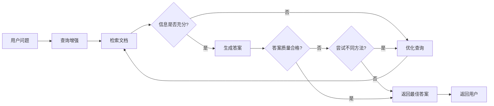

# Retrieval 与 RAG 完整教程：从基础概念到架构实践

## 什么是检索增强生成（RAG）？

大型语言模型（LLM）虽然强大，但存在两个关键限制：

* **有限上下文** — 无法一次性处理整个知识库
* **静态知识** — 训练数据在某个时间点被冻结

检索通过**在查询时获取相关外部知识**来解决这些问题，这就是**检索增强生成（RAG）** 的基础：用特定上下文信息增强LLM的回答能力。

## 构建知识库

**知识库**是在检索过程中使用的文档或结构化数据存储库。

### 自定义知识库构建

如果需要自定义知识库，可以使用LangChain的文档加载器和向量存储从自有数据构建：

```python
# 示例：构建知识库的基本流程
from langchain.document_loaders import TextLoader
from langchain.text_splitter import CharacterTextSplitter
from langchain.embeddings import OpenAIEmbeddings
from langchain.vectorstores import Chroma

# 1. 加载文档
loader = TextLoader("your_document.txt")
documents = loader.load()

# 2. 分割文本
text_splitter = CharacterTextSplitter(chunk_size=1000, chunk_overlap=0)
texts = text_splitter.split_documents(documents)

# 3. 创建嵌入并存储
embeddings = OpenAIEmbeddings()
vectorstore = Chroma.from_documents(texts, embeddings)
```

### 使用现有知识库

如果已有知识库（如SQL数据库、CRM或内部文档系统），无需重建：

* 将其作为**工具**连接到Agentic RAG中的智能体
* 查询它并将检索内容作为上下文提供给LLM（2-Step RAG）

## 检索流程详解

典型的检索工作流程如下：

```
数据源 → 文档加载器 → 文档 → 文本分割 → 嵌入转换 → 向量存储
                                                      ↑
用户查询 → 查询嵌入 → 检索器 → LLM使用检索信息 → 生成答案
```

每个组件都是模块化的：可以替换加载器、分割器、嵌入或向量存储，而无需重写应用逻辑。

### 核心构建模块

| 组件 | 功能 | 关键特性 |
|------|------|----------|
| **文档加载器** | 从外部源（Google Drive、Slack、Notion等）提取数据 | 返回标准化的Document对象 |
| **文本分割器** | 将大文档拆分为可检索的小块 | 确保适合模型的上下文窗口 |
| **嵌入模型** | 将文本转换为数值向量 | 相似含义的文本在向量空间中位置相近 |
| **向量存储** | 专门用于存储和搜索嵌入的数据库 | 支持相似性搜索 |
| **检索器** | 根据非结构化查询返回文档的接口 | 支持多种检索策略 |

## RAG架构模式

### 1. 2-Step RAG（两步式RAG）

**特点**：检索总是在生成之前执行，简单且可预测

**适用场景**：FAQ、文档问答机器人等简单应用

```python
# 2-Step RAG 基本示例
from langchain.chains import RetrievalQA

# 创建检索增强的QA链
qa_chain = RetrievalQA.from_chain_type(
    llm=llm,
    chain_type="stuff",
    retriever=vectorstore.as_retriever(),
    return_source_documents=True
)

# 执行查询
result = qa_chain({"query": "你的问题"})
print(result["result"])
```

**优势**：
- ✅ 控制度高
- ⚡ 延迟低且可预测
- 🎯 适用于明确检索需求

### 2. Agentic RAG（智能体RAG）

**特点**：LLM驱动的智能体在推理过程中决定*何时*和*如何*检索

**适用场景**：需要访问多个工具的研究助手

```python
import requests
from langchain.tools import tool
from langchain.agents import create_agent

@tool
def fetch_url(url: str) -> str:
    """从URL获取文本内容"""
    response = requests.get(url, timeout=10.0)
    response.raise_for_status()
    return response.text

# 创建具有检索工具的智能体
agent = create_agent(
    model="claude-sonnet-4-0",
    tools=[fetch_url],  # 检索工具
    system_prompt="需要时使用fetch_url从网页获取信息",
)
```

**工作流程**：
```
用户输入 → 智能体判断是否需要外部信息
    ↓ 是 → 使用工具搜索 → 判断是否足够回答
    ↓ 否 → 生成最终答案 → 返回用户
```

**优势**：
- ✅ 灵活性高
- 🧠 能够进行复杂推理
- 🔧 可集成多个工具

### 3. Hybrid RAG（混合RAG）

**特点**：结合2-Step和Agentic RAG特性，加入验证步骤

**适用场景**：需要质量验证的领域特定问答系统

**典型组件**：
- **查询增强**：改进输入问题以提高检索质量
- **检索验证**：评估检索文档的相关性和充分性
- **答案验证**：检查生成答案的准确性、完整性和与源内容的一致性



## 实践建议

### 选择适合的架构

| 需求特征 | 推荐架构 | 理由 |
|---------|----------|------|
| 简单问答、低延迟 | 2-Step RAG | 结构简单，响应快速 |
| 复杂推理、多源查询 | Agentic RAG | 灵活决策，适应复杂场景 |
| 高质量要求、需要验证 | Hybrid RAG | 平衡控制与灵活性 |

### 性能优化考虑

1. **分块策略**：根据文档类型调整块大小和重叠
2. **检索优化**：使用混合检索（关键词+向量）提高召回率
3. **缓存机制**：对频繁查询实现结果缓存
4. **增量更新**：支持知识库的增量更新

### 错误处理

```python
# 检索失败的处理示例
try:
    result = qa_chain({"query": user_question})
    if not result["source_documents"]:
        return "抱歉，没有找到相关信息。"
    return result["result"]
except Exception as e:
    return f"检索过程中出现错误：{str(e)}"
```

## 下一步学习

要深入了解和实践RAG，建议：

1. **从2-Step RAG开始**：掌握基本的检索增强生成流程
2. **尝试Agentic RAG**：体验智能体驱动的动态检索
3. **探索高级特性**：如查询重写、多跳检索、自我修正等

通过本教程，你应该对RAG的基本概念、不同架构及其适用场景有了全面了解。根据具体需求选择合适的架构，开始构建你的检索增强应用吧！