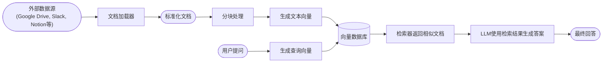
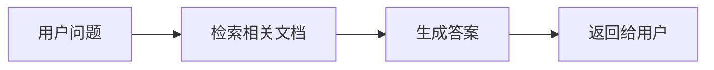
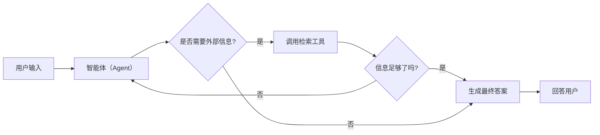
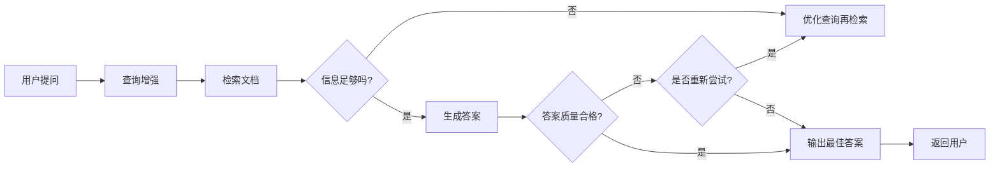

# 📚 LangChain 检索与 RAG 教程

大型语言模型（LLM）虽然强大，但它们天然有两个限制：

1. **上下文有限（Finite context）** —— 模型一次能“看”的文本有限，无法直接读取整个知识库。
2. **知识静态（Static knowledge）** —— 模型的训练数据在某个时间点被冻结，无法感知之后的新信息。

**检索（Retrieval）** 技术正是为了解决这两点，它允许模型在推理过程中**实时查询外部知识**，从而获取更准确、更实时、更可控的答案。
这是 **RAG（Retrieval-Augmented Generation）** 的理论基础。

---

## 一、从检索到 RAG：思维的转变

传统 LLM 是“闭卷考试”——它只能靠训练时学到的知识回答问题。
RAG 则让它“开卷考试”——在回答问题前，先去知识库里查找相关内容。

流程如下：



RAG 的核心理念是：

> **检索（Retrieve）相关知识 + 生成（Generate）整合性答案 = 可解释且动态的智能系统**

---

## 二、构建知识库（Knowledge Base）

知识库是检索系统的基础，用于存储你希望 LLM 能“查阅”的内容。它可以来源于：

* 内部文档、Wiki、手册
* 数据库（SQL/CRM）
* 文件系统（PDF、Markdown、HTML）
* Web 页面或 API

如果你已经有知识系统（如 CRM、数据库），可以**直接将其作为检索工具**接入；
否则，就可以用 LangChain 自带的工具从零构建一个。

### 核心组件

| 模块                   | 功能           | 示例                                 |
| -------------------- | ------------ | ---------------------------------- |
| **Document Loaders** | 加载外部数据源      | Google Drive、Notion、Slack          |
| **Text Splitters**   | 将长文档切成小块     | 按段落或字符数切分                          |
| **Embedding Models** | 把文本转为向量      | OpenAI、Cohere、SentenceTransformers |
| **Vector Stores**    | 存储和搜索向量      | FAISS、Pinecone、Milvus              |
| **Retrievers**       | 根据查询向量返回相似内容 | 向量检索、混合检索                          |

---

## 三、RAG 的三种典型架构

RAG 不是单一结构，而是一系列可组合的模式。LangChain 将其分为三种主要形式：

| 架构类型            | 特点             | 控制权  | 灵活度  | 延迟   | 适用场景         |
| --------------- | -------------- | ---- | ---- | ---- | ------------ |
| **2-Step RAG**  | 固定两步：先检索再生成    | ✅ 高  | ❌ 低  | ⚡ 快  | FAQ、文档问答     |
| **Agentic RAG** | 智能体自主决定何时检索    | ❌ 低  | ✅ 高  | ⏳ 变化 | 研究助理、多工具系统   |
| **Hybrid RAG**  | 混合结构 + 验证与反馈机制 | ⚖️ 中 | ⚖️ 中 | ⏳ 中  | 高质量问答、领域知识系统 |

---

## 四、2-Step RAG：固定流程的高效方案

在 **2-Step RAG** 中，系统总是按照固定顺序运行：

1. **检索阶段**：根据用户问题，从知识库中找出最相关的内容。
2. **生成阶段**：将这些内容作为上下文输入给 LLM，让它据此生成答案。



示例（伪代码）：

```python
from langchain.chains import RetrievalQA
from langchain.vectorstores import FAISS
from langchain.embeddings import OpenAIEmbeddings
from langchain.llms import OpenAI

# 1. 构建知识向量库
vectorstore = FAISS.from_texts(
    ["LangChain 是一个开发框架...", "RAG 用于增强模型..."],
    embedding=OpenAIEmbeddings()
)

# 2. 创建检索器
retriever = vectorstore.as_retriever()

# 3. 构建 RAG QA 链
qa = RetrievalQA.from_chain_type(
    llm=OpenAI(),
    retriever=retriever,
    return_source_documents=True
)

# 4. 运行查询
result = qa("LangChain 的作用是什么？")
print(result["result"])
```

优点：

* 可预测、简单、延迟低；
* 只需一次 LLM 调用；
* 适合问答、文档查询、聊天机器人。

---

## 五、Agentic RAG：让智能体自主决定“何时检索”

**Agentic RAG** 是一个带有决策能力的系统。
LLM 不再被动地接收检索结果，而是能**推理、判断是否需要检索**，甚至选择使用哪个工具来查找信息。



例如，一个研究助理智能体可以判断：

> “这个问题涉及实时数据，我需要先去查一下最新网页。”

实现示例：

```python
import requests
from langchain.tools import tool
from langchain.chat_models import init_chat_model
from langchain.agents import create_agent

@tool
def fetch_url(url: str) -> str:
    """从网页抓取文本内容"""
    response = requests.get(url, timeout=10)
    response.raise_for_status()
    return response.text

system_prompt = """\
当需要最新信息时，请使用 fetch_url 工具从网页获取内容。
引用相关片段后回答用户。
"""

agent = create_agent(
    model="gpt-4",
    tools=[fetch_url],
    system_prompt=system_prompt,
)
```

这种方式让模型具备**自主信息搜集能力**，可动态应对不确定的任务场景。

---

## 六、Hybrid RAG：混合结构与自校正机制

**Hybrid RAG（混合检索增强生成）** 融合了两者的优势：
既有固定流程的稳定性，也能引入智能体的灵活判断。

它通常包括：

* **查询增强**：重写用户问题，提高检索相关度。
* **检索验证**：评估检索结果是否足够相关。
* **答案验证**：检查生成的答案是否与文档一致。
* **循环改进**：若不满足条件，自动重试或重新检索。

流程如下：



应用示例：

* 医疗、金融等领域需要结果验证的问答系统；
* 多数据源整合系统；
* 需要多轮自修正的智能助手。

---

## 七、RAG 的延迟与性能考量

* **2-Step RAG** 延迟最可控（一次 LLM 调用即可）。
* **Agentic RAG / Hybrid RAG** 延迟不固定（取决于决策与检索次数）。
* 真实系统中，网络延迟、数据库响应时间等也会显著影响总耗时。

在部署时，应根据业务优先级选择平衡点：

* 快速响应 → 用 2-Step；
* 智能与灵活 → 用 Agentic；
* 质量与稳定并重 → 用 Hybrid。

---

## 八、总结：让模型“知道自己不知道”

RAG 代表了从**封闭语言模型**向**知识驱动型智能系统**的跃迁。
它让模型在推理时能主动“查阅资料”，在事实层面上更加可靠。

RAG 架构不是终点，而是基础：

* 你可以在其上构建多智能体系统；
* 结合记忆、推理、规划；
* 最终打造具备**自我学习与验证能力**的智能体。

---

接下来可以学习如何使用 **LangChain 的 `RetrievalQA`** 或 **Agentic RAG** 框架来实现一个基于你自己知识库的聊天机器人，实现真正的“会查资料的 AI 助理”。
