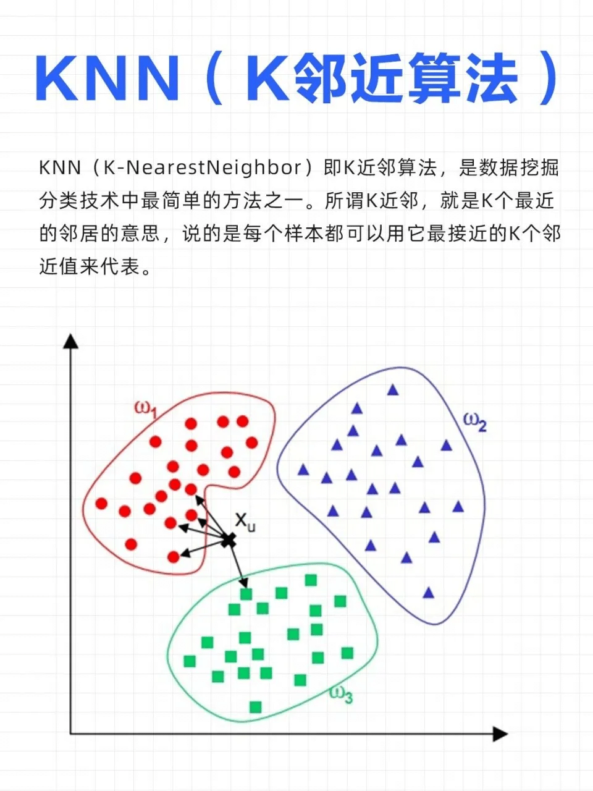
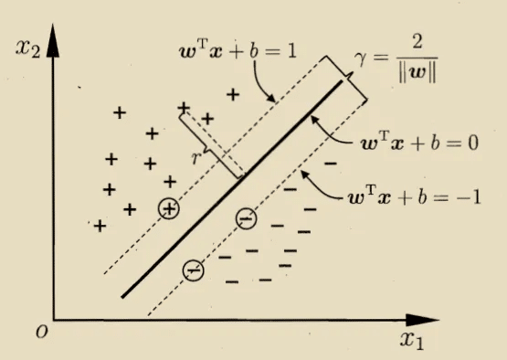

# 机器学习面试题

## 一、机器学习模型

### 1.1 有监督学习模型

有监督学习模型是一种利用已知标签的训练数据来学习输入与输出之间映射关系的机器学习方法，其核心在于通过训练集中的输入特征和对应标签来调整模型参数，从而实现对新数据的准确预测。该模型主要应用于分类和回归任务，其中分类用于将数据分配到预定义类别，回归则用于预测连续数值。

**主要算法及特点**

| 算法 | 核心原理 | 优点 | 缺点 |
| --- | --- | --- | --- |
| 支持向量机(SVM) | 寻找最优决策边界以最大化类别间隔 | 在高维空间表现良好，适合小样本数据 | 对大规模数据训练时间长，对缺失数据敏感 |
| 人工神经网络(ANN) | 模拟人脑神经元工作方式，通过多层结构处理非线性关系 | 强大的非线性建模能力，适用于复杂问题 | 训练时间长，易过拟合，对参数敏感 |
| 决策树(DT) | 通过树形结构进行特征划分 | 易于理解和解释，可处理数值和类别数据 | 易过拟合，对数据变化敏感 |
| 朴素贝叶斯(NB) | 基于贝叶斯定理的类条件独立性假设 | 计算效率高，适合高维数据 | 特征独立性假设在现实中往往不成立 |
| K近邻(KNN) | 基于距离度量找到最近的K个训练样本进行分类 | 简单易懂，无需训练过程 | 对K值选择敏感，计算量大 |


### 1.2 无监督学习模型


无监督学习模型是机器学习的重要分支，其核心在于直接从未标记的数据中挖掘潜在结构与内在规律，无需人工标注标签。 该模型主要任务包括聚类分析、降维处理、异常检测和关联规则学习等，广泛应用于客户细分、商品推荐、异常检测等领域。


### 1.3 概率模型

概率模型是一类利用概率论与统计学描述数据生成机制与变量关系的数学模型。它通过联合概率分布 $P(X, Y)$ 建模输入 $X$ 与输出 $Y$ 的不确定性，支持推理、预测与决策。
> ✅ 核心思想：将复杂系统中的不确定性显式建模，实现“在不确定中求确定”。


#### 核心概率模型类型

**1. 贝叶斯网络（Bayesian Network）**

- 类型：有向图模型（DAG）
- 结构：节点 = 随机变量，边 = 因果依赖
- 应用：医疗诊断、推荐系统、语音识别

> 🌰 示例：  
> 节点：`Rain`（是否下雨）、`Sprinkler`（洒水器是否开启）、`Wet Grass`（草地是否湿）  
> 边：`Rain → Wet Grass`，`Sprinkler → Wet Grass`  
> 可计算“已知草地湿，下雨的概率”——即后验概率推理。
---
**2. 隐马尔可夫模型（HMM）**

- 本质：结构最简单的动态贝叶斯网络
- 适用：时序数据建模（如语音、文本）
- 两大变量：
    - 隐状态序列 $y_1, y_2, ..., y_n$（不可观测）
    - 观测序列 $x_1, x_2, ..., x_n$（可观测）

> 📌 联合概率分解为：
> $$
> P(x_1,y_1,...,x_n,y_n) = P(y_1)P(x_1|y_1)\prod_{i=2}^n P(y_i|y_{i-1})P(x_i|y_i)
> $$
---
**3. 马尔可夫随机场（MRF）与条件随机场（CRF）**

| 模型 | 类型 | 特点 | 应用 |
|------|------|------|------|
| MRF | 无向图模型 | 建模变量间对称依赖（如图像像素） | 图像处理、基因分析 ||
| CRF | 判别式无向模型 | 直接建模 $P(Y|X)$，常用于序列标注 | NLP、语音识别 ||

#### 概率模型的核心学习方法

**1. 极大似然估计（MLE）**

- 目标：找到使观测数据出现概率最大的参数 $\theta$
- 公式：  
- 
$$
  \hat{\theta}_{MLE} = \arg\max_\theta P(D|\theta)
$$

- 实例：抛硬币10次得7次正面 → 估计正面概率为0.7
> 🔍 实践技巧：常对似然取对数（对数似然），便于优化。
---
**2. 贝叶斯学习（Bayesian Learning）**

- 核心理念：参数 $\theta$ 是一个随机变量，具有先验分布 $P(\theta)$
- 更新过程：利用贝叶斯公式得到后验 $P(\theta|D)$
  $$
  P(\theta|D) = \frac{P(D|\theta)P(\theta)}{P(D)}
  $$
- 优势：可融合先验知识，适合小样本场景

> 🧠 关键概念：
> 
> - 先验概率：建模前的知识（如“某病发病率低”）
> - 后验概率：观测数据后的更新信念
> - 奥卡姆剃刀原理：简单模型优先，防止过拟合
---

### 1.4 生成模型 VS 判别模型

#### 1️⃣ 判别模型（Discriminative Model）

**核心思想**：直接学习 **条件概率** ( P(y|x) )，即给定输入 (x)，预测输出 (y) 的概率。

* 目标：**区分不同类别**
* 重点：**边界/分类**
* 常见方法：
    * 逻辑回归（Logistic Regression）
    * 支持向量机（SVM）
    * 条件随机场（CRF）
    * 神经网络分类器

**数学表达**：

$$
\hat{y} = \arg\max_y P(y|x)
$$

训练时直接优化损失函数（比如交叉熵）：

$$
\mathcal{L} = - \sum_i y_i \log P(y_i|x_i)
$$

**直观理解**：

判别模型像一个法官，专注于 **判断 A 和 B 哪个可能性更大**，不关心输入是怎么生成的。


#### 2️⃣ 生成模型（Generative Model）

**核心思想**：学习 **联合概率** ( P(x, y) ) 或者数据分布 ( P(x) )，从而能生成数据。

* 目标：**建模数据分布，生成新样本**
* 重点：**数据本身**
* 常见方法：

    * 高斯混合模型（GMM）
    * 朴素贝叶斯（Naive Bayes）
    * 隐马尔可夫模型（HMM）
    * 变分自编码器（VAE）
    * 生成对抗网络（GAN）
    * 大语言模型（LLM，如 GPT 系列）

**数学表达**：

1. 对于分类任务：
$$
   P(y|x) = \frac{P(x|y)P(y)}{P(x)}
$$

2. 对于生成任务（无标签）：
$$
   P(x) \quad \text{或者} \quad P(x|z) \text{，其中 z 是潜变量}
$$

**直观理解**：

生成模型像一个画家，不仅能说“这是猫还是狗”，还能 **画出一只新的猫或狗**。


| 特性   | 判别模型                              | 生成模型                                 |                         |
| ---- | --------------------------------- | ------------------------------------ | ----------------------- |
| 学习目标 | 条件概率 (P(y                         | x))                                  | 联合概率 (P(x, y)) 或 (P(x)) |
| 预测能力 | 分类、回归                             | 生成、分类                                |                         |
| 数据建模 | 不关心数据分布                           | 学习数据分布                               |                         |
| 优势   | 边界清晰，分类精度高                        | 可以生成新样本，适应半监督学习                      |                         |
| 劣势   | 不能生成样本                            | 分类精度可能低于判别模型                         |                         |
| 示例   | Logistic Regression, SVM, DNN 分类器 | Naive Bayes, GMM, HMM, VAE, GAN, GPT |                         |


### 1.5 模型训练流程

机器学习模型训练可以抽象为 **一个迭代优化过程**，大致流程如下：

1. **明确问题与目标**
2. **收集数据**
3. **数据预处理与特征工程**
4. **选择模型**
5. **定义损失函数和优化器**
6. **训练模型（模型拟合）**
7. **模型评估与调参**
8. **模型部署与监控**

---

#### 1️⃣ 明确问题与目标

* **任务类型**：

    * 分类（Classification）：预测类别 $(y \in {0,1,...,K})$
    * 回归（Regression）：预测连续值 $(y \in \mathbb{R})$
    * 排序/推荐、聚类、生成等

* **目标指标**：

    * 分类：准确率（Accuracy）、F1、ROC-AUC
    * 回归：MSE、MAE、R²

* **约束条件**：

    * 训练时间、模型大小、可解释性等

> 🔹 小贴士：问题定义直接决定后续数据收集、模型选择和评估方法。

---

#### 2️⃣ 数据收集

* 数据是 ML 的核心，质量决定模型上限
* 来源：

    * 公开数据集（Kaggle、UCI）
    * 企业业务数据（数据库、日志）
    * 传感器或爬虫采集

* 注意：

    * 数据量是否足够
    * 标签是否准确（监督学习）

---

#### 3️⃣ 数据预处理与特征工程

##### 数据清洗：

* 缺失值处理：填充、删除或标记
* 异常值处理：去除或修正
* 数据类型转换

##### 特征处理：

* 数值归一化/标准化
* 类别变量编码（One-hot、Label Encoding）
* 特征组合或降维（PCA、SVD）

##### 特征选择：

* 相关性分析、方差选择、树模型特征重要性
* 避免高维稀疏或噪声特征

> 🔹 小贴士：好的特征比复杂模型更重要。

---

#### 4️⃣ 选择模型

根据问题类型和数据特性选择合适的算法：

| 问题类型 | 经典算法              | 深度学习算法                  |
| ---- | ----------------- | ----------------------- |
| 分类   | 逻辑回归、SVM、决策树、随机森林 | MLP、CNN、Transformer     |
| 回归   | 线性回归、岭回归、树回归      | MLP、LSTM                |
| 聚类   | K-Means、GMM       | 自编码器 + 聚类               |
| 生成   | Naive Bayes、GMM   | GAN、VAE、Diffusion Model |

---

#### 5️⃣ 定义损失函数与优化器

##### 损失函数（Loss Function）：

* **分类**：交叉熵损失
$$
  \mathcal{L} = - \sum_i y_i \log \hat{y}_i
$$
* **回归**：均方误差（MSE）
$$
  \mathcal{L} = \frac{1}{n}\sum_i (\hat{y}_i - y_i)^2
$$

##### 优化器（Optimizer）：

* 通过梯度下降优化模型参数 (\theta)
* 常用：

    * SGD、Momentum、Adam、RMSProp

##### 数学本质：

* 找到最优参数 (\theta^*)：

$$
  \theta^* = \arg\min_\theta \mathcal{L}(\theta)
$$

---

#### 6️⃣ 模型训练（拟合）

* 将训练数据输入模型
* 计算预测值 (\hat{y})
* 根据损失函数计算梯度
* 更新参数（梯度下降）
* **迭代多次（epoch）**，直到收敛或达到指定轮数

💡 注意：

* 批量训练（Batch） vs 随机梯度下降（SGD）
* 防止过拟合：

    * 正则化（L1、L2）
    * Dropout（深度学习）
    * 提前停止（Early Stopping）

---

#### 7️⃣ 模型评估与调参

##### 评估方法：

* 拆分数据集：

    * 训练集 / 验证集 / 测试集

* 交叉验证（K-Fold CV）
* 指标选择：

    * 分类：Accuracy、Precision、Recall、F1
    * 回归：MSE、MAE、R²

##### 超参数调优：

* 网格搜索（Grid Search）
* 随机搜索（Random Search）
* 贝叶斯优化
* AutoML 工具

> 🔹 小贴士：不要在测试集上调参，只在验证集上优化模型。

---

#### 8️⃣ 模型部署与监控

* 部署方式：

    * 本地服务（Flask/FastAPI）
    * 云服务（AWS Sagemaker, Azure ML）
  
* 模型监控：

    * 精度随时间下降（概念漂移）
    * 输入分布变化
  
* 定期更新模型，保持性能

```text
问题定义 → 数据收集 → 数据清洗/特征工程 → 模型选择 → 损失函数+优化器
→ 训练模型 → 模型评估与调参 → 部署与监控
```

---


## 二、数据预处理

### 2.1 数据清洗

#### 缺失值处理：删除、填充（均值、中位数、众数）、插值法等

在实际数据中，经常会遇到 **部分数据缺失** 的情况，例如：

| 姓名 | 年龄  | 工资   |
| -- | --- | ---- |
| 张三 | 25  | 5000 |
| 李四 | NaN | 6000 |
| 王五 | 30  | NaN  |

这里的 `NaN` 就表示缺失值（Not a Number）。

缺失值会导致：

* 统计指标偏差（均值、方差不准确）
* 机器学习模型报错或性能下降

所以需要 **合理处理缺失值**。

**先分析缺失情况**：

```python
df.isna().sum()
df.isna().mean()  # 缺失比例
```

----

##### 1️⃣ 删除法（Deletion）

**思路**：直接删除缺失值所在的行或列。

* **删除行（Row-wise deletion）**

    * 方法：`dropna(axis=0)`
    * 适用场景：缺失值较少，删除不会丢失太多信息
    * 缺点：丢失信息，如果缺失值很多，会导致数据量严重不足

* **删除列（Column-wise deletion）**

    * 方法：`dropna(axis=1)`
    * 适用场景：某列缺失值过多且不重要
    * 缺点：可能丢失有价值特征

**示例（Pandas）**：

```python
import pandas as pd
import numpy as np

df = pd.DataFrame({
    '姓名': ['张三','李四','王五'],
    '年龄': [25, np.nan, 30],
    '工资': [5000, 6000, np.nan]
})

# 删除含有缺失值的行
df.dropna(axis=0, inplace=True)

# 删除含有缺失值的列
df.dropna(axis=1, inplace=True)
```


##### 2️⃣ 填充法（Imputation）

**思路**：用某个合理的值代替缺失值。

###### 2.1 均值填充（Mean Imputation）

* 将缺失值用该列的平均值填充
* 适合**连续型数据**
* 优点：简单，易实现
* 缺点：会降低数据方差，可能影响模型

```python
df['年龄'].fillna(df['年龄'].mean(), inplace=True)
```

###### 2.2 中位数填充（Median Imputation）

* 将缺失值用该列的中位数填充
* 适合**有异常值的连续型数据**
* 优点：不受极端值影响

```python
df['年龄'].fillna(df['年龄'].median(), inplace=True)
```

###### 2.3 众数填充（Mode Imputation）

* 将缺失值用该列最常出现的值填充
* 适合**类别型数据**
* 优点：保留类别特征分布

```python
df['性别'].fillna(df['性别'].mode()[0], inplace=True)
```

###### 2.4 固定值填充（Constant Imputation）

* 用固定值填充，例如 0、-1、"未知"
* 适合**缺失本身有含义的情况**

```python
df['工资'].fillna(0, inplace=True)
```

---

##### 3️⃣ 插值法（Interpolation）

**思路**：利用已有数据的趋势或模式来预测缺失值

* 适合**时间序列数据或连续数据**
* 常见方法：

    * 线性插值（Linear）
    * 多项式插值（Polynomial）
    * 时间序列插值（Time）

```python
df['工资'] = df['工资'].interpolate(method='linear')
```

* 优点：保留数据趋势，适合连续型和时间序列
* 缺点：不适合类别型数据；可能引入偏差

---

##### 4️⃣ 高级填充方法

* **KNN 填充**：用相似样本的平均值填充
* **回归填充**：用其他特征预测缺失值
* **多重插补（MICE）**：用多次预测填充，保留数据分布

> 这些方法可以提高预测精度，但计算复杂度更高。

---

**缺失值处理选择指南**

| 方法     | 适用场景          | 优点         | 缺点          |
| ------ | ------------- | ---------- | ----------- |
| 删除     | 缺失值少、数据量大     | 简单         | 丢失信息、可能引入偏差 |
| 均值/中位数 | 连续型特征         | 简单、易实现     | 方差降低、可能引入偏差 |
| 众数     | 类别型特征         | 保留类别分布     | 无法处理连续型     |
| 插值     | 时间序列、连续型数据    | 保留趋势       | 不适合类别型数据    |
| 高级方法   | 对精度要求高、缺失模式复杂 | 更合理、保留数据分布 | 计算复杂、实现复杂   |

---

#### 异常值处理：删除、视为缺失值、修正或保留（根据业务逻辑）

**异常值（Outlier）** 是指在数据集中 **显著偏离其他观测值的数据点**。

* 例子：工资为 10 万元，而大多数员工工资在 3-5 千元之间。
* 异常值可能来源：

    * 数据录入错误
    * 仪器测量错误
    * 真实的极端值（罕见事件）

> 异常值如果不处理，可能导致统计指标失真或模型性能下降。

**先检测，再处理**：

```python
df.describe()
df.boxplot()
```

##### 检测异常值的方法

###### 1️⃣ 基于统计量

* **标准差法**：
$$
  x \text{ 是异常值 if } |x-\bar{x}| > k\sigma
$$
  常用 (k=3)
* **IQR法（四分位距）**：
$$
  \text{IQR} = Q_3 - Q_1
$$
$$
  x \text{ 是异常值 if } x < Q_1 - 1.5 \cdot IQR \text{ 或 } x > Q_3 + 1.5 \cdot IQR
$$

###### 2️⃣ 基于模型

* **Z-score**
* **Isolation Forest**
* **Local Outlier Factor (LOF)**

-----

##### 异常值处理方法

###### 1️⃣ 删除法

**思路**：直接删除异常值对应的行。

* 优点：

    * 简单、快速
    * 适合异常值很少的情况
  
* 缺点：

    * 丢失信息
    * 不适合异常值可能有实际意义的情况

**Pandas 示例**：

```python
import pandas as pd
import numpy as np

df = pd.DataFrame({'工资':[5000,6000,7000,100000]})
Q1 = df['工资'].quantile(0.25)
Q3 = df['工资'].quantile(0.75)
IQR = Q3 - Q1
df_clean = df[(df['工资'] >= Q1 - 1.5*IQR) & (df['工资'] <= Q3 + 1.5*IQR)]
```

---

###### 2️⃣ 视为缺失值（NaN）

**思路**：把异常值标记为缺失值，再用缺失值处理方法填充。

* 优点：

    * 可以结合均值/中位数/插值等方法
    * 保留数据量
  
* 缺点：

    * 填充值可能不准确
    * 需要合理选择填充值

**Pandas 示例**：

```python
df.loc[(df['工资'] > Q3 + 1.5*IQR), '工资'] = np.nan
df['工资'].fillna(df['工资'].median(), inplace=True)
```

---

###### 3️⃣ 修正法（Capping 或 Winsorization）

**思路**：把异常值替换为上限或下限值。

* 优点：

    * 保留数据量
    * 减少异常值对模型的影响
  
* 缺点：

    * 可能扭曲数据分布

**Pandas 示例**：

```python
lower_bound = Q1 - 1.5*IQR
upper_bound = Q3 + 1.5*IQR
df['工资'] = df['工资'].clip(lower_bound, upper_bound)
```

---

###### 4️⃣ 保留法

**思路**：对异常值不做处理，直接保留

* 适用场景：

    * 异常值是 **真实的极端事件**，对业务有意义
    * 如金融风控中的欺诈交易
  
* 优点：

    * 保留完整信息
  
* 缺点：

    * 可能影响模型训练和统计指标


| 方法          | 适用场景              | 优点         | 缺点       |
| ----------- | ----------------- | ---------- | -------- |
| 删除          | 异常值少，可能是错误数据      | 简单快速       | 丢失信息     |
| 视为缺失值       | 异常值可用填充替代         | 可结合缺失值处理方法 | 填充值可能不准确 |
| 修正（Capping） | 异常值对模型影响大，但数据量不能丢 | 保留数据量，减少影响 | 可能改变分布   |
| 保留          | 异常值是真实有效事件        | 保留信息       | 可能影响模型   |


#### 重复数据处理：识别并删除完全重复的样本

**重复数据** 是指在数据集中 **完全相同或部分字段相同的样本行**。
例如：

| 姓名 | 年龄 | 城市 |       |
| -- | -- | -- | ----- |
| 张三 | 25 | 北京 |       |
| 张三 | 25 | 北京 | ← 重复行 |
| 李四 | 30 | 上海 |       |

重复数据可能来源：

* 数据多次导入
* 采集系统错误
* 数据合并（merge/concat）时未去重

##### 重复数据的识别

在 **Pandas** 中常用方法是 `duplicated()`：

```python
import pandas as pd

df = pd.DataFrame({
    '姓名': ['张三', '张三', '李四', '王五', '李四'],
    '年龄': [25, 25, 30, 22, 30],
    '城市': ['北京', '北京', '上海', '广州', '上海']
})

# 判断是否重复（返回布尔值）
print(df.duplicated())

# 查看重复的样本
print(df[df.duplicated()])
```

输出：

```
0    False
1     True
2    False
3    False
4     True
dtype: bool
```

---

###### 1️⃣ 删除完全重复的行

```python
df_clean = df.drop_duplicates()
```

> 默认根据所有列去重，仅保留第一次出现的记录。

---

###### 2️⃣ 指定列进行去重

有时只想根据某几列判断是否重复，比如 “姓名 + 城市”：

```python
df_clean = df.drop_duplicates(subset=['姓名', '城市'])
```

---

###### 3️⃣ 保留最后一次出现的记录

```python
df_clean = df.drop_duplicates(keep='last')
```

* `keep='first'`（默认）：保留第一次出现的记录
* `keep='last'`：保留最后一次出现的记录
* `keep=False`：删除所有重复项

---

###### 4️⃣ 查看重复的数量

```python
duplicate_count = df.duplicated().sum()
print(f"共有 {duplicate_count} 条重复样本")
```

---


| 方法     | 代码示例                                | 功能         |
| ------ | ----------------------------------- | ---------- |
| 检查重复   | `df.duplicated()`                   | 返回布尔Series |
| 查看重复行  | `df[df.duplicated()]`               | 显示所有重复记录   |
| 删除重复   | `df.drop_duplicates()`              | 删除重复记录     |
| 指定列去重  | `df.drop_duplicates(subset=['列名'])` | 按指定列判断重复   |
| 保留最后   | `keep='last'`                       | 保留最后一条重复记录 |
| 删除所有重复 | `keep=False`                        | 所有重复的都删除   |


### 2.2 数据转换

#### 特征缩放：标准化（Z-score）、归一化（Min-Max Scaling）等，消除量纲影响

不同特征往往具有 **不同的量纲（单位）和取值范围**：

| 特征 | 含义    | 取值范围           |
| -- | ----- | -------------- |
| 身高 | 单位：cm | 150 ~ 190      |
| 体重 | 单位：kg | 40 ~ 90        |
| 收入 | 单位：元  | 3,000 ~ 30,000 |

👉 在这种情况下：

* **距离度量类算法**（如 KNN、K-Means）会被数值大的特征主导。
* **梯度下降算法**（如线性回归、神经网络）会因不同特征尺度不同导致收敛缓慢或震荡。

✅ 通过特征缩放，使所有特征处于**相似的数值范围**，从而：

* 提高模型收敛速度
* 避免特征“主导效应”
* 提高训练稳定性

---

##### 🧮 常见特征缩放方法

###### 1️⃣ 标准化（Standardization / Z-score Normalization）

**公式：**
$$
x' = \frac{x - \mu}{\sigma}
$$

* $\mu$：均值（mean）
* $\sigma$：标准差（standard deviation）

👉 缩放后数据服从 **均值为0、标准差为1** 的分布。

**适用场景：**

* 数据近似符合正态分布
* 线性模型（Logistic Regression, SVM, PCA）
* 神经网络输入层

**Python 实现：**

```python
from sklearn.preprocessing import StandardScaler
import pandas as pd

data = pd.DataFrame({
    '身高': [160, 170, 180],
    '体重': [50, 65, 80]
})

scaler = StandardScaler()
scaled = scaler.fit_transform(data)

print(pd.DataFrame(scaled, columns=data.columns))
```

输出：

| 身高    | 体重    |
| ----- | ----- |
| -1.22 | -1.22 |
| 0.00  | 0.00  |
| 1.22  | 1.22  |

---

###### 2️⃣ 归一化（Min-Max Scaling）

**公式：**
$$
x' = \frac{x - x_{\min}}{x_{\max} - x_{\min}}
$$

* 将数据缩放至 `[0, 1]` 或自定义区间 `[a, b]`。

**适用场景：**

* 数据没有明显的正态分布
* 神经网络输入层（尤其是 Sigmoid / Tanh）
* 需要固定区间的算法

**Python 实现：**

```python
from sklearn.preprocessing import MinMaxScaler

scaler = MinMaxScaler(feature_range=(0, 1))
scaled = scaler.fit_transform(data)

print(pd.DataFrame(scaled, columns=data.columns))
```

输出：

| 身高  | 体重  |
| --- | --- |
| 0.0 | 0.0 |
| 0.5 | 0.5 |
| 1.0 | 1.0 |

---

###### 3️⃣ 稳健缩放（Robust Scaling）

**公式：**
$$
x' = \frac{x - \text{Median}(x)}{IQR}
$$
其中 (IQR = Q3 - Q1)（四分位距）。

**适用场景：**

* 数据中存在异常值（outliers）
* 对异常值不敏感的模型

**Python 实现：**

```python
from sklearn.preprocessing import RobustScaler

scaler = RobustScaler()
scaled = scaler.fit_transform(data)
print(pd.DataFrame(scaled, columns=data.columns))
```

---

###### 4️⃣ 单位向量化（L2 Normalization）

**公式：**
$$
x' = \frac{x}{|x|}
$$
将每个样本缩放为单位长度（即向量长度为1）。

**适用场景：**

* 文本向量（TF-IDF、词嵌入）
* 余弦相似度度量任务

**Python 实现：**

```python
from sklearn.preprocessing import Normalizer

scaler = Normalizer(norm='l2')
scaled = scaler.fit_transform(data)
print(pd.DataFrame(scaled, columns=data.columns))
```

---


| 方法        | 公式                      | 结果范围        | 是否抗异常值 | 典型应用         |
| --------- | ----------------------- | ----------- | ------ | ------------ |
| **标准化**   | ((x - μ)/σ)             | 无界（均值0，方差1） | ❌      | SVM, PCA, LR |
| **归一化**   | ((x - min)/(max - min)) | [0, 1]      | ❌      | 神经网络         |
| **稳健缩放**  | ((x - Median)/IQR)      | 无界          | ✅      | 含异常值数据       |
| **单位向量化** | (x/‖x‖)                 | 向量长度=1      | ✅      | 文本相似度        |


#### 编码分类变量：独热编码（One-Hot Encoding）、标签编码等，将类别数据转为数值数据

机器学习算法（尤其是线性模型、神经网络）只能处理**数值型特征**，
而现实数据常包含大量**类别特征（categorical features）**，例如：

| 性别 | 城市 | 教育水平 |
| -- | -- | ---- |
| 男  | 北京 | 本科   |
| 女  | 上海 | 硕士   |
| 女  | 广州 | 博士   |

👉 模型无法直接理解“北京”“硕士”，
必须把这些文字转为数值，且要**避免引入人为的大小关系**。

---

##### 🧮 常见编码方法

###### 1️⃣ 标签编码（Label Encoding）

将每个类别映射为一个整数标签。

| 城市 | 编码 |
| -- | -- |
| 北京 | 0  |
| 上海 | 1  |
| 广州 | 2  |

**实现：**

```python
from sklearn.preprocessing import LabelEncoder
import pandas as pd

df = pd.DataFrame({'城市': ['北京', '上海', '广州', '北京']})

encoder = LabelEncoder()
df['城市_编码'] = encoder.fit_transform(df['城市'])

print(df)
```

输出：

| 城市 | 城市_编码 |
| -- | ----- |
| 北京 | 0     |
| 上海 | 2     |
| 广州 | 1     |
| 北京 | 0     |

✅ 优点：

* 简单高效
* 不增加维度

⚠️ 缺点：

* **引入了“大小”关系**（0 < 1 < 2），
  对线性模型或距离模型（如 KNN、SVM）会造成误导。

**适用场景：**

* **树模型（如决策树、随机森林、XGBoost）**
  树模型只关注是否相等，不受数值大小影响。

---

###### 2️⃣ 独热编码（One-Hot Encoding）

将每个类别转换为一个“0/1 向量”，
每个位置代表一个类别是否存在。

| 城市 | 北京 | 上海 | 广州 |
| -- | -- | -- | -- |
| 北京 | 1  | 0  | 0  |
| 上海 | 0  | 1  | 0  |
| 广州 | 0  | 0  | 1  |

**实现：**

###### ✅ 方法 1：Pandas 自带 `get_dummies()`

```python
df = pd.DataFrame({'城市': ['北京', '上海', '广州', '北京']})
df_encoded = pd.get_dummies(df, columns=['城市'])
print(df_encoded)
```

输出：

| 城市_北京 | 城市_上海 | 城市_广州 |
| ----- | ----- | ----- |
| 1     | 0     | 0     |
| 0     | 1     | 0     |
| 0     | 0     | 1     |
| 1     | 0     | 0     |

###### ✅ 方法 2：Scikit-Learn `OneHotEncoder`

```python
from sklearn.preprocessing import OneHotEncoder

encoder = OneHotEncoder(sparse_output=False)
encoded = encoder.fit_transform(df[['城市']])

print(pd.DataFrame(encoded, columns=encoder.get_feature_names_out(['城市'])))
```

---

✅ **优点：**

* 不引入类别顺序
* 适用于几乎所有机器学习算法

⚠️ **缺点：**

* 维度爆炸（类别多时会产生大量特征）
* 稀疏矩阵占用内存

**适用场景：**

* 线性模型（如 Logistic Regression）
* 神经网络
* KNN、SVM、KMeans

---

###### 3️⃣ 二值编码（Binary Encoding）

每个类别先映射为整数，再转为二进制位。

例如有 6 个类别：

| 类别 | 整数 | 二进制 | 分列    |
| -- | -- | --- | ----- |
| A  | 1  | 001 | 0,0,1 |
| B  | 2  | 010 | 0,1,0 |
| C  | 3  | 011 | 0,1,1 |

✅ 优点：

* 压缩维度（比独热编码小）
* 不引入序关系
  ⚠️ 缺点：
* 不直观

实现依赖库：`category_encoders`

```python
!pip install category_encoders
import category_encoders as ce

encoder = ce.BinaryEncoder(cols=['城市'])
df_encoded = encoder.fit_transform(df)
print(df_encoded)
```

---

###### 4️⃣ 频数编码（Frequency Encoding）

用每个类别出现的**频率或次数**替换类别值。

| 城市 | 频数编码 |
| -- | ---- |
| 北京 | 2    |
| 上海 | 1    |
| 广州 | 1    |

**实现：**

```python
freq = df['城市'].value_counts()
df['城市_频数编码'] = df['城市'].map(freq)
```

✅ 优点：

* 简单，不增加维度
* 可捕捉类别分布信息

⚠️ 缺点：

* 仍可能隐含“大小”关系
* 不适合距离度量模型

---

###### 5️⃣ 目标编码（Target Encoding）

用每个类别对应目标变量 ( y ) 的**平均值**编码。
常用于分类问题（尤其是高基数类别）。

| 城市 | 平均购买率 |
| -- | ----- |
| 北京 | 0.8   |
| 上海 | 0.3   |
| 广州 | 0.6   |

**实现：**

```python
target_mean = df.groupby('城市')['是否购买'].mean()
df['城市_目标编码'] = df['城市'].map(target_mean)
```

✅ 优点：

* 对高基数类别有很强表现力
  ⚠️ 缺点：
* 容易过拟合（尤其在样本少时）
  → 应在交叉验证中谨慎使用。

---


| 编码方式     | 是否保序 | 是否扩维 | 是否抗高基数 | 典型模型  | 备注       |
| -------- | ---- | ---- | ------ | ----- | -------- |
| **标签编码** | ✅    | ❌    | ✅      | 树模型   | 简单快速     |
| **独热编码** | ❌    | ✅    | ❌      | 线性、NN | 无序类别推荐   |
| **二值编码** | ❌    | ✅（少） | ✅      | 通用    | 平衡维度与无序性 |
| **频数编码** | ❌    | ❌    | ✅      | 树模型   | 捕捉全局统计   |
| **目标编码** | ❌    | ❌    | ✅      | 高基数分类 | 防止过拟合需正则 |

#### 数据类型转换：如将文本、时间等转为数值型
机器学习算法大多数只能处理数值（float、int）类型数据，例如：

* 回归模型、SVM、KNN、神经网络等；
* 决策树类模型（如 RandomForest）虽可处理部分类别数据，但通常仍建议数值化。

👉 **目标：**
将文本、日期、布尔、类别等字段，转换为模型可理解的数值特征。

---

##### 📚 常见的数据类型及转换方式


| 数据类型                   | 转换方式                                  | 举例说明                                                                                |
| ---------------------- | ------------------------------------- | ----------------------------------------------------------------------------------- |
| **文本型（string/object）** | 编码（如LabelEncoder、OneHotEncoder）       | “城市”列：`["北京","上海","广州"] → [0,1,2]`（LabelEncoder）或 `[1,0,0],[0,1,0],[0,0,1]`（OneHot） |
| **类别型（categorical）**   | 编码（与文本型相同）                            | “性别”列：`["男","女"] → [0,1]`                                                           |
| **时间型（datetime）**      | 提取时间特征或转换为时间戳                         | “2024-05-10” → 提取出`年=2024, 月=5, 日=10, 星期=5`，或转换为 `timestamp=1715299200`             |
| **布尔型（bool）**          | 转换为0和1                                | `True → 1, False → 0`                                                               |
| **混合型（数值+文本）**         | 先清洗再转换                                | `"12kg" → 12` 或 `"否"→0`、`"是"→1`                                                     |
| **文本描述型（自然语言）**        | 文本向量化（TF-IDF、Word2Vec、BERT Embedding） | `"我喜欢机器学习"` → 向量 `[0.25, 0.11, 0.83, ...]`                                          |

##### 🧠 时间类型转换详解

时间数据是最常见的“非数值型”数据之一。
通常有三种处理方式：

###### ✅ 方法1：提取时间特征

适合有周期规律的数据（如销量、温度、交通流量等）

```python
import pandas as pd

df = pd.DataFrame({
    "date": pd.to_datetime(["2023-05-01", "2023-06-15", "2023-07-20"])
})
df["year"] = df["date"].dt.year
df["month"] = df["date"].dt.month
df["day"] = df["date"].dt.day
df["weekday"] = df["date"].dt.weekday
print(df)
```

输出：

```
        date  year  month  day  weekday
0 2023-05-01  2023      5    1        0
1 2023-06-15  2023      6   15        3
2 2023-07-20  2023      7   20        3
```

---

###### ✅ 方法2：转换为时间戳（数值型）

```python
df["timestamp"] = df["date"].astype("int64") // 1e9  # 秒级时间戳
```

例如：

```
2023-05-01 → 1682899200
```

---

###### ✅ 方法3：周期性特征编码（sin、cos）

周期性时间特征（如“月份”、“小时”）可用正余弦函数编码，以保留连续性。

```python
import numpy as np

df["month_sin"] = np.sin(2 * np.pi * df["month"] / 12)
df["month_cos"] = np.cos(2 * np.pi * df["month"] / 12)
```

👉 优点：模型可以学习到“12月和1月”相邻，而不是距离为11。

---

##### 🧮 文本类型转换详解


###### ✅ 方法1：Label Encoding（标签编码）

适合有**大小或顺序关系**的类别（如：低、中、高）

```python
from sklearn.preprocessing import LabelEncoder

encoder = LabelEncoder()
df["label_encoded"] = encoder.fit_transform(["北京","上海","广州"])
print(df)
```

输出：

```
原始值：["北京","上海","广州"]
编码后：[0, 2, 1]
```

---

###### ✅ 方法2：One-Hot Encoding（独热编码）

适合无序类别

```python
import pandas as pd

df = pd.DataFrame({"city": ["北京", "上海", "广州"]})
df = pd.get_dummies(df, columns=["city"])
print(df)
```

输出：

```
   city_北京  city_上海  city_广州
0        1        0        0
1        0        1        0
2        0        0        1
```

---

###### ✅ 方法3：文本向量化（TF-IDF / Word2Vec / BERT）

用于处理自然语言文本。

```python
from sklearn.feature_extraction.text import TfidfVectorizer

texts = ["我喜欢机器学习", "机器学习很好玩"]
tfidf = TfidfVectorizer()
features = tfidf.fit_transform(texts)
print(features.toarray())
```

---


| 步骤 | 转换对象   | 工具/方法                                              | 转换后类型 |
| -- | ------ | -------------------------------------------------- | ----- |
| 1  | 布尔型    | `.astype(int)`                                     | int   |
| 2  | 文本/类别型 | `LabelEncoder` / `OneHotEncoder` / `get_dummies()` | 数值    |
| 3  | 时间型    | `pd.to_datetime()` + `.dt`提取                       | 数值    |
| 4  | 混合字符串  | `str.replace()` + `.astype()`                      | 数值    |
| 5  | 自然语言文本 | TF-IDF / Word2Vec / Embedding                      | 向量    |


### 2.3 数据分割

#### 划分训练集、验证集和测试集，合理分配数据，避免过拟合

在机器学习中，我们希望模型**不仅在训练数据上表现好**，还要**在未知数据上表现优异**。
如果只用同一份数据来训练和评估模型，就会导致模型“背题”——即 **过拟合（Overfitting）**。

👉 **解决方法：**
将原始数据划分为不同的数据集，用于不同目的：

| 数据集                     | 用途      | 作用                  |
| ----------------------- | ------- | ------------------- |
| **训练集（Training Set）**   | 训练模型    | 学习数据特征和规律           |
| **验证集（Validation Set）** | 调参和模型选择 | 判断模型在未见数据上的表现，防止过拟合 |
| **测试集（Test Set）**       | 最终评估    | 模拟真实环境下的模型表现        |

---

##### 📚 常见划分比例


| 数据集 | 常见比例    |
| --- | ------- |
| 训练集 | 60%～80% |
| 验证集 | 10%～20% |
| 测试集 | 10%～20% |

例如：

```
80% 训练集 + 10% 验证集 + 10% 测试集
```

✅ 经验法则：

* 数据量**较大** → 可以 70% / 15% / 15%
* 数据量**较小** → 采用 **交叉验证（K-Fold Cross Validation）** 来替代验证集

---

##### 🧠 数据划分的基本方法（Python 实例）

###### ✅ 方法1：使用 sklearn 的 `train_test_split`

```python
from sklearn.model_selection import train_test_split
import pandas as pd

# 构造示例数据
data = pd.DataFrame({
    "feature1": range(1, 11),
    "feature2": range(11, 21),
    "label": [0, 1, 0, 1, 0, 1, 0, 1, 0, 1]
})

# 先划分训练集 + 临时集
train_set, temp_set = train_test_split(data, test_size=0.3, random_state=42)

# 再划分验证集和测试集
val_set, test_set = train_test_split(temp_set, test_size=0.5, random_state=42)

print(f"训练集: {train_set.shape}")
print(f"验证集: {val_set.shape}")
print(f"测试集: {test_set.shape}")
```

输出：

```
训练集: (7, 3)
验证集: (1, 3)
测试集: (2, 3)
```

---

###### ✅ 方法2：分层抽样（Stratified Split）

用于**分类任务**，保证每个数据集中类别比例一致。

```python
from sklearn.model_selection import train_test_split

X = data[["feature1", "feature2"]]
y = data["label"]

X_train, X_temp, y_train, y_temp = train_test_split(
    X, y, test_size=0.3, stratify=y, random_state=42
)
X_val, X_test, y_val, y_test = train_test_split(
    X_temp, y_temp, test_size=0.5, stratify=y_temp, random_state=42
)
```

👉 优点：
避免划分后某一类样本过少或缺失。

---

##### 🧪 交叉验证（Cross Validation）

当数据量较小时，**单次划分不够稳定**，这时用交叉验证。
常用方式是 **K 折交叉验证（K-Fold CV）**：

###### 📘 原理：

* 将数据分成 K 份；
* 每次取 1 份作为验证集，其余 K−1 份作为训练集；
* 重复 K 次；
* 最后对 K 次验证结果取平均。

```python
from sklearn.model_selection import KFold, cross_val_score
from sklearn.linear_model import LogisticRegression
from sklearn.datasets import load_iris

X, y = load_iris(return_X_y=True)
model = LogisticRegression(max_iter=1000)

kf = KFold(n_splits=5, shuffle=True, random_state=42)
scores = cross_val_score(model, X, y, cv=kf)

print("每折得分:", scores)
print("平均准确率:", scores.mean())
```

输出：

```
每折得分: [0.96 0.93 0.96 0.90 0.96]
平均准确率: 0.942
```

✅ 优点：

* 更稳定的模型评估；
* 数据充分利用；
* 特别适合样本较少的情况。

---


| 问题                     | 原因             | 解决办法                         |
| ---------------------- | -------------- | ---------------------------- |
| **数据泄漏（Data Leakage）** | 测试数据在训练阶段被“偷看” | 划分前要先分割数据，再做标准化、特征工程         |
| **时间序列数据不能随机划分**       | 时间有顺序          | 应使用时间顺序划分，如前 80% 训练，后 20% 测试 |
| **类别分布不均衡**            | 某类样本比例太低       | 使用分层抽样（stratify）保持比例         |
| **随机性问题**              | 每次划分结果不同       | 设置 `random_state` 保证结果可复现    |

##### 完整示例

```python
from sklearn.model_selection import train_test_split
from sklearn.preprocessing import StandardScaler
import pandas as pd

# 1️⃣ 加载数据
df = pd.read_csv("data.csv")

# 2️⃣ 划分特征与标签
X = df.drop("label", axis=1)
y = df["label"]

# 3️⃣ 划分训练、验证、测试集
X_train, X_temp, y_train, y_temp = train_test_split(X, y, test_size=0.3, stratify=y, random_state=42)
X_val, X_test, y_val, y_test = train_test_split(X_temp, y_temp, test_size=0.5, stratify=y_temp, random_state=42)

# 4️⃣ 仅用训练集拟合标准化器，防止数据泄漏
scaler = StandardScaler().fit(X_train)

# 5️⃣ 对全部集做变换
X_train = scaler.transform(X_train)
X_val = scaler.transform(X_val)
X_test = scaler.transform(X_test)
```


### 2.4 其他处理

#### 处理不平衡数据：过采样、欠采样、SMOTE等

在分类问题中，如果各类别样本数量差异很大，就叫做**类别不平衡**。
例如：

| 类别     | 样本数量 |
| ------ | ---- |
| 正样本（1） | 100  |
| 负样本（0） | 5000 |

此时：

* 模型若只预测“0”，准确率也能达 98%；
* 但模型**几乎没学到少数类（1）的特征**。

👉 **结果**：高准确率但低召回率，模型“看似聪明，实则无用”。

---

#####  🧠 为什么要处理不平衡数据？

若不处理，模型会：

* 倾向于预测多数类；
* 忽略稀有事件（如欺诈检测、疾病诊断、异常检测）；
* 性能指标（准确率）失真。

因此，我们需要 **重新平衡数据分布**，让模型公平学习每一类。

---

#####  ⚙️ 常见的处理方法


| 方法类别     | 代表方法                | 思想     |
| -------- | ------------------- | ------ |
| **数据层面** | 欠采样、过采样、SMOTE       | 改变数据分布 |
| **算法层面** | 加权模型、代价敏感学习         | 修改训练权重 |
| **评估层面** | 使用 F1-score、AUC 等指标 | 改变评估方式 |

##### 🧩 数据层面方法详解


###### 1️⃣ 欠采样（Under-Sampling）

👉 **思想**：
从多数类中随机删除部分样本，使各类样本数量接近。

**✅ 优点：**

* 简单直观
* 降低计算量

**⚠️ 缺点：**

* 丢失多数类信息，可能影响模型表现

**📘 示例：**

```python
from imblearn.under_sampling import RandomUnderSampler
import pandas as pd

X = pd.DataFrame({'x1': [1,2,3,4,5,6,7,8], 'x2':[2,3,4,5,6,7,8,9]})
y = [0,0,0,0,1,1,1,1]

rus = RandomUnderSampler(random_state=42)
X_res, y_res = rus.fit_resample(X, y)

print("采样前:", pd.Series(y).value_counts())
print("采样后:", pd.Series(y_res).value_counts())
```

输出：

```
采样前:
0    4
1    4
采样后:
0    4
1    4
```

---

###### 2️⃣ 过采样（Over-Sampling）

👉 **思想**：
通过复制或合成新的少数类样本，使其数量与多数类接近。

**✅ 优点：**

* 不丢失信息
* 有助于模型学习少数类特征

**⚠️ 缺点：**

* 容易过拟合（尤其是简单复制样本）

**📘 示例：**

```python
from imblearn.over_sampling import RandomOverSampler

ros = RandomOverSampler(random_state=42)
X_res, y_res = ros.fit_resample(X, y)

print("采样后:", pd.Series(y_res).value_counts())
```

---

###### 3️⃣ SMOTE（Synthetic Minority Over-sampling Technique）

👉 **思想：**
通过**插值算法**生成新的少数类样本，而不是简单复制。

* 对于少数类样本 $x_i$，在其 K 个近邻中随机选取一个样本 $x_j$
* 按比例生成新样本：
$$
  x_{new} = x_i + \lambda (x_j - x_i), \quad \lambda \in [0,1]
$$

**✅ 优点：**

* 比随机过采样更合理
* 减少过拟合

**⚠️ 缺点：**

* 可能生成噪声点（边界模糊）

**📘 示例：**

```python
from imblearn.over_sampling import SMOTE

sm = SMOTE(random_state=42)
X_res, y_res = sm.fit_resample(X, y)

print("采样后:", pd.Series(y_res).value_counts())
```

---

##### 🧮 算法层面方法

有时不改数据，而是在**模型训练时调整权重**。

###### ✅ 1. 类别权重（Class Weight）

例如在 Logistic Regression、SVM、RandomForest 中：

```python
from sklearn.linear_model import LogisticRegression

model = LogisticRegression(class_weight='balanced')
model.fit(X_res, y_res)
```

作用：

* 自动根据类别数量分配权重：

$$
  w_i = \frac{N}{2 \times N_i}
$$

即类别样本越少，权重越大。

---

###### ✅ 2. 代价敏感学习（Cost-sensitive Learning）

通过设置 **误分类代价矩阵**，让模型“更怕”少数类预测错误。

例如在决策树中：

```python
from sklearn.tree import DecisionTreeClassifier
model = DecisionTreeClassifier(class_weight={0:1, 1:5})
```

---

##### 📊 评估层面方法

当类别不平衡时，**准确率（Accuracy）** 不能真实反映性能。
推荐使用以下指标：

| 指标                 | 含义                | 适用场景             |
| ------------------ | ----------------- | ---------------- |
| **精确率（Precision）** | 预测为正的样本中，实际为正的比例  | 少数类错误代价高时（如诈骗检测） |
| **召回率（Recall）**    | 实际为正的样本中，被模型找出的比例 | 少数类漏检代价高时（如癌症检测） |
| **F1-score**       | 精确率与召回率的调和平均      | 综合评估             |
| **ROC-AUC**        | 模型区分类别能力          | 综合性能指标           |


#### 数据增强：在图像、文本等领域扩充训练样本

**数据增强（Data Augmentation）**
是指通过对已有数据进行**变换、扰动或生成新样本**，来**扩充训练数据集**，
以提升模型的**泛化能力（Generalization）**、防止**过拟合（Overfitting）**。

##### 🧠 为什么要做数据增强？

在实际中，数据往往：

* 样本量少；
* 分布不均；
* 噪声大；
* 难以采集。

👉 数据增强可以：

* **增加样本多样性**；
* **让模型学习“本质特征”**；
* **减少过拟合、提升鲁棒性**；
* **节约标注成本**。

##### 📊 数据增强的类型总览


| 类型     | 适用领域        | 举例                 |
| ------ | ----------- | ------------------ |
| 图像增强   | CV（计算机视觉）   | 翻转、旋转、裁剪、亮度调整、噪声添加 |
| 文本增强   | NLP（自然语言处理） | 同义词替换、随机插入、回译、混合生成 |
| 音频增强   | 语音识别、音频分类   | 加噪、变速、变调、时间裁剪      |
| 数值特征增强 | 结构化数据       | 随机扰动、SMOTE、噪声注入    |

##### 🖼️ 图像数据增强详解


图像增强（Image Augmentation）是最常用的方式之一。

###### ✅ 1️⃣ 基本变换

| 方法           | 说明           |
| ------------ | ------------ |
| 翻转（Flip）     | 水平或垂直翻转      |
| 旋转（Rotation） | 随机角度旋转       |
| 平移（Shift）    | 图像在平面内移动     |
| 缩放（Zoom）     | 改变大小         |
| 裁剪（Crop）     | 随机或中心裁剪      |
| 颜色扰动         | 改变亮度、对比度、饱和度 |
| 加噪声          | 模拟噪声环境       |

**📘 示例（使用 PyTorch）**

```python
from torchvision import transforms
from PIL import Image

# 定义数据增强管道
transform = transforms.Compose([
    transforms.RandomHorizontalFlip(p=0.5),
    transforms.RandomRotation(15),
    transforms.ColorJitter(brightness=0.2, contrast=0.2),
    transforms.RandomResizedCrop(224, scale=(0.8, 1.0)),
    transforms.ToTensor()
])

img = Image.open("cat.jpg")
aug_img = transform(img)
```

✅ 这些操作能在训练时动态应用，每个 epoch 生成不同版本的图片。

---

###### ✅ 2️⃣ 高级图像增强

| 技术                            | 原理             | 应用       |
| ----------------------------- | -------------- | -------- |
| **Cutout**                    | 在图片上随机遮盖一部分区域  | 增强模型抗遮挡性 |
| **Mixup**                     | 将两张图线性混合       | 改善边界泛化能力 |
| **CutMix**                    | 将一张图的一部分贴到另一张图 | 提升鲁棒性    |
| **AutoAugment / RandAugment** | 自动搜索最佳增强策略     | 提升模型性能   |

---

##### ✍️ 文本数据增强详解（NLP）


文本增强相对更复杂，因为语言结构要保持语义合理。

###### ✅ 1️⃣ 基本策略

| 方法                              | 示例                | 说明          |
| ------------------------------- | ----------------- | ----------- |
| **同义词替换**                       | “我很高兴” → “我非常开心”  | 替换部分词汇      |
| **随机插入**                        | “我去吃饭” → “我马上去吃饭” | 随机插入相近词     |
| **随机删除**                        | “我今天去上学” → “我去上学” | 删除不影响语义的词   |
| **随机交换**                        | “他去了北京” → “北京他去了” | 打乱局部顺序      |
| **回译（Back Translation）**        | 中文 → 英文 → 中文      | 利用翻译模型生成新句式 |
| **EDA（Easy Data Augmentation）** | 综合以上操作            | 简单实用的增强方法   |

**📘 示例（使用 nlpaug）**

```python
import nlpaug.augmenter.word as naw

text = "机器学习可以让计算机自己学习规律。"

# 同义词替换增强
aug = naw.SynonymAug(aug_src='wordnet')
aug_text = aug.augment(text)

print("原句：", text)
print("增强后：", aug_text)
```

输出：

```
原句： 机器学习可以让计算机自己学习规律。
增强后： 机器学习能使计算机自己学习规律。
```

---


## 三、线性模型

### 3.1 线性回归

**线性回归（Linear Regression）** 是机器学习中最基础的监督学习模型之一，用于 **预测一个连续数值**。

其核心思想是：

> 寻找一个最优的线性函数，使预测值 $\hat{y}$ 与真实值 $y$ 之间的误差最小。

---

#### 1️⃣ 原理

##### 一元线性回归

假设输入特征只有一个 ( x )，输出为 ( y )：

$$
\hat{y} = w x + b
$$

其中：

* $ \hat{y} $：预测值
* $ w $：权重（斜率）
* $b $：偏置（截距）

目标是：找到最佳的 $w$、$b$，使得预测结果最接近真实值。

---

##### 多元线性回归

当特征有多个 $x_1, x_2, ..., x_n $ 时：

$$
\hat{y} = w_1 x_1 + w_2 x_2 + \dots + w_n x_n + b
$$

或者用向量形式表示为：

$$
\hat{y} = \mathbf{w}^\top \mathbf{x} + b
$$

##### 岭回归

**岭回归**是 **线性回归的一种改进**，主要用于解决 **多重共线性（特征高度相关）** 或 **过拟合** 问题。

核心思想：

> 在最小化预测误差的基础上，增加对权重的 **L2 正则化约束**，使模型权重不至于过大。


线性回归的损失函数（均方误差）为：

$$
J(\mathbf{w}) = \frac{1}{2m} \sum_{i=1}^{m} (\hat{y}^{(i)} - y^{(i)})^2
$$

岭回归在此基础上增加 **L2 正则化项**：

$$
J_{\text{ridge}}(\mathbf{w}) = \frac{1}{2m} \sum_{i=1}^{m} (\hat{y}^{(i)} - y^{(i)})^2 + \frac{\lambda}{2} \sum_{j=1}^{n} w_j^2
$$

其中：

* $\lambda \ge 0$ 是 **正则化系数**
* $w_j$ 是模型的权重
* 当 $\lambda = 0$ 时，退化为普通线性回归
* 当 $\lambda$ 增大时，模型权重被压缩，减少过拟合

###### 解析解（正规方程）

加入 L2 正则化后的解析解为：

$$
\mathbf{w} = (\mathbf{X}^\top \mathbf{X} + \lambda \mathbf{I})^{-1} \mathbf{X}^\top \mathbf{y}
$$

其中：

* $\mathbf{I}$ 是 $n \times n$ 单位矩阵
* 正则化项保证矩阵 **可逆**，解决多重共线性问题

> 注意：偏置 $b$ 通常不正则化。

###### 梯度下降法

岭回归梯度更新公式：

$$
\frac{\partial J_{\text{ridge}}}{\partial w_j} = \frac{1}{m} \sum_{i=1}^{m} (\hat{y}^{(i)} - y^{(i)}) x_j^{(i)} + \lambda w_j
$$

更新规则：

$$
w_j := w_j - \alpha \left( \frac{1}{m} \sum_{i=1}^{m} (\hat{y}^{(i)} - y^{(i)}) x_j^{(i)} + \lambda w_j \right)
$$

其中 $\alpha$ 为学习率。

```python
import numpy as np
from sklearn.linear_model import Ridge
from sklearn.model_selection import train_test_split
from sklearn.metrics import mean_squared_error, r2_score

# 构造示例数据
np.random.seed(42)
X = np.random.rand(100, 5)
y = X @ np.array([1.5, -2.0, 0.5, 3.0, -1.0]) + np.random.randn(100) * 0.5

# 划分训练集和测试集
X_train, X_test, y_train, y_test = train_test_split(X, y, test_size=0.2, random_state=42)

# 训练岭回归模型
ridge = Ridge(alpha=1.0)  # alpha = λ
ridge.fit(X_train, y_train)

# 预测
y_pred = ridge.predict(X_test)

# 模型评估
print("系数 w:", ridge.coef_)
print("截距 b:", ridge.intercept_)
print("MSE:", mean_squared_error(y_test, y_pred))
print("R²:", r2_score(y_test, y_pred))
```


##### Lasso回归

**Lasso 回归（Least Absolute Shrinkage and Selection Operator）** 是在线性回归的基础上加入 **L1 正则化项** 的模型。
它不仅能防止过拟合，还能实现 **特征选择（Feature Selection）**，因为它会使部分特征系数变为 **0**。

###### ⚙️ 模型原理

在普通线性回归中，我们希望最小化残差平方和：

$$
J(\mathbf{w}) = \frac{1}{2m} \sum_{i=1}^{m} (y_i - \hat{y}*i)^2 = \frac{1}{2m} \sum*{i=1}^{m} (y_i - \mathbf{w}^T \mathbf{x}_i)^2
$$

而在 **Lasso 回归** 中，我们在损失函数中加入一个 **L1 正则化项**：

$$
J(\mathbf{w}) = \frac{1}{2m} \sum_{i=1}^{m} (y_i - \mathbf{w}^T \mathbf{x}*i)^2 + \lambda \sum*{j=1}^{n} |w_j|
$$

其中：

* $\lambda$ 为正则化强度（超参数），控制模型复杂度；
* $|w_j|$ 是权重的绝对值；
* L1 正则化鼓励权重稀疏（部分权重为 0）。

###### 🧮 数学推导

**1. 损失函数**

我们最小化如下目标：
$$
\min_{\mathbf{w}} \frac{1}{2m} |\mathbf{y} - X\mathbf{w}|_2^2 + \lambda |\mathbf{w}|_1
$$

其中：

* $|\mathbf{w}|_1 = \sum_j |w_j|$
* $|\cdot|_2^2$ 表示平方和。

---

**2. L1 的不可导性**

由于 $|w_j|$ 在 $w_j=0$ 处不可导，梯度下降不能直接使用。
因此，Lasso 回归的求解通常采用 **坐标下降法（Coordinate Descent）** 或 **次梯度法（Subgradient Method）**。

---

**3. 坐标下降法（Coordinate Descent）**

在每个特征维度上单独优化：

$$
w_j \leftarrow S\left( \frac{1}{m} \sum_{i=1}^{m} x_{ij}(y_i - \hat{y}_{i, -j}), \frac{\lambda}{m} \right)
$$

其中 $S$ 是 **软阈值函数（Soft Thresholding Function）**：

$$
S(z, \gamma) =
\begin{cases}
z - \gamma, & \text{if } z > \gamma \
0, & \text{if } |z| \le \gamma \
z + \gamma, & \text{if } z < -\gamma
\end{cases}
$$

该函数能自动把小于阈值的权重压缩为 0，从而实现 **特征选择**。

---


```python
from sklearn.linear_model import Lasso
from sklearn.model_selection import train_test_split
from sklearn.metrics import mean_squared_error, r2_score
from sklearn.datasets import load_boston
import numpy as np

# 加载数据
X, y = load_boston(return_X_y=True)

# 划分数据
X_train, X_test, y_train, y_test = train_test_split(X, y, test_size=0.2, random_state=42)

# 创建并训练 Lasso 回归模型
lasso = Lasso(alpha=0.1)
lasso.fit(X_train, y_train)

# 预测
y_pred = lasso.predict(X_test)

# 评估
print("MSE:", mean_squared_error(y_test, y_pred))
print("R²:", r2_score(y_test, y_pred))
print("系数:", lasso.coef_)
```

###### ⚠️ 注意事项


1. **特征标准化**

    * 在使用 Lasso 前必须对特征进行 **标准化**（StandardScaler），否则不同量纲的特征会受到不同惩罚。

2. **超参数 λ 的选择**

    * $\lambda$ 过大 → 系数全部趋近于 0；
    * $\lambda$ 过小 → 退化为普通线性回归；
    * 可通过交叉验证（如 `LassoCV`）自动选择最佳参数。

3. **多重共线性问题**

    * Lasso 能自动“剔除”冗余特征，因此在多重共线性问题中表现较好。

---

##### 弹性网络回归

**弹性网络（Elastic Net）** 是一种在 **Lasso** 的基础上加入 **L2 正则化** 的线性模型。
它在保证特征选择能力的同时，缓解了 Lasso 在特征高度相关时的不稳定性问题。

###### ⚙️ 模型原理

普通线性回归的目标函数为：

$$
J(\mathbf{w}) = \frac{1}{2m} \sum_{i=1}^{m} (y_i - \mathbf{w}^T \mathbf{x}_i)^2
$$

而弹性网络在此基础上加入了 **L1 + L2 正则项**：

$$
J(\mathbf{w}) = \frac{1}{2m} \sum_{i=1}^{m} (y_i - \mathbf{w}^T \mathbf{x}*i)^2 +
\lambda_1 \sum*{j=1}^{n} |w_j| +
\frac{\lambda_2}{2} \sum_{j=1}^{n} w_j^2
$$

为了更方便调节，通常将它改写为带有混合系数的形式：

$$
J(\mathbf{w}) = \frac{1}{2m} |\mathbf{y} - X\mathbf{w}|_2^2 +
\lambda \left( \alpha |\mathbf{w}|_1 + \frac{1 - \alpha}{2} |\mathbf{w}|_2^2 \right)
$$

其中：

* $\lambda$ 控制整体正则化强度；
* $\alpha \in [0,1]$ 控制 L1 和 L2 的比例：

  * $\alpha = 1$ → Lasso 回归；
  * $\alpha = 0$ → 岭回归；
  * $0 < \alpha < 1$ → 弹性网络。

---

###### 🧮 数学推导思路

弹性网络的目标是同时最小化：

* 残差平方和；
* 权重的 **绝对值之和**（稀疏性）；
* 权重的 **平方和**（稳定性）。

由于 L1 项不可导，因此使用 **坐标下降法（Coordinate Descent）** 求解。

其更新公式类似于 Lasso 的软阈值函数：

$$
w_j \leftarrow \frac{S\left(\frac{1}{m}\sum_{i=1}^{m} x_{ij}(y_i - \hat{y}_{i,-j}), \lambda \alpha\right)}{1 + \lambda (1-\alpha)}
$$

其中 $S(z, \gamma)$ 为软阈值函数：

$$
S(z, \gamma) =
\begin{cases}
z - \gamma, & z > \gamma \
0, & |z| \le \gamma \
z + \gamma, & z < -\gamma
\end{cases}
$$

L2 项的存在使得分母中多了 $1 + \lambda(1-\alpha)$，这会防止权重过度压缩，缓解 Lasso 的不稳定性。

---


| 模型         | 正则化几何形状     | 特征选择能力 | 稳定性        |
| ---------- | ----------- | ------ | ---------- |
| Ridge      | 圆形（L2）      | 无      | 强          |
| Lasso      | 菱形（L1）      | 强      | 弱（相关特征不稳定） |
| ElasticNet | 圆角菱形（L1+L2） | 中等     | 中等偏强       |


| 模型       | 正则项     | 稀疏性 | 多重共线性处理 | 适用场景   |
| -------- | ------- | --- | ------- | ------ |
| 线性回归     | 无       | 无   | 差       | 无约束数据  |
| 岭回归      | L2      | 无   | 好       | 防止过拟合  |
| Lasso 回归 | L1      | 强   | 差       | 特征选择   |
| 弹性网络     | L1 + L2 | 中等  | 好       | 高维稀疏数据 |

```python
from sklearn.linear_model import ElasticNet
from sklearn.model_selection import train_test_split
from sklearn.datasets import load_diabetes
from sklearn.metrics import mean_squared_error, r2_score
from sklearn.preprocessing import StandardScaler

# 加载数据
X, y = load_diabetes(return_X_y=True)

# 标准化
scaler = StandardScaler()
X = scaler.fit_transform(X)

# 划分训练集与测试集
X_train, X_test, y_train, y_test = train_test_split(X, y, test_size=0.2, random_state=42)

# 训练模型
elastic = ElasticNet(alpha=0.1, l1_ratio=0.5)  # α控制L1与L2比例
elastic.fit(X_train, y_train)

# 预测
y_pred = elastic.predict(X_test)

# 评估
print("MSE:", mean_squared_error(y_test, y_pred))
print("R²:", r2_score(y_test, y_pred))
print("系数:", elastic.coef_)
```


#### 2️⃣ 损失函数

线性回归常用的损失函数是 **均方误差（MSE）**：

$$
\text{MSE} = \frac{1}{m}\sum_{i=1}^{m} (\hat{y}^{(i)} - y^{(i)})^2
$$

其他常见的有：

* **MAE**（平均绝对误差）：
$$
  \text{MAE} = \frac{1}{m}\sum | \hat{y} - y |
$$
* **RMSE**（均方根误差）：
$$
  \text{RMSE} = \sqrt{\text{MSE}}
$$

#### 3️⃣ 数学推导过程


我们来推导出最优参数 $\mathbf{w}$ 的解析解（正规方程法）。

##### 1️⃣ 向量化表示

设：

* $\mathbf{X}$ 为特征矩阵（维度：$m \times n$）
* $\mathbf{y}$ 为真实标签（维度：$m \times 1$）
* $\mathbf{w}$ 为权重向量（维度：$n \times 1$）

模型可写为：

$$
\hat{\mathbf{y}} = \mathbf{X} \mathbf{w}
$$

损失函数为：

$$
J(\mathbf{w}) = \frac{1}{2m} (\mathbf{Xw} - \mathbf{y})^\top (\mathbf{Xw} - \mathbf{y})
$$

---

##### 2️⃣ 对参数求导

我们对 $\mathbf{w}$ 求偏导：

$$
\frac{\partial J}{\partial \mathbf{w}} = \frac{1}{m} \mathbf{X}^\top (\mathbf{Xw} - \mathbf{y})
$$

令导数为 0，得到最优解：

$$
\mathbf{X}^\top \mathbf{Xw} = \mathbf{X}^\top \mathbf{y}
$$

---

##### 3️⃣ 解出参数（正规方程）

$$
\mathbf{w} = (\mathbf{X}^\top \mathbf{X})^{-1} \mathbf{X}^\top \mathbf{y}
$$

这是 **线性回归的解析解**，前提是 $\mathbf{X}^\top \mathbf{X}$ 可逆。

---

##### 4️⃣ 梯度下降法（数值解）

若特征较多或矩阵不可逆，可使用梯度下降法迭代求解：

更新规则：

$$
\begin{aligned}
w_j &:= w_j - \alpha \frac{\partial J}{\partial w_j} \
b &:= b - \alpha \frac{\partial J}{\partial b}
\end{aligned}
$$

其中学习率 $\alpha$ 控制每次更新的步长。

导数展开为：

$$
\frac{\partial J}{\partial w_j} = \frac{1}{m} \sum_{i=1}^{m} (\hat{y}^{(i)} - y^{(i)}) x_j^{(i)}
$$

$$
\frac{\partial J}{\partial b} = \frac{1}{m} \sum_{i=1}^{m} (\hat{y}^{(i)} - y^{(i)})
$$


#### 4️⃣ 评估指标

线性回归常用以下指标评估模型性能：

| 指标              | 公式                                                       | 含义                 | 理想值         |         |      |
| --------------- |----------------------------------------------------------|--------------------|-------------| ------- | ---- |
| **MSE**（均方误差）   | $\frac{1}{m}\sum (\hat{y} - y)^2$                        | 衡量误差平方的平均值         | 越小越好        |         |      |
| **RMSE**（均方根误差） | $\sqrt{\frac{1}{m}\sum (\hat{y} - y)^2}$                 | 与原量纲一致             | 越小越好        |         |      |
| **MAE**（平均绝对误差） | $ \frac{1}{m}\sum \lvert  \hat{y} - y \rvert$                                | 对异常值更鲁棒 | 越小越好 |
| **R²**（决定系数）    | $R^2 = 1 - \frac{\sum (y_i - \hat{y}_i)^2}{\sum (y_i - \bar{y})^2}$ | 反映拟合程度             | 越接近 1 越好    |         |      |

$$
R^2 = 1 - \frac{\sum (y_i - \hat{y}_i)^2}{\sum (y_i - \bar{y})^2}
$$

#### 5️⃣ 实现代码

```python
import numpy as np
import matplotlib.pyplot as plt
from sklearn.linear_model import LinearRegression
from sklearn.model_selection import train_test_split
from sklearn.metrics import mean_squared_error, r2_score
from sklearn.datasets import make_regression
from sklearn.preprocessing import StandardScaler

# 生成示例数据
X, y = make_regression(n_samples=100, n_features=1, noise=10, random_state=42)

# 数据标准化
scaler = StandardScaler()
X_scaled = scaler.fit_transform(X)

# 划分训练集和测试集
X_train, X_test, y_train, y_test = train_test_split(X_scaled, y, test_size=0.2, random_state=42)

# 创建并训练模型
model = LinearRegression()
model.fit(X_train, y_train)

# 预测
y_pred = model.predict(X_test)

# 评估模型
mse = mean_squared_error(y_test, y_pred)
r2 = r2_score(y_test, y_pred)

print(f"均方误差(MSE): {mse:.2f}")
print(f"R²分数: {r2:.2f}")
print(f"系数: {model.coef_}")
print(f"截距: {model.intercept_:.2f}")

# 可视化结果
plt.figure(figsize=(10, 6))
plt.scatter(X_test, y_test, color='blue', label='实际值')
plt.plot(X_test, y_pred, color='red', linewidth=2, label='预测值')
plt.xlabel('特征')
plt.ylabel('目标')
plt.title('线性回归结果')
plt.legend()
plt.show()
```


#### 6️⃣ 模型优化（参数调优）

```python
from sklearn.model_selection import GridSearchCV

# 参数网格
param_grid = {
    'alpha': [0.001, 0.01, 0.1, 1, 10, 100],
    'l1_ratio': [0.1, 0.3, 0.5, 0.7, 0.9]
}

# 网格搜索
grid_search = GridSearchCV(ElasticNet(), param_grid, cv=5, scoring='r2')
grid_search.fit(X_train, y_train)

print(f"最佳参数: {grid_search.best_params_}")
print(f"最佳分数: {grid_search.best_score_:.3f}")
```


#### 7️⃣ 注意事项


| 问题        | 说明            | 解决方法         |
| --------- | ------------- | ------------ |
| **多重共线性** | 特征高度相关导致矩阵不可逆 | 使用岭回归（L2正则化） |
| **异常值敏感** | 极端样本会严重影响模型   | 去除或鲁棒回归      |
| **线性假设**  | 模型假设输入与输出线性关系 | 可加入多项式特征     |
| **异方差性**  | 残差方差不一致       | 对数变换或加权回归    |
| **特征缩放**  | 梯度下降收敛速度慢     | 标准化或归一化      |

### 3.2 逻辑回归


逻辑回归是一种用于**二分类问题**的线性模型。
与线性回归不同的是，它的输出是一个**概率值**（范围 $[0,1]$），然后通过阈值（通常为 0.5）将样本分类为正类或负类。

#### 1️⃣ 原理

假设输入样本为 $x = (x_1, x_2, \dots, x_n)$，模型参数为 $\theta = (\theta_0, \theta_1, \dots, \theta_n)$，逻辑回归假设：

$$
z = \theta^T x = \theta_0 + \theta_1 x_1 + \dots + \theta_n x_n
$$

然后使用 **Sigmoid 函数** 将 $z$ 映射到 $[0,1]$：

$$
h_\theta(x) = \sigma(z) = \frac{1}{1 + e^{-z}}
$$

此时 $h_\theta(x)$ 表示样本属于正类（$y=1$）的概率。

##### 分类规则

$$
\hat{y} =
\begin{cases}
1, & \text{if } h_\theta(x) \ge 0.5 \\
0, & \text{if } h_\theta(x) < 0.5
\end{cases}
$$

#### 2️⃣ 损失函数


逻辑回归使用的损失函数是**对数损失（Log Loss）** 或 **交叉熵损失（Cross Entropy Loss）**。

##### 2.1 单样本损失函数

对于一个样本 $(x^{(i)}, y^{(i)})$：

$$
L(\theta) = -\left[y^{(i)} \log h_\theta(x^{(i)}) + (1 - y^{(i)}) \log (1 - h_\theta(x^{(i)}))\right]
$$

##### 2.2 总损失函数

对所有样本取平均：

$$
J(\theta) = -\frac{1}{m} \sum_{i=1}^m \left[y^{(i)} \log h_\theta(x^{(i)}) + (1 - y^{(i)}) \log (1 - h_\theta(x^{(i)}))\right]
$$


#### 3️⃣ 数学推导过程

目标：通过最小化 $J(\theta)$ 求解最优参数 $\theta$。

##### 3.1 梯度（Gradient）

对参数 $\theta_j$ 求偏导：

$$
\frac{\partial J(\theta)}{\partial \theta_j}
= \frac{1}{m} \sum_{i=1}^m (h_\theta(x^{(i)}) - y^{(i)}) x_j^{(i)}
$$

##### 3.2 梯度下降法更新规则

$$
\theta_j := \theta_j - \alpha \frac{\partial J(\theta)}{\partial \theta_j}
$$

其中 $\alpha$ 为学习率（learning rate）。


#### 4️⃣ 评估指标


常见的二分类评估指标有：

| 指标              | 含义            | 公式                                                             |
| --------------- | ------------- | -------------------------------------------------------------- |
| 准确率（Accuracy）   | 分类正确的比例       | $\displaystyle \text{Acc} = \frac{TP + TN}{TP + TN + FP + FN}$ |
| 精确率（Precision）  | 预测为正中实际为正的比例  | $\displaystyle \text{P} = \frac{TP}{TP + FP}$                  |
| 召回率（Recall）     | 实际为正中被预测为正的比例 | $\displaystyle \text{R} = \frac{TP}{TP + FN}$                  |
| F1-score        | 精确率与召回率的调和平均  | $\displaystyle F1 = \frac{2PR}{P + R}$                         |
| AUC（ROC 曲线下的面积） | 衡量整体分类能力      | 数值越接近 1 越好                                                     |


#### 5️⃣ 实现代码

```python
from sklearn.linear_model import LogisticRegression
from sklearn.model_selection import train_test_split
from sklearn.metrics import accuracy_score, precision_score, recall_score, f1_score, roc_auc_score
from sklearn.datasets import load_breast_cancer

# 1. 加载数据
data = load_breast_cancer()
X, y = data.data, data.target

# 2. 划分数据集
X_train, X_test, y_train, y_test = train_test_split(X, y, test_size=0.2, random_state=42)

# 3. 训练逻辑回归模型
model = LogisticRegression(max_iter=1000)
model.fit(X_train, y_train)

# 4. 预测
y_pred = model.predict(X_test)
y_pred_prob = model.predict_proba(X_test)[:, 1]

# 5. 评估
print("准确率:", accuracy_score(y_test, y_pred))
print("精确率:", precision_score(y_test, y_pred))
print("召回率:", recall_score(y_test, y_pred))
print("F1 值:", f1_score(y_test, y_pred))
print("AUC 值:", roc_auc_score(y_test, y_pred_prob))
```

#### 6️⃣ 模型优化


| 优化方向        | 方法                             | 说明                       |
| ----------- | ------------------------------ | ------------------------ |
| **特征缩放**    | 标准化 `StandardScaler`           | 有助于梯度下降更快收敛              |
| **正则化**     | $L_1$（Lasso）或 $L_2$（Ridge）     | 防止过拟合，sklearn 默认使用 $L_2$ |
| **调整超参数**   | `C`（正则化强度）                     | 越小代表正则化越强                |
| **特征选择**    | 去除共线性特征                        | 提高模型稳定性                  |
| **类别不平衡处理** | `class_weight='balanced'` 或上采样 | 解决类别样本分布不均的问题            |


#### 7️⃣ 注意事项

1. **输入特征需数值化**（One-Hot 编码等方式处理分类特征）
2. **特征缩放很重要**（尤其是使用梯度下降训练时）
3. **不要在强非线性问题上直接使用逻辑回归**（它本质是线性分类器）
4. **检查多重共线性**（可用 VIF 检查）
5. **合理选择正则化项**，防止过拟合或欠拟合。

#### 8️⃣ 优缺点

**优点：**

* 简单、高效，可解释性强；
* 输出概率，有良好的理论基础；
* 可用于在线学习（增量更新）。

**缺点：**

* 仅能处理线性可分问题；
* 对异常值敏感；
* 特征工程影响大。

### 3.2 面试题

####  什么是梯度下降？

梯度下降是一种**优化算法**，用于最小化一个目标函数（如损失函数）。
它的核心思想是：

> **沿着函数梯度的反方向**不断调整参数，直到找到函数的最小值。

你可以把它想象成一个人站在山顶（损失函数的高点），
每次朝着“最陡的下坡方向”走一步，直到走到山谷底（损失最小点）。

**数学定义**

假设我们有一个需要最小化的函数：

$$
J(\theta)
$$

其中 $\theta$ 表示参数向量（例如模型权重）。
目标是找到：

$$
\theta^* = \arg\min_\theta J(\theta)
$$

---

**梯度（Gradient）**

梯度是函数在某一点的**方向导数向量**，表示函数增长最快的方向。
梯度定义为：

$$
\nabla_\theta J(\theta) =
\begin{bmatrix}
\frac{\partial J}{\partial \theta_1} \
\frac{\partial J}{\partial \theta_2} \
\vdots \
\frac{\partial J}{\partial \theta_n}
\end{bmatrix}
$$

若我们想让函数 $J(\theta)$ 变小，就应当**沿着梯度的反方向**移动。

---

**梯度下降的更新公式**

每次迭代时，更新参数：

$$
\theta := \theta - \alpha \nabla_\theta J(\theta)
$$

其中：

* $\alpha$：学习率（learning rate），控制每次更新步长；
* $\nabla_\theta J(\theta)$：梯度；
* 负号表示**沿梯度反方向**更新。

---

**梯度下降的几何直观**

* **梯度方向**：函数上升最快的方向；
* **负梯度方向**：函数下降最快的方向；
* **学习率 $\alpha$ 太大** → 可能跨过谷底、发散；
* **学习率 $\alpha$ 太小** → 收敛速度慢；
* **恰当的 $\alpha$** → 稳定而快速地收敛到最小值。

**梯度下降的三种主要形式**


| 类型                         | 计算方式                                                                                           | 特点                |
| -------------------------- | ---------------------------------------------------------------------------------------------- | ----------------- |
| **批量梯度下降（BGD）**            | 使用全部样本计算梯度：  $\nabla_\theta J(\theta) = \frac{1}{m} \sum_{i=1}^m \nabla_\theta L^{(i)}(\theta)$ | 收敛稳定，但计算量大        |
| **随机梯度下降（SGD）**            | 每次使用一个样本更新：  $\theta := \theta - \alpha \nabla_\theta L^{(i)}(\theta)$                         | 更新快，但波动大          |
| **小批量梯度下降（Mini-batch GD）** | 每次使用一小部分样本（如 32、64 个）计算梯度                                                                      | 综合两者优点，是深度学习的标准做法 |

**梯度下降的收敛过程**

假设目标函数是：

$$
J(\theta) = \theta^2
$$

则：

$$
\frac{dJ}{d\theta} = 2\theta
$$

更新公式为：

$$
\theta := \theta - \alpha \cdot 2\theta
$$

如果设初始 $\theta_0 = 5, \alpha = 0.1$：

| 迭代次数 | $\theta$ | $J(\theta)$ |
| ---- | -------- | ----------- |
| 0    | 5.0      | 25.0        |
| 1    | 4.0      | 16.0        |
| 2    | 3.2      | 10.24       |
| 3    | 2.56     | 6.55        |
| ...  | ...      | ...         |

可以看到，$\theta$ 一步步接近最优点 $0$，$J(\theta)$ 逐渐下降。

**梯度下降的优缺点**

**优点：**

* 简单易实现；
* 通用性强，适用于各种可微函数；
* 可用于大规模机器学习任务。

**缺点：**

* 对学习率 $\alpha$ 敏感；
* 可能陷入局部最小值；
* 收敛速度取决于函数形状（鞍点、平缓区域等）。

**改进算法（扩展）**

在现代深度学习中，梯度下降衍生出许多改进算法，例如：

| 优化算法         | 关键思想                       |
| ------------ | -------------------------- |
| **Momentum** | 模拟惯性，加快收敛                  |
| **AdaGrad**  | 自适应学习率                     |
| **RMSProp**  | 避免学习率过小问题                  |
| **Adam**     | 结合 Momentum 和 RMSProp（最常用） |


#### 梯度下降改进算法：Momentum、AdaGrad、RMSProp、Adam

##### Momentum

加入“惯性”的概念，让参数更新不仅依赖当前梯度，还考虑过去梯度的累积趋势。
就像一个小球在山谷中滚动时，会有**惯性**，不会立即停下。

**数学公式**

定义速度项 $v_t$：

$$
v_t = \beta v_{t-1} + (1 - \beta) \nabla_\theta J(\theta_t)
$$

参数更新为：

$$
\theta_{t+1} = \theta_t - \alpha v_t
$$

其中：

* $\beta$ 是动量系数（通常取 $0.9$）；
* $v_t$ 类似动量的累积梯度。
* $\alpha$ 是学习率


**特点**

✅ 加速收敛（尤其在峡谷形曲面中）
✅ 抑制震荡（方向更稳定）
⚠️ 如果 $\beta$ 太大，可能“冲过谷底”。

----

##### AdaGrad（自适应学习率算法）

不同参数的梯度大小差异可能很大。
AdaGrad 通过对**每个参数单独调整学习率**，使得更新更稳定。

**数学公式**

设每个参数都有自己的累积平方梯度 $G_t$：

$$
G_t = G_{t-1} + [\nabla_\theta J(\theta_t)]^2
$$

参数更新：

$$
\theta_{t+1} = \theta_t - \frac{\alpha}{\sqrt{G_t + \varepsilon}} \nabla_\theta J(\theta_t)
$$

其中 $\varepsilon$ 是防止除零的小常数（如 $10^{-8}$）。

** 特点**

✅ 对稀疏数据有效（如 NLP 中的词嵌入）
⚠️ 缺点：学习率不断衰减，可能过早停滞。

-----

##### RMSProp（均方根传播）

RMSProp 是为了解决 AdaGrad **学习率衰减过快**的问题。
它不是累积所有历史梯度平方，而是**使用指数加权移动平均**（EWMA）。

**数学公式**

$$
E[g^2]*t = \beta E[g^2]*{t-1} + (1 - \beta)(\nabla_\theta J(\theta_t))^2
$$

$$
\theta_{t+1} = \theta_t - \frac{\alpha}{\sqrt{E[g^2]*t + \varepsilon}} \nabla*\theta J(\theta_t)
$$

其中：

* $\beta$ 一般取 $0.9$；
* $E[g^2]_t$ 是梯度平方的指数加权平均。

**特点**

✅ 自适应学习率，不会过早衰减
✅ 在非平稳问题（如 RNN）上表现良好
⚠️ 无动量项，收敛方向可能抖动

-----

##### Adam（Adaptive Moment Estimation）

Adam = Momentum + RMSProp
既考虑梯度的**动量（方向）**，又考虑梯度的**自适应学习率（尺度）**。

**数学公式**

定义一阶动量（平均梯度）和二阶动量（平均平方梯度）：

$$
\begin{aligned}
m_t &= \beta_1 m_{t-1} + (1 - \beta_1)\nabla_\theta J(\theta_t) \
v_t &= \beta_2 v_{t-1} + (1 - \beta_2)(\nabla_\theta J(\theta_t))^2
\end{aligned}
$$

为修正偏差，进行偏差校正：

$$
\begin{aligned}
\hat{m}_t &= \frac{m_t}{1 - \beta_1^t} \
\hat{v}_t &= \frac{v_t}{1 - \beta_2^t}
\end{aligned}
$$

最终参数更新：

$$
\theta_{t+1} = \theta_t - \frac{\alpha}{\sqrt{\hat{v}_t} + \varepsilon} \hat{m}_t
$$

**参数取值（默认推荐）**

* $\beta_1 = 0.9$
* $\beta_2 = 0.999$
* $\varepsilon = 10^{-8}$

**特点**

✅ 收敛快、稳定、鲁棒
✅ 对超参数不太敏感
✅ 深度学习中最常用的优化算法（几乎默认选择）
⚠️ 有时会陷入局部极小值或鞍点

----


| 算法           | 学习率类型 | 是否使用动量 | 是否需要偏差修正 | 优点      | 缺点      |
| ------------ | ----- | ------ | -------- | ------- | ------- |
| **SGD**      | 固定    | ❌      | ❌        | 简单稳定    | 收敛慢，震荡  |
| **Momentum** | 固定    | ✅      | ❌        | 加速收敛    | 可能超调    |
| **AdaGrad**  | 自适应   | ❌      | ❌        | 稀疏数据好   | 学习率过快衰减 |
| **RMSProp**  | 自适应   | ❌      | ❌        | 稳定快速    | 无动量     |
| **Adam**     | 自适应   | ✅      | ✅        | 快速稳定、通用 | 可能欠收敛   |

#### 梯度下降法找到的一定是下降最快的方向吗？

梯度下降法找到的是当前点处函数值下降最快的方向，但仅限于基于一阶导数信息的“局部”最快下降方向。换句话说，它是在当前点附近用线性近似模型所决定的下降最快方向<dfn seq=source_group_web_1 type=source_group_web>9。

**理论说明**

- 梯度方向是多元函数在某一点处函数值增长最快的方向，因此负梯度方向就是下降最快的方向。梯度下降法正是沿着负梯度方向更新参数，使目标函数快速减小。
- 但是，梯度下降法只利用了一阶导数信息，没有考虑更高阶的信息（如Hessian矩阵，即二阶导数）。因此，它对“局部”下降方向的判断仅限于当前点的切平面，无法保证全局最优或者在复杂地形中找到最快的下降路径。

**与牛顿法的对比**

- 牛顿法在每一步都考虑了二阶导数信息，能更好地拟合当前点附近的曲面，理论上收敛速度更快（二阶收敛），尤其在接近最优解时表现优于仅有一阶收敛速度的梯度下降法。
- 但由于牛顿法计算和存储开销大，实际大规模问题中往往还是选用梯度下降及其变种。

**结论**

梯度下降法在当前点的负梯度方向是函数下降最快的方向，但仅基于一阶信息，对整体优化路径而言不一定能把握“全局最快”的下降方向，特别是在有高阶信息可利用时。

##### MBGD需要注意什么？

######  1. **Mini-batch 大小（batch size）选择**
* **过大**：

    * 梯度估计非常准确，但更新次数少 → 收敛慢。
    * 需要更多显存。
    * 噪声太小，可能陷入局部最小值。
* **过小**：

    * 噪声大，收敛不稳定。
    * 并行效率低。

📏 一般经验：

* 小模型：`batch_size = 32 ~ 128`
* 大模型（CNN/RNN）：`batch_size = 256 ~ 1024`
* 极大模型（Transformer）：可能使用 `4096` 或更多（配合学习率调整）

###### 2. **学习率（Learning Rate, α）要配合调整**

学习率和 batch size **高度相关**。
常见经验公式：

$$
\alpha_{\text{new}} = \alpha_{\text{base}} \times \frac{b_{\text{new}}}{b_{\text{base}}}
$$

即 batch size 翻倍，学习率也可以近似翻倍。
但要通过**warmup**（热身）等策略平滑过渡。

###### 3. **数据打乱（Shuffling）**

每个 epoch 前必须 **随机打乱数据**，否则每个 batch 的数据可能分布有偏差，导致模型学习方向错误。
尤其在分类任务中，如果样本按类别顺序排列而未打乱，会严重影响训练效果。

######  4. **正则化与批归一化的关系**

* 当 batch 较小时，**BatchNorm 的均值与方差估计不稳定**。
  → 可以使用 **LayerNorm** 或 **GroupNorm** 代替。
* 当 batch 较大时，BatchNorm 通常能提升收敛速度。

###### 5. **梯度噪声与收敛稳定性**

* MBGD 的梯度带有一定随机性，这种“噪声”其实有益处（防止陷入局部极小点）。
* 但噪声过大（batch 太小）时，会导致训练过程震荡。
* 可结合 **Momentum** 或 **Adam** 来平滑更新。

###### 6. **显存与计算效率的权衡**

* batch 越大，占用显存越多。
* 若显存不足，可采用：

    * **Gradient Accumulation（梯度累积）**；
    * **Mixed Precision Training（混合精度训练）**；
    * **Gradient Checkpointing（梯度检查点）**。

###### 7. **Mini-batch 的构建要有代表性**

* 尽量保证每个 batch 的数据分布与整体训练集相似；
* 对于类别不平衡问题，建议采用 **分层采样（stratified sampling）**；
* 对序列任务，要注意样本长度的分布。

-----

##### 什么是正态分布？为什么要重视它？


正态分布（也叫高斯分布）是一种连续概率分布，其概率密度函数（PDF）定义为：

$$
f(x \mid \mu, \sigma^2) = \frac{1}{\sqrt{2 \pi \sigma^2}} \exp\left(- \frac{(x - \mu)^2}{2\sigma^2}\right)
$$

其中：

* $x$：随机变量；
* $\mu$：均值（mean），分布中心；
* $\sigma^2$：方差（variance），控制分布宽度；
* $\sigma$：标准差（standard deviation）。

**记号**：$X \sim \mathcal{N}(\mu, \sigma^2)$ 表示随机变量 $X$ 服从均值为 $\mu$、方差为 $\sigma^2$ 的正态分布。

**正态分布的特征**

1. **对称性**

    * 关于均值 $\mu$ 对称，$\mu$ 是分布的峰值点。

2. **单峰性**

    * 只有一个峰，呈钟形曲线。

3. **68-95-99.7 规则**（经验法则）

    * 约 68% 的数据落在 $[\mu - \sigma, \mu + \sigma]$
    * 约 95% 的数据落在 $[\mu - 2\sigma, \mu + 2\sigma]$
    * 约 99.7% 的数据落在 $[\mu - 3\sigma, \mu + 3\sigma]$

4. **渐近性**

    * 曲线两端无限接近 x 轴，但永不触及。

**正态分布的数学性质**

1. **期望与方差**

$$
\mathbb{E}[X] = \mu, \quad \mathrm{Var}(X) = \sigma^2
$$

2. **标准化**

可以将任意正态分布转化为标准正态分布 $Z \sim \mathcal{N}(0, 1)$：

$$
Z = \frac{X - \mu}{\sigma}
$$

3. **线性组合仍为正态分布**

如果 $X \sim \mathcal{N}(\mu_X, \sigma_X^2)$，$Y \sim \mathcal{N}(\mu_Y, \sigma_Y^2)$ 独立，则：

$$
aX + bY \sim \mathcal{N}(a\mu_X + b\mu_Y, a^2\sigma_X^2 + b^2\sigma_Y^2)
$$

###### 为什么要重视正态分布？

1. **中心极限定理（Central Limit Theorem, CLT）**

     * 无论原始数据分布如何，**大量独立同分布的随机变量平均值趋向于正态分布**。
     * 这使得正态分布在统计推断中非常重要，例如置信区间、假设检验等。

2. **数学分析方便**

     * 正态分布函数光滑、可微、闭合形式明确。
     * 许多统计量（如均值、方差、线性回归估计量）在大样本下服从正态分布。

3. **机器学习中的应用**

     * 假设误差服从正态分布是 **线性回归**、**逻辑回归**、**高斯混合模型（GMM）**等模型的核心假设。
     * 噪声建模、贝叶斯推断、概率生成模型都依赖于正态分布。

4. **异常检测与标准化**

    * 数据标准化（z-score）：

$$
z = \frac{x - \mu}{\sigma}
$$

   * 通过正态分布的性质可以检测异常值（远离 $\mu$ 多倍标准差）。

---


##### 如何检查变量是否遵循正态分布？

######  1. 图示法（可视化判断）
- 直方图：观察数据分布是否呈现“中间高、两头低”的钟形曲线，且左右基本对称。
- Q-Q图 / P-P图：若数据点大致落在一条对角线上，表明数据与正态分布吻合良好。
- 优点：直观、易于理解，适合初步判断，尤其在大样本时更稳健。
###### 2. 描述性统计量法
- 偏度（Skewness）与峰度（Kurtosis）：
  - 偏度≈0 表示对称分布（正态）；>0 为右偏，<0 为左偏。
  - 峰度≈0 表示峰态适中（正态）；>0 为尖峰，<0 为平峰。
  - 一般认为：|偏度| 。
###### 3. 统计检验法（假设检验）
- Shapiro-Wilk 检验（W 检验）：
    - 适用于小样本（n ≤ 50），检验效能较高。
- Kolmogorov-Smirnov 检验（K-S 检验）：
    - 适用于大样本（n > 50 或 n > 2000，依软件而定），通过比较样本分布与正态分布的累积函数差异进行判断。
- 结果解读：
    - 原假设 H₀：数据服从正态分布。
    - 若 p > 0.05，不拒绝原假设，认为数据符合正态分布。

**总结流程图：**

```markdown

1. 绘制直方图/QQ图 → 初步判断形状
       ↓
2. 查看偏度/峰度 → 数值是否在合理范围
       ↓
3. 进行SW或KS检验 → p > 0.05？
       ↓
4. 综合结论：是否满足正态性假设
```

## 四、模型验证

### 4.1 过拟合 & 欠拟合 


#### 欠拟合（Underfitting）

* **概念**：模型过于简单，无法捕捉数据中的规律。
* **表现**：

    * 训练集误差高
    * 测试集误差高

* **原因**：

    * 模型容量不足（如线性模型拟合非线性数据）
    * 特征不足
    * 训练轮数太少、正则化过强

#### 过拟合（Overfitting）

* **概念**：模型过于复杂，过度拟合训练数据中的噪声。
* **表现**：

    * 训练集误差低
    * 测试集误差高

* **原因**：

    * 模型容量太大（如深度神经网络）
    * 特征太多、噪声大
    * 训练轮数太多、正则化太弱


| 情况   | 训练误差 | 测试误差 |
| ---- | ---- | ---- |
| 欠拟合  | 高    | 高    |
| 合适拟合 | 低    | 低    |
| 过拟合  | 低    | 高    |

训练误差和测试误差随训练轮数变化曲线示意：

* 欠拟合：误差曲线高且几乎不下降
* 过拟合：训练误差不断下降，测试误差下降后回升

#### 欠拟合解决策略

* 提高模型复杂度（如用多项式回归、深层神经网络）
* 增加特征或工程特征
* 减小正则化参数（如 L1/L2）
* 训练更长时间

#### 过拟合解决策略

* **正则化**：L1/L2、Dropout
* **简化模型**：减少参数、降低网络层数
* **增加训练数据**
* **数据增强**（如图像翻转、噪声）
* **提前停止**（Early stopping）
* **交叉验证**：判断模型泛化性能


```python
import numpy as np
import matplotlib.pyplot as plt
from sklearn.preprocessing import PolynomialFeatures
from sklearn.linear_model import LinearRegression
from sklearn.pipeline import make_pipeline

# 生成非线性数据
np.random.seed(0)
X = np.sort(np.random.rand(20,1)*2 - 1, axis=0)
y = X**3 + 0.1*np.random.randn(20,1)

# 欠拟合：1阶多项式
model_under = make_pipeline(PolynomialFeatures(1), LinearRegression())
model_under.fit(X,y)
y_pred_under = model_under.predict(X)

# 适合拟合：3阶多项式
model_good = make_pipeline(PolynomialFeatures(3), LinearRegression())
model_good.fit(X,y)
y_pred_good = model_good.predict(X)

# 过拟合：15阶多项式
model_over = make_pipeline(PolynomialFeatures(15), LinearRegression())
model_over.fit(X,y)
y_pred_over = model_over.predict(X)

# 可视化
plt.scatter(X, y, color='black', label='data')
plt.plot(X, y_pred_under, label='Underfit')
plt.plot(X, y_pred_good, label='Good fit')
plt.plot(X, y_pred_over, label='Overfit')
plt.legend()
plt.show()
```


### 4.2 交叉验证 


在机器学习中，我们希望模型不仅在训练集上表现好，还能在未见过的数据上有良好的表现（即泛化能力）。
**交叉验证**是一种通过**多次划分训练集和验证集**来评估模型性能的技术。

* **目标**：减少模型评估的偏差，使性能评估更稳定可靠。

#### 基本思想

假设我们有数据集 $D$，大小为 $N$。

1. 将 $D$ 分成 $k$ 个大小相同的子集（folds）：$D_1, D_2, ..., D_k$
2. 进行 $k$ 次训练和验证：

   * 每次用 $k-1$ 个子集作为训练集
   * 剩下的 1 个子集作为验证集
3. 每次计算性能指标（如准确率 $Acc_i$）
4. 平均 $k$ 次性能指标得到最终估计：
   $$
   Acc_{CV} = \frac{1}{k} \sum_{i=1}^{k} Acc_i
   $$

#### 常用交叉验证方法


##### 1. k 折交叉验证（k-Fold CV）

* 将数据随机分成 $k$ 份，每次轮流做验证集。
* 常用 $k=5$ 或 $k=10$。
* 优点：利用数据充分、稳定性好
* 缺点：训练次数 $k$ 次，计算量大

##### 2. 留一法交叉验证（Leave-One-Out, LOO）

* 每次留 1 个样本做验证，其余 $N-1$ 个样本做训练
* 优点：无偏估计
* 缺点：计算量非常大（尤其样本多时）

##### 3. 留 P 法交叉验证（Leave-P-Out, LPO）

* 每次留 $p$ 个样本做验证
* 泛化了 LOO

##### 4. 分层 k 折交叉验证（Stratified k-Fold）

* 适用于分类问题
* 保证每折中各类别比例与整体数据集一致
* Python 常用 `StratifiedKFold`

##### 5. 重复随机划分（Shuffle Split）

* 每次随机划分训练集和验证集
* 可以重复多次
* 优点：灵活，训练集比例可控

#### 数学表述

设性能指标函数为 $M(\cdot)$（如均方误差 MSE、准确率 Accuracy 等），$k$ 折交叉验证的估计为：

$$
CV_{k} = \frac{1}{k} \sum_{i=1}^{k} M(\text{model trained on } D \setminus D_i, D_i)
$$

* $D \setminus D_i$：训练集
* $D_i$：验证集


```python
from sklearn.model_selection import cross_val_score, KFold, StratifiedKFold
from sklearn.datasets import load_iris
from sklearn.linear_model import LogisticRegression

# 数据集
X, y = load_iris(return_X_y=True)

# 模型
model = LogisticRegression(max_iter=200)

# k-Fold 交叉验证
kf = KFold(n_splits=5, shuffle=True, random_state=42)
scores = cross_val_score(model, X, y, cv=kf, scoring='accuracy')
print("5-Fold CV Accuracy:", scores)
print("平均准确率:", scores.mean())

# 分层 k-Fold（分类问题）
skf = StratifiedKFold(n_splits=5, shuffle=True, random_state=42)
scores_strat = cross_val_score(model, X, y, cv=skf, scoring='accuracy')
print("Stratified 5-Fold CV Accuracy:", scores_strat.mean())
```

### 4.3 网格搜索

####  网格搜索的核心原理
1. 定义参数网格  
   创建一个包含超参数值的参数网格，即所有可能的超参数组合。例如，对于支持向量机（SVM），可以搜索参数 `C` 和 `gamma`，对于随机森林可以搜索 `max_depth` 和 `n_estimators`
2. 遍历参数组合  
   按照网格中的所有组合训练模型并评估性能。对于每一个参数组合，使用交叉验证来评估模型性能
3. 选择最佳参数  
   根据某种评价指标（如准确率、F1分数或均方误差），选出性能最好的参数配置

#### 网格搜索的流程
- 数据准备：准备好训练集和验证集，验证集用于评估每个参数组合的性能
- 定义模型：指定需要优化的模型（例如决策树、支持向量机或深度学习模型）
- 参数范围：定义需要调节的超参数及其可能的取值范围
- 训练与评估：遍历所有参数组合，训练模型，并在验证集上评估性能
- 选择最佳参数：根据验证集的评价指标，选出性能最好的超参数组合

#### 优点与缺点
**优点：**

- 系统全面：通过遍历所有参数组合，保证找到全局最优解（在给定搜索空间内）
- 易于实现：各种机器学习库（如 scikit-learn）提供了简单的接口来实现网格搜索

**缺点：**

- 计算成本高：随着参数数量和可能的取值增加，搜索空间会呈指数级增长，导致训练时间过长
- 效率低下：对于大型数据集和复杂模型，网格搜索可能会变得非常耗时

```python
from sklearn.model_selection import GridSearchCV
from sklearn.svm import SVC
from sklearn.datasets import load_iris
加载数据集
data = load_iris()
X, y = data.data, data.target
定义模型
model = SVC()
定义参数网格
param_grid = {
    'C': [0.1, 1, 10, 100],
    'gamma': [1, 0.1, 0.01, 0.001],
    'kernel': ['rbf']
}
网格搜索
grid_search = GridSearchCV(estimator=model, param_grid=param_grid, cv=5, scoring='accuracy')
grid_search.fit(X, y)
输出最佳参数和对应的性能
print("最佳参数:", grid_search.best_params_)
print("最佳准确率:", grid_search.best_score_)
```

### 4.4 随机搜索

#### 随机搜索的核心原理
1. 随机采样  
   与网格搜索不同，随机搜索不会穷举所有参数组合，而是从参数的候选分布中随机选择组合进行评估。这样可以大大减少计算量，尤其在超参数数量较多时，效率更高。
2. 迭代优化  
   随机搜索通过多次迭代，每次随机生成一组超参数，训练模型并评估性能，记录最佳结果。随着迭代次数增加，找到较优解的概率提升。
3. 灵活的搜索空间  
   支持多种概率分布（如均匀分布、对数均匀分布、正态分布等），能更好地探索参数空间，有助于跳出局部最优解。

#### 优点与缺点
**优点：**

- 计算效率高：相比网格搜索，计算成本显著降低，尤其适合高维参数空间
- 灵活度高：支持连续、离散参数及各种分布，减少人为设定偏差
- 易于并行：每次采样独立，可方便地并行处理

**缺点：**

- 结果不确定性：由于随机性，不同运行结果可能有差异，不一定总能找到全局最优解
- 缺乏方向性：每次采样独立，不能利用历史信息指导搜索

```python
from sklearn.model_selection import RandomizedSearchCV
from sklearn.ensemble import RandomForestClassifier
from scipy.stats import randint
定义模型
model = RandomForestClassifier()
定义参数分布
param_dist = {
    'n_estimators': randint(1, 200),
    'max_features': randint(7, 9),
}
随机搜索
random_search = RandomizedSearchCV(model, param_distributions=param_dist, n_iter=10, cv=5)
random_search.fit(X_train, y_train)
输出最佳参数
print("最佳参数:", random_search.best_params_)
print("最佳得分:", random_search.best_score_)
```
### 4.5 贝叶斯优化

## 五、分类

### 5.1 损失函数

| 损失            | 公式（单样本）                                  | 梯度（对 logits ）                      | 适用      |
| ------------- | ---------------------------------------- | ---------------------------------- | ------- |
| 0–1           | indicator                                | —                                  | 理论评价    |
| BCE           | $-[y\log\hat{p}+(1-y)\log(1-\hat{p})]$   | $\hat{p}-y$（若 $\hat{p}=\sigma(z)$） | 二分类     |
| Cross-Entropy | $-\sum y_c\log\hat{p}_c$                 | $\hat{p}-y$（对 logits）              | 多分类     |
| Hinge         | $\max(0,1-y f(x))$                       | 次梯度 $-y x$（若 $yf<1$）               | SVM/间隔  |
| Focal         | $-(1-\hat{p})^\gamma y\log\hat{p}+\dots$ | 复杂（含 $(1-\hat{p})^\gamma$ 项）       | 类不平衡    |
| KL            | $\sum P\log\frac P Q$                    | 与交叉熵相关                             | 分布匹配、蒸馏 |

* 训练样本 $i$ 的真实标签记为 $y^{(i)}$。二分类常用 $y\in{0,1}$ 或 $y\in{-1,1}$；多分类用 one-hot 向量 $\mathbf{y}\in{0,1}^C$。
* 模型输出常有两种形式：

    * 概率形式 $\hat{p}$（例如经过 Sigmoid/Softmax 后的概率）；
    * Logit（未经过归一化的实数向量）记为 $z$。
  
* 损失函数 $L(\cdot)$ 是单样本损失；训练目标通常最小化平均损失 $\frac{1}{m}\sum_i L^{(i)}$。

#### 0–1 损失（理论基准）

**定义（二分类）**：

$$
L_{0\text{-}1}(y,\hat{y}) = \begin{cases}0,&y=\hat{y},\\1,&y\neq\hat{y}.\end{cases}
$$

**含义**：预测正确不惩罚，错误惩罚 1。

**性质**：最直观，但**不可导且非凸**，无法用于基于梯度的优化。

**示例**：若 $y=1$，模型预测 $\hat{y}=0$，损失为 1；若 $\hat{y}=1$，损失为 0。

> 结论：0–1 损失用于评价（比如最终准确率），但优化时用可导近似（如交叉熵、hinge）。

#### 对数损失 / 二分类交叉熵（Log Loss / Binary Cross-Entropy）


#####  定义（概率输出）

模型给出正类概率 $\hat{p}=P(y=1\mid x)$，单样本损失：

$$
L_{\text{BCE}}(y,\hat{p}) = -\big[y\log\hat{p} + (1-y)\log(1-\hat{p})\big].
$$

#####  含义（从极大似然导出）

若假设 $P(y\mid x)=\hat{p}^{y}(1-\hat{p})^{1-y}$，MLE 等价于最大化对数似然：

$$
\ell(\theta)=\sum_i y^{(i)}\log\hat{p}^{(i)} + (1-y^{(i)})\log(1-\hat{p}^{(i)}),
$$

最小化负对数似然即上式 $L_{\text{BCE}}$。

##### 梯度（用于参数更新）

若 $\hat{p}=\sigma(z)$，且 $z=\theta^\top x$，则

$$
\frac{\partial L}{\partial z} = \hat{p}-y.
$$

**推导要点**：$\frac{d}{dz}\sigma(z)=\sigma(z)(1-\sigma(z))$，代入并化简得上式 —— 这也是二分类交叉熵好用的原因：梯度形式非常简洁。

##### 数值例子（逐步算）

* 设 $y=1$，模型预测概率 $\hat{p}=0.8$。
  损失：
  $$
  L = -[1\cdot\log 0.8 + 0\cdot\log(0.2)] = -\log 0.8.
  $$
  计算（逐位）$\log 0.8 \approx -0.22314355$，所以 $L \approx 0.2231$。
* 梯度 w.r.t. logit $z$：若 $\hat{p}=0.8$，则 $\partial L/\partial z = 0.8 - 1 = -0.2$。

##### 特点与适用场景

* 优点：概率解释、凸（对线性模型），适合二分类与神经网络（二分类用 Sigmoid + BCE）。
* 缺点：对不平衡数据敏感（多数类压制），常配合 class-weight 或 Focal Loss。

#### 多分类交叉熵（Softmax + Cross-Entropy）


##### 模型与定义

设 $C$ 类，logits 向量为 $\mathbf{z}=(z_1,\dots,z_C)$，Softmax 输出：

$$
\hat{p}*c = \frac{e^{z_c}}{\sum*{j=1}^C e^{z_j}}.
$$

若真实标签为 one-hot $\mathbf{y}$，交叉熵为：

$$
L_{\text{CE}}(\mathbf{y},\hat{\mathbf{p}}) = -\sum_{c=1}^C y_c \log \hat{p}_c.
$$

##### 来源（MLE）

同样来自多分类的对数似然最大化。

##### 梯度（对 logits 的简洁形式）

对于样本真实类 $t$，对 $z_k$ 的导数：
$$
\frac{\partial L}{\partial z_k} = \hat{p}_k - y_k.
$$
**解释**：如果 $k$ 为真实类（$y_k=1$），梯度为 $\hat{p}_k-1$；否则为 $\hat{p}_k-0$。这是交叉熵 + softmax 的重要优势：直接得到 $p-y$ 的形式，数值稳定且计算高效。

##### 数值例子

* 三类问题，logits $\mathbf{z}=(2.0, 0.5, 0.3)$。
  先计算 Softmax 分母：
  $$S = e^{2.0}+e^{0.5}+e^{0.3}\approx 7.3891 + 1.6487 + 1.3499 = 10.3877.$$
  所以概率：
  $$\hat{p}_1=7.3891/10.3877 \approx 0.711, \quad \hat{p}_2\approx 0.159,\quad \hat{p}_3\approx 0.130.$$
  若真实类 $t=1$（one-hot $(1,0,0)$），交叉熵：
  $$L = -\log(0.711) \approx 0.341.$$
  梯度对 $z_1$：$\hat{p}_1 - 1 \approx -0.289$；对 $z_2$：$0.159 - 0 = 0.159$，对 $z_3$：$0.130$。

##### 特点

* 与 Softmax 结合时数值和梯度形式简洁（$p-y$），适用于多分类神经网络。

#### Hinge 损失（用于 SVM，基于间隔）


##### 定义（二分类，$y\in{-1,1}$）

$$
L_{\text{hinge}}(y,f(x)) = \max(0,,1 - y,f(x)),
$$
其中 $f(x)$ 通常是线性决策函数 $f(x)=\theta^\top x$（logit 风格）。

##### 含义（间隔最大化）

* 若 $y f(x) \ge 1$（被正确分类且到决策边界有至少 1 的“安全边距”）→ 损失为 0。
* 若 $y f(x) < 1$ → 损失线性增加，推动模型把样本推到间隔之外。

##### 次梯度（Subgradient）

Hinge 在 $1-yf(x)=0$ 不可导，但次梯度为：
$$
\partial L = \begin{cases}
{0}, & y f(x) > 1,\
{-y x}, & y f(x) < 1,\
\text{any } \lambda\in[-y x,0], & y f(x) =1.
\end{cases}
$$
通常在实现中遇到 $<1$ 时用 $-y x$ 更新。

##### 数值例子

* 设 $y=1, f(x)=0.2$，则 $1 - y f(x) = 0.8>0$，损失 $=0.8$。
* 若 $f(x)=2$，$1 - 2 = -1 \le 0$，损失 $=0$。

##### 特点与适用

* 优点：鼓励大间隔（更好的泛化），对边界附近样本敏感。
* 与 SVM 的正则化（如加入 $\frac{\lambda}{2}|\theta|^2$）共同使用，形成标准的 SVM 优化目标。
* Hinge 不是概率性损失（没有概率输出），但可通过 Platt scaling 做概率校准。


#### 平方 Hinge（Squared Hinge）


有些实现使用平方版以便更平滑：
$$
L_{\text{squared-hinge}} = \max(0,,1 - y f(x))^2.
$$
对易犯错的点惩罚更重，不可导点替代为普通导数（在 $>0$ 区域）更平滑。


#### Focal Loss（面向困难样本、解决类别不平衡）


用于二分类或多分类（目标检测领域常用）。

##### 二分类形式（$y\in{0,1}$）

定义（以正类为例）：
$$
L_{\text{focal}}(y,\hat{p}) = -\alpha (1-\hat{p})^\gamma y\log\hat{p} - (1-\alpha)\hat{p}^\gamma (1-y)\log(1-\hat{p})
$$
常见参数：$\gamma\ge0$（聚焦参数），$\alpha\in[0,1]$（类别平衡因子）。

##### 含义

* 当样本被正确且置信度高（$\hat{p}\approx1$），$(1-\hat{p})^\gamma$ 很小，损失被削弱（对易样本降权）。
* 对难样本（$\hat{p}$ 低）给予更高权重，促使模型关注难样本。

##### 数值例子

* 设正类 $y=1$，$\hat{p}=0.9$，$\alpha=0.25,\gamma=2$：
  $$
  L = -0.25(1-0.9)^2\log 0.9 = -0.25(0.01)\cdot(-0.1053605) \approx 0.0002634.
  $$
* 若 $\hat{p}=0.2$（难样本）：
  $$
  L = -0.25(0.8)^2\log 0.2 = -0.25(0.64)\cdot(-1.6094) \approx 0.2575.
  $$
  可以看到难样本损失明显更大。

##### 适用场景

* 类别极不平衡时（如目标检测中正负样本比例巨大），Focal Loss 能有效提升少数类性能。

#### KL 散度（Kullback–Leibler divergence）


用于衡量**两个概率分布** $P$（真分布）与 $Q$（预测分布）之间的差异：
$$
D_{\mathrm{KL}}(P\Vert Q) = \sum_i P(i)\log\frac{P(i)}{Q(i)}.
$$
与交叉熵关系：
$$
H(P,Q) = H(P) + D_{\mathrm{KL}}(P\Vert Q),
$$
其中 $H(P)=-\sum_i P(i)\log P(i)$ 是熵。若 $P$ 固定，最小化交叉熵等价于最小化 KL 散度。

**用途**：序列模型的教师强制（teacher forcing）、知识蒸馏（distillation）中常用（让学生分布 $Q$ 接近老师分布 $P$）。


### 5.2 评估指标

#### 🧭 一、分类任务中的四种结果类型（混淆矩阵基础）

在二分类问题中（正类 Positive / 负类 Negative），每个样本预测结果可分为四类：

| 实际 / 预测        | Positive            | Negative            |
| -------------- | ------------------- | ------------------- |
| Positive（真实为正） | True Positive (TP)  | False Negative (FN) |
| Negative（真实为负） | False Positive (FP) | True Negative (TN)  |

由此形成**混淆矩阵（Confusion Matrix）**：

$$
\begin{bmatrix}
TP & FP \
FN & TN
\end{bmatrix}
$$

#### 🧮 二、准确率（Accuracy）

##### 定义：

$$
\text{Accuracy} = \frac{TP + TN}{TP + TN + FP + FN}
$$

##### 含义：

预测正确的样本占总样本比例。

##### 示例：

若模型预测 100 个样本，其中正确 90 个，则：
$$
\text{Accuracy} = \frac{90}{100} = 0.9
$$

##### 优缺点：

* ✅ 简单直观。
* ❌ 当样本严重不平衡时（例如 99% 为负类），准确率会**掩盖错误**。例如模型全预测为负类，准确率仍可达 99%。

#### 🎯 三、精确率（Precision）与召回率（Recall）

##### 1️⃣ 精确率（Precision）

定义：
$$
\text{Precision} = \frac{TP}{TP + FP}
$$

含义：
被预测为正类的样本中，**有多少是真的正类**。

> 高精确率 → 模型“慎重”，预测为正的样本大多确实是正。

---

##### 2️⃣ 召回率（Recall）

定义：
$$
\text{Recall} = \frac{TP}{TP + FN}
$$

含义：
所有真实正类样本中，**模型找出了多少个**。

> 高召回率 → 模型“敏感”，尽可能找出所有正样本。

---

##### 数值示例：

| 实际                              | 预测 |
| ------------------------------- | -- |
| 100 个正样本中模型找出 80 个（TP=80，FN=20） |    |
| 同时错误预测 10 个负样本为正（FP=10）         |    |

计算：
$$
\text{Precision} = \frac{80}{80+10} = 0.8889
$$
$$
\text{Recall} = \frac{80}{80+20} = 0.8
$$

---

##### 平衡关系（Precision-Recall Tradeoff）：

通常，**提高 Recall 会降低 Precision**（模型更“激进”），反之亦然。
阈值（threshold）调节能改变两者平衡。

#### 🔁 四、F1 分数（F1-score）


为平衡精确率与召回率，引入**调和平均数**：

$$
F_1 = 2 \cdot \frac{\text{Precision} \cdot \text{Recall}}{\text{Precision} + \text{Recall}}
$$

##### 示例：

$$
\text{Precision}=0.8889,\quad \text{Recall}=0.8
$$

代入：

$$
F_1 = 2 \times \frac{0.8889\times 0.8}{0.8889+0.8} = 0.842
$$

##### 特点：

* F1 高 → 模型同时兼顾高 Precision 和 Recall；
* 常用于**不平衡分类问题**；
* 当正负样本比例极不均衡时，F1 比 Accuracy 更能反映模型性能。

#### ⚖️ 五、Fβ 分数（通用形式）


若希望更关注 Recall 或 Precision，可用加权版：

$$
F_\beta = (1+\beta^2)\cdot \frac{\text{Precision}\cdot\text{Recall}}{(\beta^2\cdot\text{Precision})+\text{Recall}}
$$

* $\beta>1$ → 更注重 Recall；
* $\beta<1$ → 更注重 Precision。

例：$F_{0.5}$ 偏向精确率，$F_2$ 偏向召回率。

#### 📊 六、特异度（Specificity）与假阳率（FPR）


##### 特异度（True Negative Rate）：

$$
\text{Specificity} = \frac{TN}{TN + FP}
$$

##### 假阳率（False Positive Rate）：

$$
\text{FPR} = \frac{FP}{FP + TN} = 1 - \text{Specificity}
$$

> 在医学场景，特异度表示模型识别“健康人”的能力。

#### 🪶 七、ROC 曲线与 AUC（Area Under Curve）


##### 1️⃣ ROC 曲线定义：

ROC 曲线以：

* 横轴：假阳率（FPR）
* 纵轴：真正率（TPR）= Recall = $\frac{TP}{TP + FN}$

当阈值从 1 降到 0 时，绘制 $(\text{FPR}, \text{TPR})$ 点。

##### 2️⃣ AUC 指标：

AUC 是 ROC 曲线下的面积：
$$
\text{AUC} = \int_0^1 \text{TPR}(x),dx
$$

AUC 取值范围 $[0,1]$：

* AUC = 1：完美分类器
* AUC = 0.5：随机猜测
* AUC < 0.5：性能比随机还差（预测结果可反转）

##### 3️⃣ 直观解释：

AUC = “随机抽取一对（正样本、负样本），模型判断正样本得分更高的概率”。

#### 🧱 八、PR 曲线（Precision–Recall 曲线）

横轴为 Recall，纵轴为 Precision，曲线反映阈值变化下的取舍。

在类别极不平衡的情况下，**PR 曲线更有意义**（相比 ROC 曲线）。


#### 🧾 九、宏平均与微平均（多分类指标）


当分类任务是多类别（如 3 类、5 类）时，Precision、Recall、F1 有多种求法：

* **Macro 平均**（Macro-Average）：
  对每个类别独立计算指标，然后平均：
  $$
  \text{Macro-F1} = \frac{1}{C}\sum_{i=1}^C F_1^{(i)}
  $$
  → 各类权重相同（不考虑样本数差异）

* **Micro 平均**（Micro-Average）：
  统计所有样本总的 TP、FP、FN 后再算：
  $$
  \text{Micro-F1} = \frac{2TP_{\text{total}}}{2TP_{\text{total}} + FP_{\text{total}} + FN_{\text{total}}}
  $$
  → 各样本权重相同（大类别占主导）

#### 🧩 十、Cohen’s Kappa 系数（一致性度量）

##### 定义：

$$
\kappa = \frac{p_o - p_e}{1 - p_e}
$$
其中：

* $p_o$ = 实际观测一致率（即 Accuracy）
* $p_e$ = 随机一致的期望值

> 反映预测与真实标签之间的一致性，剔除了随机一致的影响。

取值：

* $\kappa=1$：完全一致
* $\kappa=0$：随机一致
* $\kappa<0$：比随机还差

#### 🧮 十一、示例汇总（数值计算）


假设：

| 实际 / 预测  | Positive | Negative |
| -------- | -------- | -------- |
| Positive | 50 (TP)  | 10 (FN)  |
| Negative | 5 (FP)   | 35 (TN)  |

计算：

* Accuracy = $(50+35)/100 = 0.85$
* Precision = $50/(50+5)=0.909$
* Recall = $50/(50+10)=0.833$
* F1 = $2×(0.909×0.833)/(0.909+0.833)=0.87$
* Specificity = $35/(35+5)=0.875$
* FPR = $0.125$


| 指标        | 关注点       | 适用场景        |
| --------- | --------- | ----------- |
| Accuracy  | 整体正确率     | 类别平衡时使用     |
| Precision | 预测为正的可信度  | 欺诈检测、垃圾邮件识别 |
| Recall    | 覆盖正类的能力   | 疾病筛查、风险监测   |
| F1        | 精确率与召回率平衡 | 不平衡分类       |
| ROC–AUC   | 阈值无关的整体性能 | 各类分类任务通用    |
| PR–AUC    | 少数类关注场景   | 严重不平衡数据     |
| Kappa     | 剔除随机一致影响  | 多分类一致性评估    |


```python
from sklearn.metrics import (
    accuracy_score, precision_score, recall_score, f1_score,
    roc_auc_score, confusion_matrix, classification_report
)

y_true = [1, 0, 1, 1, 0, 1, 0]
y_pred = [1, 0, 1, 0, 0, 1, 1]
y_prob = [0.9, 0.2, 0.8, 0.4, 0.3, 0.95, 0.7]  # 概率输出

print("Accuracy:", accuracy_score(y_true, y_pred))
print("Precision:", precision_score(y_true, y_pred))
print("Recall:", recall_score(y_true, y_pred))
print("F1:", f1_score(y_true, y_pred))
print("ROC-AUC:", roc_auc_score(y_true, y_prob))
print("Confusion Matrix:\n", confusion_matrix(y_true, y_pred))
print("\nClassification Report:\n", classification_report(y_true, y_pred))
```


### 5.3 多分类

**多分类问题** 是指：每个样本只能属于多个可能类别中的**一个且仅一个**。

例如：

* 输入：一张图片
* 输出类别：{猫, 狗, 鸟}
  → 只能属于其中一个。

数学上，给定：

* 输入特征：$x \in \mathbb{R}^d$
* 输出标签：$y \in {1, 2, \dots, K}$

任务目标是学习一个函数：
$$
f_\theta(x) = \arg\max_{k} P(y=k \mid x; \theta)
$$

#### ⚙️ 二、模型结构与原理


##### 1️⃣ 线性模型

最基本形式（如逻辑回归的多分类扩展）：
$$
z_k = w_k^\top x + b_k, \quad k = 1, 2, \dots, K
$$
其中：

* $w_k$ 是第 $k$ 类的权重向量；
* $b_k$ 是偏置；
* $z_k$ 是该类别的“打分”（logit）。

##### 2️⃣ Softmax 函数（归一化概率）

为了得到各类的概率分布，使用 Softmax：
$$
p_k = P(y=k \mid x; \theta) = \frac{e^{z_k}}{\sum_{j=1}^{K} e^{z_j}}
$$

##### 🔍 Softmax 性质：

1. 每个 $p_k \in (0,1)$；
2. $\sum_k p_k = 1$。

#### 🧮 三、损失函数（Cross-Entropy Loss）


我们使用**交叉熵损失函数（Cross-Entropy Loss）**，它是极大似然估计的负对数形式。

---

##### 1️⃣ 极大似然推导：

给定样本 $(x^{(i)}, y^{(i)})$，其概率为：
$$
P(y^{(i)} \mid x^{(i)}; \theta) = \prod_{k=1}^K p_k^{\mathbf{1}(y^{(i)}=k)}
$$

其中 $\mathbf{1}(\cdot)$ 是指示函数。

整个训练集似然为：
$$
L(\theta) = \prod_{i=1}^m P(y^{(i)} \mid x^{(i)}; \theta)
$$

取对数（对数似然）：
$$
\log L(\theta) = \sum_{i=1}^m \sum_{k=1}^K \mathbf{1}(y^{(i)}=k) \log p_k^{(i)}
$$

负号取负对数似然：
$$
J(\theta) = - \frac{1}{m} \sum_{i=1}^m \sum_{k=1}^K y_k^{(i)} \log p_k^{(i)}
$$

这就是**交叉熵损失（Cross-Entropy Loss）**。

---

##### 2️⃣ 损失函数解释：

* $y_k^{(i)}$ 是 one-hot 编码（例如类别 3 → $[0, 0, 1, 0, 0]$）；
* 只在真实类别对应项上起作用。

**示例：**
假设 3 类问题中真实类别为 2，预测概率为：
$$
\hat{p} = [0.2, 0.7, 0.1]
$$
则损失为：
$$
L = -\log(0.7) = 0.357
$$

#### 📈 四、梯度推导（重要！）


Softmax 的输出：
$$
p_k = \frac{e^{z_k}}{\sum_{j} e^{z_j}}
$$

对 $z_k$ 求导：

$$
\frac{\partial p_k}{\partial z_j} =
\begin{cases}
p_k(1 - p_k), & \text{if } j=k \\
* p_k p_j, & \text{if } j \ne k
  \end{cases}
$$

对损失函数 $J$：
$$
\frac{\partial J}{\partial z_k} = p_k - y_k
$$

> 直观理解：模型预测 $p_k$ 与真实标签 $y_k$ 的差值就是梯度。

这也是多分类 Softmax 回归训练的核心更新规则。


```python
from sklearn.datasets import load_iris
from sklearn.linear_model import LogisticRegression
from sklearn.metrics import classification_report

# 加载数据集
X, y = load_iris(return_X_y=True)

# 逻辑回归多分类
model = LogisticRegression(multi_class='multinomial', solver='lbfgs', max_iter=500)
model.fit(X, y)

# 预测
y_pred = model.predict(X)

print(classification_report(y, y_pred))
```
#### 常见算法（用于多分类）


| 算法                     | 思路             | 优点     | 缺点     |
| ---------------------- | -------------- | ------ | ------ |
| **Softmax 回归（多项逻辑回归）** | 线性模型 + Softmax | 简单可解释  | 线性可分限制 |
| **SVM（多分类扩展）**         | 一对一 / 一对多      | 较高准确率  | 训练复杂   |
| **决策树 / 随机森林**         | 基于划分规则         | 非线性能力强 | 可解释性有限 |
| **神经网络**               | 多层非线性映射        | 高表达能力  | 需大量数据  |
| **kNN**                | 基于邻居投票         | 无需训练   | 预测耗时   |


### 5.4 多标签
在**多标签分类**问题中，一个样本可以同时属于**多个类别**。
与之相对的，**多分类（Multi-Class）**中每个样本只属于一个类别。

* **二分类**：每个样本只属于两个类别之一
  例如：垃圾邮件识别（spam / not spam）

* **多分类**：每个样本属于多个类别中的一个
  例如：手写数字识别（0~9）

* **多标签分类**：每个样本可以同时属于多个类别
  例如：
  一张图片可以同时包含：

    * “猫” ✅
    * “狗” ✅
    * “车” ❌ 
    * 因此标签为 `[1, 1, 0]`

#### 二、数学定义


假设：

* 样本特征为 $x_i \in \mathbb{R}^d$
* 标签集合为 $Y = {1, 2, \dots, K}$
* 每个样本的真实标签为 $y_i \subseteq Y$

对于多标签问题，我们通常将标签表示为一个长度为 $K$ 的**二进制向量**：

$$
\mathbf{y}*i = [y*{i1}, y_{i2}, \dots, y_{iK}]
$$

其中：

$$
y_{ik} =
\begin{cases}
1, & \text{如果样本 } i \text{ 属于类别 } k \
0, & \text{否则}
\end{cases}
$$

模型输出为：

$$
\hat{\mathbf{y}}*i = [\hat{y}*{i1}, \hat{y}*{i2}, \dots, \hat{y}*{iK}]
$$

其中 $\hat{y}_{ik} \in [0,1]$ 表示属于标签 $k$ 的概率。

#### 三、常见建模方法


##### 1. **Binary Relevance（BR）**

最常见、最简单的方式：
把多标签问题拆成 **K 个独立的二分类问题**。

每个标签独立建模：
$$
P(y_k=1|x) = \sigma(w_k^\top x)
$$

其中 $\sigma(z)=\frac{1}{1+e^{-z}}$ 是 sigmoid 函数。

优点：

* 简单、易实现
* 可以并行训练

缺点：

* 忽略了标签之间的相关性（例如“猫”和“动物”强相关）

---

##### 2. **Classifier Chain（CC）**

通过将前面标签的预测作为后续模型的输入，捕捉标签间依赖。

假设标签顺序为 $(y_1, y_2, ..., y_K)$：

$$
P(y_1, ..., y_K | x) = \prod_{k=1}^K P(y_k | x, y_1, ..., y_{k-1})
$$

即第 $k$ 个分类器不仅使用特征 $x$，还使用之前的标签预测。

---

##### 3. **Label Powerset（LP）**

把**所有标签组合**视为一个新的“复合类”。

例如：

* 原始标签空间：`{A, B, C}`
* 可能的组合：`{}`, `{A}`, `{B}`, `{C}`, `{A,B}`, `{A,C}`, `{B,C}`, `{A,B,C}`

→ 变成一个多分类问题。

优点：考虑了标签相关性
缺点：当标签数量多时，组合爆炸。

#### 四、损失函数（Loss Function）


##### 1. **Binary Cross-Entropy（Sigmoid + BCE）**

最常用损失函数。对每个标签独立使用 sigmoid，再计算交叉熵。

对于单个样本：
$$
L_i = -\sum_{k=1}^{K} \Big[ y_{ik} \log(\hat{y}*{ik}) + (1 - y*{ik}) \log(1 - \hat{y}_{ik}) \Big]
$$

整体损失为：
$$
L = \frac{1}{N} \sum_{i=1}^{N} L_i
$$

Python 示例（PyTorch）：

```python
import torch
import torch.nn as nn

criterion = nn.BCEWithLogitsLoss()  # 内部自带 sigmoid
loss = criterion(preds, labels)
```

---

##### 2. **Focal Loss（处理类别不平衡）**

当正负样本极度不平衡时使用：
$$
L = - \sum_k \alpha (1 - \hat{y}_k)^\gamma y_k \log(\hat{y}_k)
$$

* $\alpha$：平衡正负样本
* $\gamma$：聚焦难分类样本

#### 五、评估指标（Evaluation Metrics）


对于多标签任务，我们需要按**标签维度**或**样本维度**计算指标。

##### 1. **Hamming Loss**

衡量错误预测的比例：
$$
\text{Hamming Loss} = \frac{1}{N \times K} \sum_{i=1}^N \sum_{k=1}^K I[y_{ik} \neq \hat{y}_{ik}]
$$

越小越好。

---

##### 2. **Subset Accuracy（Exact Match Ratio）**

所有标签完全匹配才算正确：
$$
\text{Subset Accuracy} = \frac{1}{N} \sum_{i=1}^N I[\mathbf{y}_i = \hat{\mathbf{y}}_i]
$$

过于严格，常不推荐单独使用。

---

##### 3. **Precision / Recall / F1-score（Micro / Macro）**

* **Micro-F1**：全局统计 TP, FP, FN
  更关注**频繁标签**的整体表现。
* **Macro-F1**：对每个标签单独计算 F1，再平均。
  更关注**稀有标签**。

Python：

```python
from sklearn.metrics import f1_score
f1_micro = f1_score(y_true, y_pred, average='micro')
f1_macro = f1_score(y_true, y_pred, average='macro')
```


```python
from sklearn.datasets import make_multilabel_classification
from sklearn.model_selection import train_test_split
from sklearn.linear_model import LogisticRegression
from sklearn.multioutput import MultiOutputClassifier
from sklearn.metrics import f1_score

# 1. 构造数据
X, y = make_multilabel_classification(n_samples=2000, n_features=10, n_classes=5, random_state=42)

# 2. 划分数据集
X_train, X_test, y_train, y_test = train_test_split(X, y, test_size=0.2, random_state=42)

# 3. 模型
model = MultiOutputClassifier(LogisticRegression())
model.fit(X_train, y_train)

# 4. 预测与评估
y_pred = model.predict(X_test)
print("Micro-F1:", f1_score(y_test, y_pred, average='micro'))
print("Macro-F1:", f1_score(y_test, y_pred, average='macro'))
```

## 六、回归

### 6.1 损失函数

#### 1. 总体背景与符号约定

* 训练样本 ${(x^{(i)}, y^{(i)})}_{i=1}^{m}$。
* 模型预测为 $\hat{y}^{(i)} = f_\theta(x^{(i)})$，参数为 $\theta$。
* 单样本损失记为 $L\big(y^{(i)},\hat{y}^{(i)}\big)$，总体（平均）损失为
  $$
  J(\theta)=\frac{1}{m}\sum_{i=1}^m L\big(y^{(i)},\hat{y}^{(i)}\big).
  $$

我们关心的常见回归损失：MSE、MAE、Huber、Log-cosh、Quantile Loss（分位数损失）、Poisson/NLL 等。


#### 2. 均方误差（MSE / Mean Squared Error）

##### 定义

$$
L_{\text{MSE}}(y,\hat{y}) = (y - \hat{y})^2.
$$

平均（样本）损失：

$$
J_{\text{MSE}}(\theta)=\frac{1}{m}\sum_{i=1}^m (y^{(i)} - \hat{y}^{(i)})^2.
$$

##### 含义

对预测误差平方惩罚，较大误差被放大（对离群点敏感）。MSE 等价于假设误差服从均值为 0、方差为常数的高斯噪声，使用极大似然可导出 MSE。

##### 梯度（对单样本的预测 $\hat{y}$）

对 $\hat{y}$：
$$
\frac{\partial L_{\text{MSE}}}{\partial \hat{y}} = -2 (y - \hat{y}).
$$
若对参数 $\theta$，链式法则：
$$
\nabla_\theta L_{\text{MSE}} = -2 (y - \hat{y}) \nabla_\theta \hat{y}.
$$

##### 数值例子（逐位算）

取单样本 $y=3.0,\ \hat{y}=2.2$：

* 误差 $e = y - \hat{y} = 3.0 - 2.2 = 0.8$。
* MSE 损失 $L = e^2 = 0.8^2 = 0.64$。
* 梯度 w.r.t. $\hat{y}$：$\partial L/\partial \hat{y} = -2 \times 0.8 = -1.6$。

（注意：数值计算都逐位计算，确保准确。）

##### 优缺点

* 优点：解析简单、可导、常用。
* 缺点：对大误差（离群点）敏感。

---

#### 3. 平均绝对误差（MAE / Mean Absolute Error）

##### 定义

$$
L_{\text{MAE}}(y,\hat{y}) = |y - \hat{y}|.
$$

平均损失：

$$
J_{\text{MAE}}(\theta)=\frac{1}{m}\sum_{i=1}^m |y^{(i)} - \hat{y}^{(i)}|.
$$

##### 含义

对误差按绝对值惩罚，鲁棒性比 MSE 更强（对离群点不那么敏感）。等价于假设误差服从拉普拉斯分布。

##### 梯度（对单样本）

对 $\hat{y}$ 的次导/符号函数（$y\neq\hat{y}$）：
$$
\frac{\partial L_{\text{MAE}}}{\partial \hat{y}} =
\begin{cases}
-1, & \hat{y} < y,\
+1, & \hat{y} > y.
\end{cases}
$$
在 $\hat{y}=y$ 处不可导，用次梯度 $\in[-1,1]$。

##### 数值例子

$y=3.0,\ \hat{y}=2.2$：

* 误差 $e=0.8$；
* MAE $=|0.8|=0.8$；
* 梯度对 $\hat{y}$：因为 $\hat{y}<y$，$\partial L/\partial \hat{y} = -1$。

##### 优缺点

* 优点：对离群点更鲁棒。
* 缺点：不可导点导致用梯度法时收敛行为不如 MSE 平滑；在很多框架中用次梯度处理即可。

---

#### 4. Huber 损失（平滑的 MAE / MSE 混合）

##### 定义（带阈值 $\delta>0$）

单样本：
$$
L_{\text{Huber}}(y,\hat{y}) =
\begin{cases}
\frac{1}{2}(y-\hat{y})^2, & \text{if } |y-\hat{y}|\le \delta,[6pt]
\delta\big(|y-\hat{y}| - \tfrac{1}{2}\delta\big), & \text{if } |y-\hat{y}|>\delta.
\end{cases}
$$

##### 含义

在小误差区域使用二次（MSE），在大误差（离群点）区域使用线性（MAE）惩罚，因此兼顾平滑性与鲁棒性。$\delta$ 控制从二次到线性的切换点。

##### 梯度（对 $\hat{y}$）

$$
\frac{\partial L_{\text{Huber}}}{\partial \hat{y}} =
\begin{cases}
-(y-\hat{y}), & |y-\hat{y}|\le \delta,[4pt]
-\delta,\mathrm{sign}(y-\hat{y}), & |y-\hat{y}|>\delta.
\end{cases}
$$

##### 数值例子（取 $\delta=1$）

* 若 $y=3.0,\ \hat{y}=2.2$，误差 $0.8\le1$：

  * 损失 $=\tfrac{1}{2}\cdot 0.8^2 = 0.5 \times 0.64 = 0.32$；
  * 梯度 $=-(3.0-2.2) = -0.8$。
* 若 $y=10,\ \hat{y}=2$，误差 $8>1$：

  * 损失 $=1\cdot(8 - 0.5\cdot1)=8 - 0.5 = 7.5$；
  * 梯度 $=-1\cdot \mathrm{sign}(8) = -1$（即对 $\hat{y}$ 为 -1）。

##### 优缺点

* 优点：平滑且鲁棒，常用在回归和 RL（奖励）中。
* 缺点：需选择超参 $\delta$。

---

#### 5. Log-cosh 损失

##### 定义

$$
L_{\text{log-cosh}}(y,\hat{y}) = \log\big(\cosh(y - \hat{y})\big).
$$

##### 含义

对小误差近似 $\tfrac{1}{2}(y-\hat{y})^2$，对大误差近似 $|y-\hat{y}| - \log 2$，因此行为介于 MSE 与 MAE 之间且平滑可导。

##### 梯度

$$
\frac{\partial L_{\text{log-cosh}}}{\partial \hat{y}} = -\tanh(y - \hat{y}).
$$

##### 数值例子

$y=3.0,\ \hat{y}=2.2$，误差 $0.8$：

* $\cosh(0.8) = \tfrac{e^{0.8}+e^{-0.8}}{2}\approx \tfrac{2.22554+0.44933}{2}=1.337435$（逐位计算：$e^{0.8}\approx2.2255409, e^{-0.8}\approx0.449329$，和约 $2.67487$, 除以 2 得 $1.337435$）。
* $\log\cosh(0.8)\approx \log 1.337435 \approx 0.290$（近似）。
* 梯度 $= -\tanh(0.8)\approx -0.664$（$\tanh(0.8)\approx0.664$）。

（数值用近似值表示，保留示例说明目的。）

---

#### 6. Quantile Loss（分位数损失） — 用于预测分位数（如上、下界）

##### 定义（分位数 $\tau\in(0,1)$）

单样本：

$$
L_{\tau}(y,\hat{y}) =
\begin{cases}
\tau (y - \hat{y}), & \text{if } y \ge \hat{y},\\[4pt]
(1-\tau)(\hat{y} - y), & \text{if } y < \hat{y}.
\end{cases}
$$

##### 含义

用于学习条件分位数（例如中位数 $\tau=0.5$ 对应 MAE 的中位数解）。在预测不对称风险（对过高或过低误差惩罚不同）时非常有用。

##### 数值例子（$\tau=0.9$）

$y=10,\ \hat{y}=8$：$y\ge\hat{y}$，损失 $=0.9*(10-8)=0.9*2=1.8$。

$y=6,\ \hat{y}=8$：$y<\hat{y}$，损失 $=(1-0.9)*(8-6)=0.1*2=0.2$。

说明高估误差（$\hat{y}>y$）被轻罚，低估误差（$\hat{y}<y$）被重罚（或反之，取决于 $\tau$）。

---

#### 7. Poisson / Gamma / NLL（适用于计数或特定噪声模型）

##### Poisson NLL（计数型输出）

若假设 $y\sim\text{Poisson}(\lambda=\hat{y})$，负对数似然（单样本）：
$$
L_{\text{Poisson}}(y,\hat{y}) = \hat{y} - y\log \hat{y} + \log(y!).
$$
（常省去与 $\hat{y}$ 无关的 $\log(y!)$ 项用于优化）

适用场景：计数数据（事件次数）。

---

#### 8. 损失选择的标准与实践建议

* 若误差呈**高斯噪声**且你希望对大误差更敏感：选择 **MSE**。
* 若数据含**离群点**或希望鲁棒：选择 **MAE** 或 **Huber（首选）** 或 **Log-cosh**。
* 若需要预测**分位数**或不对称损失：用 **Quantile Loss**。
* 若输出是计数型（非负整数）：用 **Poisson NLL**。

同时建议：

* 在神经网络中，若使用 MSE 且输出尺度大，配合合适的学习率和标准化（target scaling）；
* 若使用 MAE/Hinge 类型不可导点的损失，可用优化器（Adam）配合 subgradient 或使用 Huber 代替。

---

#### 9. 正则化与损失结合

通常在最小化损失时会加正则化项（防止过拟合）：
$$
J(\theta) = \frac{1}{m}\sum_{i=1}^m L(y^{(i)},\hat{y}^{(i)}) + \lambda R(\theta),
$$
常见 $R(\theta)=|\theta|_2^2$（L2）或 $|\theta|_1$（L1）。

---

#### 10. 评估指标（与损失不同，常用于模型评估）

* **MSE**：$\text{MSE}=\frac{1}{m}\sum (y-\hat{y})^2$。
* **RMSE**（均方根误差）：$\text{RMSE}=\sqrt{\text{MSE}}$，与原始单位一致。
* **MAE**：$\frac{1}{m}\sum |y-\hat{y}|$。
* **R²（决定系数）**：
  $$
  R^2 = 1 - \frac{\sum_i (y_i - \hat{y}_i)^2}{\sum_i (y_i - \bar{y})^2},
  $$
  其中 $\bar{y}=\frac{1}{m}\sum_i y_i$。$R^2$ 越接近 1 越好；负值表示模型性能比常数预测差。

---

#### 11. Python 实现示例（NumPy / PyTorch）

##### NumPy：计算 MSE / MAE / Huber

```python
import numpy as np

y = np.array([3.0, 2.0, 7.0])
y_hat = np.array([2.2, 2.5, 6.0])
m = len(y)

# MSE
mse = np.mean((y - y_hat)**2)  # (0.64 + 0.25 + 1.0)/3 = 1.89/3 = 0.63
# 逐位计算: 0.8^2=0.64, (-0.5)^2=0.25, 1.0^2=1.0 -> sum 1.89

# MAE
mae = np.mean(np.abs(y - y_hat))  # (0.8 + 0.5 + 1.0)/3 = 2.3/3 ≈ 0.7666667

# Huber (delta=1.0)
delta = 1.0
diff = np.abs(y - y_hat)
huber = np.where(diff <= delta, 0.5 * diff**2, delta * (diff - 0.5 * delta))
huber_mean = np.mean(huber)
# 逐位: diff = [0.8,0.5,1.0] -> huber = [0.5*0.64=0.32, 0.5*0.25=0.125, 0.5*1.0=0.5] -> sum=0.945 -> mean=0.315
```

> 注：上面 MSE 的逐位和计算已明确列出，确保数值准确。

##### PyTorch：常用损失

```python
import torch
import torch.nn as nn

y = torch.tensor([3.0, 2.0, 7.0])
y_hat = torch.tensor([2.2, 2.5, 6.0])

mse_loss = nn.MSELoss()
mae_loss = nn.L1Loss()
huber_loss = nn.SmoothL1Loss()  # PyTorch 的 SmoothL1 相当于 Huber（默认 beta=1.0）

print(mse_loss(y_hat, y))   # ≈ 0.63
print(mae_loss(y_hat, y))   # ≈ 0.7667
print(huber_loss(y_hat, y)) # ≈ 0.315
```

---

#### 12. 数值稳定性与实践细节

* 对于 MSE，若目标值范围很大，梯度可能很大，需调小学习率或缩放 target。
* 对 MAE/Hinge 类型的不可导点，用次梯度或平滑近似（Huber / Log-cosh）。
* 对于 Poisson / NLL，预测值 $\hat{y}$ 必须是正（可用 softplus 激活 $\log(1+e^z)$），避免 $\log 0$。
* 在深度网络训练中，使用 `BCEWithLogitsLoss`、`CrossEntropyLoss` 等内置稳定实现，避免手写数值不稳。


### 6.2 评估指标


#### 🌟 一、常见的回归评估指标概览

| 指标名称      | 英文名称                                  | 数学公式                                                                              | 含义                                 |   |                 |
| --------- | ------------------------------------- | --------------------------------------------------------------------------------- | ---------------------------------- | - | --------------- |
| 平均绝对误差    | MAE (Mean Absolute Error)             | $\displaystyle MAE = \frac{1}{n} \sum_{i=1}^{n}                                   | y_i - \hat{y}_i                    | $ | 平均绝对偏差，衡量平均误差大小 |
| 均方误差      | MSE (Mean Squared Error)              | $\displaystyle MSE = \frac{1}{n} \sum_{i=1}^{n} (y_i - \hat{y}_i)^2$              | 强调大误差的惩罚                           |   |                 |
| 均方根误差     | RMSE (Root Mean Squared Error)        | $\displaystyle RMSE = \sqrt{MSE}$                                                 | 与原目标单位一致，更直观                       |   |                 |
| 平均绝对百分比误差 | MAPE (Mean Absolute Percentage Error) | $\displaystyle MAPE = \frac{100%}{n} \sum_{i=1}^{n} \left                         | \frac{y_i - \hat{y}_i}{y_i} \right | $ | 衡量相对误差（适用于比例问题） |
| 判定系数      | $R^2$ (R-squared)                     | $\displaystyle R^2 = 1 - \frac{\sum (y_i - \hat{y}_i)^2}{\sum (y_i - \bar{y})^2}$ | 衡量模型对方差的解释能力（拟合优度）                 |   |                 |

---

#### 🧮 二、各指标数学原理与解释

---

##### 1️⃣ 平均绝对误差（MAE）

$$
MAE = \frac{1}{n} \sum_{i=1}^{n} |y_i - \hat{y}_i|
$$

* 含义：所有预测误差的**绝对值平均值**。
* 特点：

    * 对异常值（outlier）**不敏感**。
    * 物理意义明确：平均预测误差是多少个单位。

* 举例：

    * 若真实值为 $[3, 5, 7]$，预测值为 $[2, 6, 8]$：
    $$
    MAE = \frac{|3-2| + |5-6| + |7-8|}{3} = 1
    $$

---

##### 2️⃣ 均方误差（MSE）

$$
MSE = \frac{1}{n} \sum_{i=1}^{n} (y_i - \hat{y}_i)^2
$$

* 含义：误差平方的平均。
* 特点：

    * **平方项**会放大大误差的影响（对异常值敏感）。
    * 优点是**光滑可导**，便于优化。

* 举例：
  $$
  MSE = \frac{(3-2)^2 + (5-6)^2 + (7-8)^2}{3} = 1
  $$

---

##### 3️⃣ 均方根误差（RMSE）

$$
RMSE = \sqrt{MSE}
$$

* 含义：MSE 的平方根，使单位与原数据一致。
* 特点：

    * 数值更直观（单位与 $y$ 相同）。
    * 同样对异常值敏感。

* 举例：
  $$
  RMSE = \sqrt{1} = 1
  $$

---

##### 4️⃣ 平均绝对百分比误差（MAPE）

$$
MAPE = \frac{100%}{n} \sum_{i=1}^{n} \left| \frac{y_i - \hat{y}_i}{y_i} \right|
$$

* 含义：每个预测值相对真实值的**百分比误差平均**。
* 特点：

    * 适合 **量纲不同** 的数据比较。
    * 但当 $y_i = 0$ 时无定义，需注意。
* 举例：

    * $y = [100, 200, 300]$, $\hat{y} = [110, 190, 310]$：
    $$
    MAPE = \frac{1}{3}(0.1 + 0.05 + 0.0333) \times 100% = 6.1%
    $$

---

##### 5️⃣ 判定系数（$R^2$）

$$
R^2 = 1 - \frac{SS_{res}}{SS_{tot}} = 1 - \frac{\sum (y_i - \hat{y}_i)^2}{\sum (y_i - \bar{y})^2}
$$

其中：

* $SS_{res}$：残差平方和（residual sum of squares）
* $SS_{tot}$：总平方和（total sum of squares）
* $\bar{y}$：样本真实值的平均数

**含义：**

* 衡量模型预测解释了目标变量方差的比例。
* $R^2$ 的范围通常在 $[0, 1]$（但在某些情况下可小于 0）。
* 值越大表示模型拟合效果越好。

举例：

* 若模型预测值完全正确，$\sum (y_i - \hat{y}_i)^2 = 0$，则 $R^2 = 1$；
* 若模型与均值预测无差别，则 $R^2 = 0$。

---

#### 💡 三、各指标对比总结

| 指标    | 是否对异常值敏感 | 是否可导    | 是否有物理意义 | 适用场景     |
| ----- | -------- | ------- | ------- | -------- |
| MAE   | 否        | 否（不可导点） | 有       | 一般误差分析   |
| MSE   | 是        | 是       | 有       | 模型训练优化   |
| RMSE  | 是        | 是       | 强       | 模型性能解释   |
| MAPE  | 是        | 否       | 强       | 比例型数据    |
| $R^2$ | 否        | 否       | 相对解释能力  | 模型整体拟合质量 |

---

#### 🧠 四、代码实战（以 `sklearn` 为例）

```python
from sklearn.metrics import mean_absolute_error, mean_squared_error, r2_score
import numpy as np

# 假设真实值与预测值
y_true = np.array([3, 5, 7])
y_pred = np.array([2, 6, 8])

mae = mean_absolute_error(y_true, y_pred)
mse = mean_squared_error(y_true, y_pred)
rmse = np.sqrt(mse)
r2 = r2_score(y_true, y_pred)

print(f"MAE = {mae:.3f}")
print(f"MSE = {mse:.3f}")
print(f"RMSE = {rmse:.3f}")
print(f"R² = {r2:.3f}")
```

输出结果：

```
MAE = 1.000
MSE = 1.000
RMSE = 1.000
R² = 0.875
```

---

#### 📘 五、总结

* **MAE**：平均误差（稳健、直观）
* **MSE / RMSE**：平方惩罚（偏重大误差，训练常用）
* **MAPE**：百分比误差（适合比例型问题）
* **$R^2$**：解释方差比例（拟合优度指标）


## 七、特征工程


### 7.1 特征选择


#### 一、什么是特征选择

特征选择是指在 **原始特征集合中选择对模型最有用的子集**，删除冗余或无关特征，从而提高模型性能、减少过拟合、降低计算复杂度和提高模型可解释性。

假设：

* 数据集 $X \in \mathbb{R}^{n \times d}$，$n$ 为样本数，$d$ 为特征数。
* 标签为 $y \in \mathbb{R}^n$（回归）或 $y \in {0,1}^n$（分类）。
* 特征选择的目标是找到子集 $S \subseteq {1,2,\dots,d}$，使得 $X_S$ 对预测 $y$ 有最大贡献。

---

#### 二、特征选择的三大类别

##### 1️⃣ Filter（过滤法）

* **原理**：独立于模型，基于 **特征与标签的统计关系** 进行排序和筛选。
* **方法**：

###### (1) 方差选择（Variance Threshold）

* 原理：如果特征的方差很小，说明该特征几乎不变化，对预测无用。
* 公式：
  $$
  Var(x_j) = \frac{1}{n} \sum_{i=1}^n (x_{ij} - \bar{x}_j)^2
  $$
* 阈值设定 $\theta$，若 $Var(x_j) < \theta$，则删除特征 $x_j$。

###### (2) 相关系数（Correlation）

* **Pearson 相关系数**（连续特征）：
  $$
  \rho_{x_j,y} = \frac{Cov(x_j,y)}{\sigma_{x_j}\sigma_y} = \frac{\sum_i (x_{ij}-\bar{x}*j)(y_i-\bar{y})}{\sqrt{\sum_i (x*{ij}-\bar{x}_j)^2}\sqrt{\sum_i (y_i-\bar{y})^2}}
  $$
* 高相关（绝对值大）保留，低相关剔除。
* 对分类可用 **卡方检验**：
  $$
  \chi^2 = \sum_{i,j} \frac{(O_{ij}-E_{ij})^2}{E_{ij}}
  $$
* 对二分类变量或分类特征常用 Mutual Information（互信息）：
  $$
  I(X;Y) = \sum_{x\in X}\sum_{y\in Y} p(x,y)\log \frac{p(x,y)}{p(x)p(y)}
  $$

---

##### 2️⃣ Wrapper（包裹法）

* **原理**：使用模型性能作为评价指标，搜索特征子集。
* **特点**：

  * 耗时较 Filter 方法高，但通常效果更好。
* **方法**：

###### (1) 递归特征消除（RFE, Recursive Feature Elimination）

* 过程：

  1. 训练模型（如线性回归或SVM）
  2. 根据特征重要性（权重 $w_j$ 或特征系数）删除最不重要的特征
  3. 重复迭代直到达到期望特征数量
* 公式（线性模型重要性示例）：
  $$
  w_j = | \theta_j |
  $$

###### (2) 前向/后向/逐步选择（Stepwise Selection）

* **前向选择**：从空集开始，逐步加入使模型性能提升最大的特征
* **后向选择**：从全量特征开始，逐步剔除对模型影响最小的特征
* **逐步选择**：前向 + 后向交替进行

---

##### 3️⃣ Embedded（嵌入法）

* **原理**：特征选择嵌入模型训练过程中，通过正则化或树模型自动评估特征重要性。
* **方法**：

###### (1) L1 正则化（Lasso 回归）

* 损失函数：
  $$
  J(\theta) = \frac{1}{n}\sum_{i=1}^{n} (y_i - X_i \theta)^2 + \lambda \sum_{j=1}^{d} |\theta_j|
  $$
* 当 $\lambda$ 足够大时，会将部分 $\theta_j$ 收缩为 0 → 对应特征被剔除。

###### (2) 树模型特征重要性

* 决策树、随机森林、XGBoost 等可输出每个特征的 **Gini importance** 或 **Gain**。
* 对分类问题：
  $$
  Importance(x_j) = \sum_{t\in T: split \text{ on } x_j} \Delta i(t)
  $$
* $\Delta i(t)$ 为节点 $t$ 在分裂时不纯度下降（Gini 或 Entropy）

---

#### 三、特征选择的数学目标

特征选择本质是**优化子集 $S$**：

$$
S^* = \arg\max_{S\subseteq{1,\dots,d}} Score(S)
$$

* Filter：$Score(S) = \sum_{j\in S} |\rho(x_j,y)|$ 或互信息
* Wrapper：$Score(S) = CV_Score(Model(X_S, y))$
* Embedded：$Score(S) = \sum_{j\in S} |w_j|$ 或树模型重要性

> 特征选择问题是**NP-hard**（组合优化），实际用启发式算法（RFE、贪心、正则化）近似求解。

---

#### 四、特征选择的注意事项

1. **避免数据泄漏**：在交叉验证/测试集上做特征选择会导致数据泄漏，应仅在训练集上选择特征。
2. **多重共线性**：高相关特征可能导致模型不稳定，可剔除冗余特征或做 PCA 降维。
3. **类别特征编码**：

   * One-hot 编码后特征数量增加，需结合正则化或树模型进行筛选。
4. **特征选择与标准化**：

   * 对 L1/L2 正则化模型需要先对特征归一化。
5. **特征重要性解释**：

   * Filter 方法简单可解释，但忽略特征间交互。
   * Wrapper/Embedded 方法考虑特征交互，但复杂度高。

---

#### 五、特征选择示例代码

##### 1️⃣ Filter 方法（方差 & 相关系数）

```python
from sklearn.feature_selection import VarianceThreshold, SelectKBest, f_classif
import numpy as np

X = np.random.rand(100, 10)
y = np.random.randint(0,2,100)

# 方差选择
selector = VarianceThreshold(threshold=0.01)
X_var = selector.fit_transform(X)

# 卡方检验（分类任务）
selector = SelectKBest(score_func=f_classif, k=5)
X_best = selector.fit_transform(X, y)
```

##### 2️⃣ Wrapper 方法（RFE + 逻辑回归）

```python
from sklearn.feature_selection import RFE
from sklearn.linear_model import LogisticRegression

model = LogisticRegression()
rfe = RFE(model, n_features_to_select=5)
X_rfe = rfe.fit_transform(X, y)
print(rfe.support_)  # 输出保留特征布尔数组
```

##### 3️⃣ Embedded 方法（Lasso + 树模型）

```python
from sklearn.linear_model import Lasso
from sklearn.ensemble import RandomForestClassifier

# Lasso 回归
lasso = Lasso(alpha=0.01)
lasso.fit(X, y)
selected_features = np.where(lasso.coef_ != 0)[0]

# 树模型
rf = RandomForestClassifier()
rf.fit(X, y)
importances = rf.feature_importances_
```

---

#### 六、总结

| 方法       | 优点           | 缺点      | 使用场景        |
| -------- | ------------ | ------- | ----------- |
| Filter   | 快、易解释        | 忽略特征间交互 | 大规模特征筛选     |
| Wrapper  | 考虑模型性能、交互    | 计算量大    | 小规模特征、追求高精度 |
| Embedded | 模型训练自动筛选、效率高 | 依赖模型    | L1/L2回归、树模型 |

> 特征选择本质是 **降低噪声、减少过拟合、提升模型可解释性**，实际操作时常与正则化、PCA、模型调参结合使用。


### 7.2 特征提取


#### 一、什么是特征提取

* **特征选择（Feature Selection）**：从原有特征中选择对模型有用的特征。
* **特征提取（Feature Extraction）**：通过**变换原始特征**生成新的特征，以更有效地表示数据。

通俗理解：

* 特征选择 → 删掉不重要的特征
* 特征提取 → **生成新的、更紧凑或更有信息量的特征**

**目标**：

* 降维
* 提升模型性能
* 消除冗余或噪声
* 提取数据的潜在结构

假设：

* 原始数据矩阵 $X \in \mathbb{R}^{n \times d}$（$n$ 样本，$d$ 特征）
* 特征提取生成新的特征矩阵 $Z \in \mathbb{R}^{n \times k}$，通常 $k<d$。

---

#### 二、特征提取的核心原理

特征提取通常通过**数学变换或映射**将原始特征空间映射到一个新的特征空间：

$$
Z = f(X)
$$

* $f$ 可以是线性或非线性映射
* 新特征 $Z$ 保留原始数据的关键信息，可能减少噪声或冗余

特征提取常与 **降维（Dimensionality Reduction）** 密切相关。

---

#### 三、常见线性特征提取方法

##### 1️⃣ 主成分分析（PCA, Principal Component Analysis）

* **目标**：找到能最大化数据方差的正交方向
* **数学定义**：

  * 数据中心化：$\tilde{X} = X - \bar{X}$
  * 协方差矩阵：
    $$
    \Sigma = \frac{1}{n} \tilde{X}^T \tilde{X}
    $$
  * 求解特征值和特征向量：
    $$
    \Sigma v_i = \lambda_i v_i
    $$
  * 选择前 $k$ 个最大特征值对应的特征向量组成投影矩阵 $V_k$：
    $$
    Z = \tilde{X} V_k
    $$
* **优点**：压缩维度、去相关性
* **缺点**：只捕捉线性关系，特征可解释性差

---

##### 2️⃣ 线性判别分析（LDA, Linear Discriminant Analysis）

* **目标**：在分类问题中最大化类间距离、最小化类内方差
* **公式**：

  * 类内散度矩阵：
    $$
    S_W = \sum_{c=1}^{C} \sum_{x_i \in c} (x_i - \mu_c)(x_i - \mu_c)^T
    $$
  * 类间散度矩阵：
    $$
    S_B = \sum_{c=1}^{C} n_c (\mu_c - \mu)(\mu_c - \mu)^T
    $$
  * 求解投影矩阵 $W$：
    $$
    W = \arg\max_W \frac{|W^T S_B W|}{|W^T S_W W|}
    $$
* **优点**：适用于监督分类问题，降维后类别可分性增强
* **缺点**：只能提取 $C-1$ 个特征（类别数限制），假设数据高斯分布

---

##### 3️⃣ 独立成分分析（ICA, Independent Component Analysis）

* **目标**：将混合信号分解为**统计独立的成分**
* **公式**：
  $$
  X = A S
  $$

  * $X$：观测数据
  * $A$：混合矩阵
  * $S$：独立成分
* **优化目标**：最大化非高斯性或最小化互信息：
  $$
  \max \sum_i \text{Negentropy}(s_i)
  $$

---

#### 四、常见非线性特征提取方法

##### 1️⃣ 核主成分分析（Kernel PCA）

* **思想**：对原始数据做非线性映射 $\phi: X \rightarrow \mathcal{F}$，再做 PCA
* 核技巧：
  $$
  K_{ij} = \phi(x_i)^T \phi(x_j)
  $$
* 优点：可以提取非线性结构
* 缺点：计算量大，核选择敏感

---

##### 2️⃣ t-SNE（t-Distributed Stochastic Neighbor Embedding）

* **目标**：将高维数据嵌入低维空间（主要用于可视化）
* **方法**：

  * 高维空间相似度：
    $$
    p_{j|i} = \frac{\exp(-|x_i - x_j|^2 / 2\sigma_i^2)}{\sum_{k\neq i} \exp(-|x_i - x_k|^2 / 2\sigma_i^2)}
    $$
  * 低维空间相似度：
    $$
    q_{ij} = \frac{(1 + |y_i - y_j|^2)^{-1}}{\sum_{k\neq l} (1 + |y_k - y_l|^2)^{-1}}
    $$
  * 最小化 KL 散度：
    $$
    KL(P|Q) = \sum_i \sum_j p_{ij} \log \frac{p_{ij}}{q_{ij}}
    $$
* **优点**：保持局部结构，视觉效果好
* **缺点**：不可解释、适合小数据集

---

##### 3️⃣ AutoEncoder（自编码器）

* **神经网络实现特征提取**：

  * 编码器 $f_\theta: X \rightarrow Z$
  * 解码器 $g_\phi: Z \rightarrow \hat{X}$
  * 最小化重建误差：
    $$
    \min_{\theta,\phi} \sum_i |x_i - g_\phi(f_\theta(x_i))|^2
    $$
* **优点**：可学习非线性低维表示
* **缺点**：训练复杂，需调参

---

#### 五、特征提取 vs 特征选择

| 特点       | 特征选择     | 特征提取        |
| -------- | -------- | ----------- |
| 方法       | 选择原始特征子集 | 生成新特征       |
| 是否降维     | 不一定      | 一般降维        |
| 是否改变原始数据 | 否        | 是（线性或非线性变换） |
| 优点       | 简单可解释    | 提取潜在结构、减少冗余 |
| 缺点       | 忽略组合关系   | 特征难解释       |

---

#### 六、特征提取实战示例（Python）

##### 1️⃣ PCA

```python
from sklearn.decomposition import PCA
import numpy as np

X = np.random.rand(100, 10)
pca = PCA(n_components=3)
Z = pca.fit_transform(X)
print("新特征维度:", Z.shape)  # (100,3)
```

##### 2️⃣ LDA（监督降维）

```python
from sklearn.discriminant_analysis import LinearDiscriminantAnalysis as LDA

y = np.random.randint(0,3,100)  # 三类
lda = LDA(n_components=2)
Z = lda.fit_transform(X, y)
print("新特征维度:", Z.shape)  # (100,2)
```

##### 3️⃣ AutoEncoder（PyTorch示例）

```python
import torch
import torch.nn as nn

X_tensor = torch.rand(100,10)

class AutoEncoder(nn.Module):
    def __init__(self, input_dim=10, hidden_dim=3):
        super().__init__()
        self.encoder = nn.Linear(input_dim, hidden_dim)
        self.decoder = nn.Linear(hidden_dim, input_dim)
    def forward(self, x):
        z = torch.relu(self.encoder(x))
        out = self.decoder(z)
        return out, z

model = AutoEncoder()
optimizer = torch.optim.Adam(model.parameters(), lr=0.01)
criterion = nn.MSELoss()

for epoch in range(100):
    optimizer.zero_grad()
    out, z = model(X_tensor)
    loss = criterion(out, X_tensor)
    loss.backward()
    optimizer.step()

# 提取低维特征
_, Z_new = model(X_tensor)
print("低维特征:", Z_new.shape)  # (100,3)
```

---

#### 七、特征提取注意事项

1. **标准化/归一化**：

    * PCA、LDA 对尺度敏感，需先标准化 $X$。

2. **选择维度 $k$**：

    * PCA 可根据累计方差贡献率选择 $k$。

3. **监督 vs 无监督**：

    * LDA 需标签，PCA 不需标签。

4. **可解释性**：

    * PCA/AutoEncoder 特征难解释，需要结合原始特征理解。

5. **非线性特征提取**：

    * t-SNE 适合可视


## 八、决策树

### 8.1 教程


* **定义**：决策树是一种 **树形结构模型**，用于分类或回归任务。

    * **节点（Node）**：表示特征或属性的条件
    * **边（Edge）**：表示条件判断的结果
    * **叶子节点（Leaf）**：表示最终预测结果

* **分类 vs 回归**：

    * 分类树（CART分类）：预测离散标签
    * 回归树（CART回归）：预测连续值

**决策树特点**：

* 非线性、非参数模型
* 可处理多类别、多特征
* 易解释，可可视化


#### 1️⃣ 原理

决策树核心问题：**如何选择最优特征和最优切分点？**


##### 1️⃣ 分类问题

* 常用指标：**信息增益（ID3）、信息增益率（C4.5）、基尼指数（CART）**

###### (1) 信息熵（Entropy）

* 衡量系统的不确定性：
  $$
  H(D) = - \sum_{k=1}^K p_k \log_2 p_k
  $$
* $p_k$：第 $k$ 类样本比例

###### (2) 条件熵（Conditional Entropy）

* 按特征 $A$ 划分：
  $$
  H(D|A) = \sum_{v \in \text{Values}(A)} \frac{|D_v|}{|D|} H(D_v)
  $$

###### (3) 信息增益（Information Gain）

$$
IG(D,A) = H(D) - H(D|A)
$$

* 选择信息增益最大的特征进行划分（ID3算法）

###### (4) 信息增益率（C4.5）

* 信息增益偏向取值多的特征，C4.5 修正：
  $$
  GainRatio(D,A) = \frac{IG(D,A)}{H_A(D)}
  $$
* $H_A(D)$：特征 $A$ 的固有信息

###### (5) 基尼指数（CART）

* 衡量不纯度（Impurity）：
  $$
  Gini(D) = 1 - \sum_{k=1}^K p_k^2
  $$
* 对划分 $D$ 按特征 $A$：
  $$
  Gini_A(D) = \sum_{v \in \text{Values}(A)} \frac{|D_v|}{|D|} Gini(D_v)
  $$
* 选择使 Gini_A(D) 最小的特征和切分点

---

##### 2️⃣ 回归问题

* 常用损失函数：**均方误差（MSE）**
  $$
  MSE(D) = \frac{1}{|D|} \sum_{i \in D} (y_i - \bar{y}_D)^2
  $$
* 划分后：
  $$
  \Delta MSE = MSE(D) - \left( \frac{|D_1|}{|D|} MSE(D_1) + \frac{|D_2|}{|D|} MSE(D_2) \right)
  $$
* 选择使 $\Delta MSE$ 最大的特征和切分点


#### 2️⃣ 损失函数

#### 3️⃣ 决策树数学推导过程（以CART分类树为例）


1. **根节点选择**：

    * 对每个特征 $A_j$，尝试每个可能划分点 $s$
    * 计算划分后的基尼指数：
      $$
      Gini(D, A_j, s) = \frac{|D_{\le s}|}{|D|} Gini(D_{\le s}) + \frac{|D_{> s}|}{|D|} Gini(D_{> s})
      $$

2. **选择最小 $Gini(D,A_j,s)$**
3. **递归划分**：

    * 对左右子树重复以上过程
    * 直到满足停止条件：

        * 节点样本数 < min_samples_split
        * 树深度达到 max_depth
        * 节点纯度达到阈值


#### 4️⃣ 评估指标

* **分类树**：

    * 准确率（Accuracy）
    * 精确率 / 召回率 / F1
    * ROC / AUC
  
* **回归树**：

    * 均方误差（MSE）
    * 均方根误差（RMSE）
    * 平均绝对误差（MAE）
    * 判定系数 $R^2$


#### 5️⃣ 实现代码

##### 1️⃣ 分类树

```python
from sklearn.tree import DecisionTreeClassifier
from sklearn.metrics import accuracy_score

X_train, X_test, y_train, y_test = ...
clf = DecisionTreeClassifier(criterion='gini', max_depth=5, min_samples_split=10)
clf.fit(X_train, y_train)

y_pred = clf.predict(X_test)
print("Accuracy:", accuracy_score(y_test, y_pred))
```

##### 2️⃣ 回归树

```python
from sklearn.tree import DecisionTreeRegressor
from sklearn.metrics import mean_squared_error

reg = DecisionTreeRegressor(criterion='squared_error', max_depth=5)
reg.fit(X_train, y_train)

y_pred = reg.predict(X_test)
mse = mean_squared_error(y_test, y_pred)
print("MSE:", mse)
```

##### 3️⃣ 可视化

```python
from sklearn.tree import export_text, plot_tree
import matplotlib.pyplot as plt

# 文本展示
print(export_text(clf, feature_names=feature_names))

# 图形展示
plt.figure(figsize=(12,8))
plot_tree(clf, feature_names=feature_names, class_names=class_names, filled=True)
plt.show()
```

#### 6️⃣ 模型优化


1. **剪枝（Pruning）**：

    * 防止过拟合
    * **预剪枝**：设置 max_depth, min_samples_split, min_samples_leaf
    * **后剪枝**：训练完成后删除贡献不大的节点

2. **集成方法**：

    * Bagging → 随机森林（Random Forest）
    * Boosting → GBDT / XGBoost

3. **特征处理**：

    * 类别特征编码：One-hot 或 Ordinal
    * 连续特征无需标准化

4. **参数调优**：

    * max_depth, min_samples_split, min_samples_leaf, max_features, ccp_alpha


#### 7️⃣ 注意事项

* 容易**过拟合** → 控制树深、剪枝或集成
* 对**噪声敏感**
* 样本分布不平衡 → 影响划分质量，可用 class_weight
* 对连续特征、类别特征处理不同

#### 8️⃣ 优缺点


| 优点              | 缺点               |
| --------------- | ---------------- |
| 1. 易理解、可解释，可可视化 | 1. 容易过拟合         |
| 2. 无需特征归一化      | 2. 对噪声敏感         |
| 3. 可处理数值和类别特征   | 3. 单棵树不稳定        |
| 4. 可以处理多类别问题    | 4. 预测精度有限（需集成提升） |


## 九、KNN

### 9.1 KNN教程



#### 1️⃣ 原理

KNN 是一种**基于实例的监督学习算法**，既可以做分类（Classification），也可以做回归（Regression）。
核心思想：

* 对于一个新的数据点 $x$，找到训练集中**与它最近的 $K$ 个点**。
* 根据这些点的标签来预测新样本的标签：

  * **分类**：多数投票（majority voting）。
  * **回归**：平均或加权平均。

##### 1.1 距离度量

常用的距离度量方法：

1. **欧氏距离（Euclidean distance）**：
   $$
   d(x_i, x_j) = \sqrt{\sum_{m=1}^{M} (x_{i,m} - x_{j,m})^2}
   $$

2. **曼哈顿距离（Manhattan distance）**：
   $$
   d(x_i, x_j) = \sum_{m=1}^{M} |x_{i,m} - x_{j,m}|
   $$

3. **闵可夫斯基距离（Minkowski distance）**：
   $$
   d(x_i, x_j) = \left(\sum_{m=1}^{M} |x_{i,m} - x_{j,m}|^p \right)^{1/p}
   $$

* 当 $p=2$ → 欧氏距离
* 当 $p=1$ → 曼哈顿距离

4. **加权距离**（常用于 KNN 回归或加权分类）：
   $$
   w_i = \frac{1}{d(x, x_i) + \epsilon}, \quad \hat{y} = \frac{\sum_{i=1}^K w_i y_i}{\sum_{i=1}^K w_i}
   $$

#### 2️⃣ 损失函数


KNN 本质是**非参数、懒惰学习（lazy learning）**，没有显式的参数拟合，所以 **没有训练损失函数**，但是可以用以下方式描述预测误差：

##### 2.1 分类损失

对于一个测试样本 $x$，预测类别 $\hat{y}$ 与真实类别 $y$ 的损失通常用**0-1 损失**：
$$
L(y, \hat{y}) =
\begin{cases}
0, & y = \hat{y} \
1, & y \neq \hat{y}
\end{cases}
$$

##### 2.2 回归损失

常用 **平方误差** 或 **绝对误差**：

* 均方误差（MSE）：
  $$
  L(y, \hat{y}) = (y - \hat{y})^2
  $$
* 平均绝对误差（MAE）：
  $$
  L(y, \hat{y}) = |y - \hat{y}|
  $$


#### 3️⃣ 数学推导过程


##### 3.1 分类

假设找到 $K$ 个最近邻样本集合 $N_K(x)$，每个邻居 $x_i$ 的类别为 $y_i$：

$$
\hat{y} = \arg\max_{c \in C} \sum_{x_i \in N_K(x)} \mathbf{1}(y_i = c)
$$

* $\mathbf{1}(\cdot)$ 为指示函数
* $C$ 是类别集合

加权投票：
$$
\hat{y} = \arg\max_{c \in C} \sum_{x_i \in N_K(x)} w_i \mathbf{1}(y_i = c)
$$
其中 $w_i = \frac{1}{d(x, x_i) + \epsilon}$

##### 3.2 回归

找到 $K$ 个邻居 $N_K(x)$，取均值或加权均值：
$$
\hat{y} = \frac{1}{K} \sum_{x_i \in N_K(x)} y_i
$$
加权：
$$
\hat{y} = \frac{\sum_{x_i \in N_K(x)} w_i y_i}{\sum_{x_i \in N_K(x)} w_i}
$$

#### 4️⃣ 评估指标

##### 4.1 分类

* **准确率（Accuracy）**：
  $$
  \text{Accuracy} = \frac{\text{预测正确样本数}}{\text{总样本数}}
  $$
* **精确率、召回率、F1-score**：
  $$
  \text{Precision} = \frac{TP}{TP+FP}, \quad
  \text{Recall} = \frac{TP}{TP+FN}, \quad
  F1 = \frac{2 \cdot Precision \cdot Recall}{Precision + Recall}
  $$

##### 4.2 回归

* **均方误差（MSE）**
* **均方根误差（RMSE）**
* **平均绝对误差（MAE）**
* **$R^2$ 决定系数**：
  $$
  R^2 = 1 - \frac{\sum_i (y_i - \hat{y}_i)^2}{\sum_i (y_i - \bar{y})^2}
  $$


#### 5️⃣ 实现代码


```python
from sklearn.datasets import load_iris
from sklearn.model_selection import train_test_split
from sklearn.preprocessing import StandardScaler
from sklearn.neighbors import KNeighborsClassifier
from sklearn.metrics import accuracy_score, classification_report

# 1. 数据准备
data = load_iris()
X, y = data.data, data.target
X_train, X_test, y_train, y_test = train_test_split(X, y, test_size=0.2, random_state=42)

# 2. 特征归一化（KNN 对距离敏感）
scaler = StandardScaler()
X_train = scaler.fit_transform(X_train)
X_test = scaler.transform(X_test)

# 3. KNN 分类
knn = KNeighborsClassifier(n_neighbors=5, weights='distance')  # 权重距离加权
knn.fit(X_train, y_train)

# 4. 预测
y_pred = knn.predict(X_test)

# 5. 评估
print("Accuracy:", accuracy_score(y_test, y_pred))
print(classification_report(y_test, y_pred))
```

> 回归类似，只需用 `KNeighborsRegressor`，损失函数改为 MSE/MAE。


#### 6️⃣ 模型优化


1. **选择合适的 K 值**：

    * K 太小 → 易受噪声影响，过拟合
    * K 太大 → 过于平滑，欠拟合
    * 常用交叉验证选择最优 K

2. **距离度量**：

    * 对连续变量：欧氏、曼哈顿
    * 对类别变量：汉明距离（Hamming distance）

3. **特征缩放**：

    * KNN 对尺度敏感，建议标准化（StandardScaler）或归一化（MinMaxScaler）

4. **权重选择**：

    * 距离加权投票能提升预测效果，尤其是数据分布不均时

5. **降维**：

    * 数据维度过高 → “维度灾难”，可用 PCA 降维


#### 7️⃣ 注意事项

* KNN 是**惰性学习**，训练快，但预测慢（需计算所有训练样本距离）
* 高维数据会导致“距离集中现象”，影响效果
* 对异常值敏感（尤其是 K 小时）
* 需要足够内存存储全部训练集
* 特征尺度不一致需归一化或标准化


#### 8️⃣ 优缺点


| 优点           | 缺点             |
| ------------ | -------------- |
| 简单直观，容易理解和实现 | 预测阶段计算量大，存储需求高 |
| 无需训练过程，无参数学习 | 对高维数据效果差（维度灾难） |
| 可用于分类与回归     | 对异常值敏感         |
| 可通过距离加权提升性能  | K 值选择对结果影响大    |
| 可处理非线性边界     | 特征尺度敏感，需要归一化   |


## 十、SVM

### 10.1 SVM教程



#### 1️⃣ 原理

SVM 是一种**监督学习算法**，用于分类和回归（分类最常用）。核心思想是：

1. **分类问题**：在特征空间中寻找一个**最优超平面（Hyperplane）**，将不同类别的样本分开。
2. **最大化间隔（Margin）**：在所有可能的分隔超平面中，选择**使两类样本最近点到超平面距离最大**的平面。
3. **支持向量**：离超平面最近的训练样本点称为支持向量，它们决定了超平面的位置。

---

##### 1.1 超平面公式

对于线性可分的情况：

$$
\mathbf{w} \cdot \mathbf{x} + b = 0
$$

* $\mathbf{w}$：法向量，决定超平面方向
* $b$：偏置项
* 分类决策函数：
  $$
  f(\mathbf{x}) = \text{sign}(\mathbf{w}\cdot \mathbf{x} + b)
  $$


#### 2️⃣ 损失函数


##### 2.1 线性可分 SVM

* 最大化间隔 $\gamma = \frac{2}{|\mathbf{w}|}$
* 约束条件：
  $$
  y_i (\mathbf{w} \cdot \mathbf{x}_i + b) \ge 1, \quad i=1,\dots,n
  $$
* 优化目标（硬间隔最大化）：
  $$
  \min_{\mathbf{w},b} \frac{1}{2}|\mathbf{w}|^2
  $$

##### 2.2 线性不可分（软间隔）SVM

* 引入松弛变量 $\xi_i \ge 0$：
  $$
  y_i (\mathbf{w} \cdot \mathbf{x}_i + b) \ge 1 - \xi_i
  $$
* 损失函数（目标函数）：
  $$
  \min_{\mathbf{w},b,\xi} \frac{1}{2}|\mathbf{w}|^2 + C \sum_{i=1}^n \xi_i
  $$
* $C$：正则化参数，平衡间隔最大化和分类错误

##### 2.3 Hinge 损失函数

* SVM 的**分类损失函数**可表示为 hinge loss：
  $$
  L(y_i, f(\mathbf{x}_i)) = \max(0, 1 - y_i f(\mathbf{x}_i))
  $$
* 总损失：
  $$
  \min_{\mathbf{w},b} \frac{1}{2} |\mathbf{w}|^2 + C \sum_{i=1}^n \max(0, 1 - y_i (\mathbf{w}\cdot \mathbf{x}_i + b))
  $$


#### 3️⃣ 数学推导过程


##### 3.1 原始问题（Primal Problem）

$$
\min_{\mathbf{w},b,\xi} \frac{1}{2}|\mathbf{w}|^2 + C \sum_{i=1}^n \xi_i
$$

$$
\text{s.t. } y_i (\mathbf{w}\cdot \mathbf{x}_i + b) \ge 1 - \xi_i, \quad \xi_i \ge 0
$$

##### 3.2 对偶问题（Dual Problem）

通过拉格朗日乘子 $\alpha_i \ge 0$：

$$
L(\mathbf{w},b,\xi, \alpha, \mu) = \frac{1}{2}|\mathbf{w}|^2 + C \sum_i \xi_i - \sum_i \alpha_i [y_i(\mathbf{w}\cdot \mathbf{x}_i+b) - 1 + \xi_i] - \sum_i \mu_i \xi_i
$$

对 $\mathbf{w}, b, \xi$ 求偏导，得到对偶问题：

$$
\max_{\alpha} \sum_i \alpha_i - \frac{1}{2}\sum_{i,j} \alpha_i \alpha_j y_i y_j \mathbf{x}_i \cdot \mathbf{x}_j
$$

$$
\text{s.t. } 0 \le \alpha_i \le C, \quad \sum_i \alpha_i y_i = 0
$$

* 预测函数：
  $$
  f(\mathbf{x}) = \text{sign}\left(\sum_{i \in SV} \alpha_i y_i \mathbf{x}_i \cdot \mathbf{x} + b \right)
  $$
* 只依赖支持向量（SV）

##### 3.3 核方法（Kernel Trick）

线性不可分时，将数据映射到高维空间：

$$
f(\mathbf{x}) = \text{sign}\left(\sum_{i \in SV} \alpha_i y_i K(\mathbf{x}_i, \mathbf{x}) + b \right)
$$

常用核函数：

1. 线性核：$K(\mathbf{x}_i,\mathbf{x}_j) = \mathbf{x}_i \cdot \mathbf{x}_j$
2. 多项式核：$K(\mathbf{x}_i,\mathbf{x}_j) = (\mathbf{x}_i\cdot \mathbf{x}_j + 1)^d$
3. RBF（高斯核）：$K(\mathbf{x}_i,\mathbf{x}_j) = \exp(-\gamma |\mathbf{x}_i-\mathbf{x}_j|^2)$
4. Sigmoid 核：$K(\mathbf{x}_i,\mathbf{x}_j) = \tanh(\kappa \mathbf{x}_i \cdot \mathbf{x}_j + \theta)$


#### 4️⃣ 评估指标

* **分类准确率（Accuracy）**
* **精确率、召回率、F1-score**
* **ROC-AUC**（适合二分类）
* **混淆矩阵**

> 回归问题可用 MSE、MAE、$R^2$ 等指标（SVR）。


#### 5️⃣ 实现代码


```python
from sklearn.datasets import load_iris
from sklearn.model_selection import train_test_split
from sklearn.preprocessing import StandardScaler
from sklearn.svm import SVC
from sklearn.metrics import accuracy_score, classification_report

# 1. 数据
data = load_iris()
X, y = data.data, data.target
X_train, X_test, y_train, y_test = train_test_split(X, y, test_size=0.2, random_state=42)

# 2. 特征标准化
scaler = StandardScaler()
X_train = scaler.fit_transform(X_train)
X_test = scaler.transform(X_test)

# 3. SVM 分类器
svm_clf = SVC(kernel='rbf', C=1.0, gamma='scale')  # RBF 核
svm_clf.fit(X_train, y_train)

# 4. 预测
y_pred = svm_clf.predict(X_test)

# 5. 评估
print("Accuracy:", accuracy_score(y_test, y_pred))
print(classification_report(y_test, y_pred))
```

> 回归使用 `SVR(kernel='rbf')`，损失函数为 epsilon-insensitive loss。


#### 6️⃣ 模型优化


1. **选择核函数**：

    * 线性核适合高维稀疏数据
    * RBF 核适合大多数非线性问题
   
2. **调节参数**：

    * $C$：正则化参数，过大容易过拟合，过小欠拟合
    * $\gamma$（RBF 核）：核宽度，过大过拟合，过小欠拟合
   
3. **特征缩放**：

    * 对距离敏感，需归一化或标准化
   
4. **使用交叉验证选择参数**：

    * `GridSearchCV` 或 `RandomizedSearchCV`
   
5. **处理类别不平衡**：

    * 设置 `class_weight='balanced'`


#### 7️⃣ 注意事项

* 对**大规模数据**训练时间长
* 对**噪声和异常值**敏感（尤其 C 大时）
* 核函数选择和参数调节很关键
* 高维稀疏数据线性核更适合
* SVM 本质是二分类，多分类需“一对多”或“一对一”策略


#### 8️⃣ 优缺点


| 优点           | 缺点           |
| ------------ | ------------ |
| 对高维数据效果好     | 对大数据集训练慢，预测慢 |
| 适合非线性边界（核方法） | 对参数（C, γ）敏感  |
| 具有全局最优解（凸优化） | 对噪声和异常值敏感    |
| 可以处理线性和非线性问题 | 核方法不易解释      |
| 支持多分类扩展      | 对类别不平衡问题敏感   |


## 十一、集成学习

### 11.1 教程

#### 1️⃣ 原理


**集成学习**是一类将多个模型组合在一起以提高整体性能的算法思想，其核心理念是：

> “多个弱学习器结合，可以形成一个强学习器。”

集成方法主要有两类：

##### 1.1 Bagging（Bootstrap Aggregating，自助聚合）

* 核心思想：通过**对训练集进行有放回抽样**生成多个不同子集，在每个子集上训练一个模型，然后将多个模型预测结果**平均（回归）或投票（分类）**。
* 代表算法：

    * **随机森林（Random Forest）**
  
* 作用：**降低模型方差（Variance）**

公式：
$$
\hat{y} = \frac{1}{M} \sum_{m=1}^M h_m(x)
$$

* $h_m(x)$：第 $m$ 个基模型的预测
* $M$：基模型数量

---

##### 1.2 Boosting（提升方法）

* 核心思想：顺序训练模型，每个新模型**重点关注前一个模型预测错误的样本**。
* 代表算法：

    * **AdaBoost**
    * **Gradient Boosting / XGBoost / LightGBM / CatBoost**
  
* 作用：**降低模型偏差（Bias）**

AdaBoost 分类预测公式：
$$
H(x) = \text{sign}\left(\sum_{m=1}^M \alpha_m h_m(x)\right)
$$

* $\alpha_m$：第 $m$ 个模型的权重
* $h_m(x)$：基模型预测结果（通常为 $\pm 1$）

---

##### 1.3 Stacking（堆叠）

* 核心思想：使用多个不同模型生成一层输出，再用一个“元学习器（Meta-learner）”综合预测结果。
* 公式：

  $$
  z_i = [h_1(x_i), h_2(x_i), \dots, h_M(x_i)]
  $$

  $$
  \hat{y}_i = g(z_i)
  $$

* $h_m$：第 $m$ 个基模型
* $g$：元学习器（如逻辑回归、线性回归）


#### 2️⃣ 损失函数

集成学习的损失函数取决于基模型和任务类型：

##### 2.1 分类

* **0-1 损失**：
  $$
  L(y, \hat{y}) = \mathbf{1}(y \neq \hat{y})
  $$
* **交叉熵损失（Soft Voting 可用）**：
  $$
  L(y, \hat{p}) = - \sum_{c} y_c \log \hat{p}_c
  $$

##### 2.2 回归

* 均方误差（MSE）：
  $$
  L(y, \hat{y}) = (y - \hat{y})^2
  $$
* 平均绝对误差（MAE）：
  $$
  L(y, \hat{y}) = |y - \hat{y}|
  $$


#### 3️⃣ 数学推导过程

##### 3.1 Bagging 方差减少公式

假设基模型方差为 $\sigma^2$，相关性为 $\rho$：
$$
\text{Var}(\hat{y}_{bag}) = \rho \sigma^2 + \frac{1-\rho}{M}\sigma^2
$$

* $M$：基模型数量
* 结论：**基模型越多，方差越小，且基模型相关性越低效果越好**

##### 3.2 Boosting 加权组合

AdaBoost：

1. 初始化样本权重 $w_i = 1/n$
2. 训练基模型 $h_m(x)$，计算加权错误率：
   $$
   \epsilon_m = \frac{\sum_{i=1}^n w_i \mathbf{1}(y_i \neq h_m(x_i))}{\sum_{i=1}^n w_i}
   $$
3. 基模型权重：
   $$
   \alpha_m = \frac{1}{2} \ln \frac{1-\epsilon_m}{\epsilon_m}
   $$
4. 更新样本权重：
   $$
   w_i \leftarrow w_i \cdot \exp(-\alpha_m y_i h_m(x_i))
   $$


#### 4️⃣ 评估指标

##### 4.1 分类

* **Accuracy、Precision、Recall、F1-score**
* **ROC-AUC**

##### 4.2 回归

* **MSE、RMSE、MAE**
* **$R^2$**


#### 5️⃣ 实现代码


##### 5.1 Bagging（随机森林）

```python
from sklearn.datasets import load_iris
from sklearn.model_selection import train_test_split
from sklearn.ensemble import RandomForestClassifier
from sklearn.metrics import accuracy_score, classification_report

data = load_iris()
X_train, X_test, y_train, y_test = train_test_split(data.data, data.target, test_size=0.2, random_state=42)

rf = RandomForestClassifier(n_estimators=100, max_depth=5, random_state=42)
rf.fit(X_train, y_train)
y_pred = rf.predict(X_test)

print("Accuracy:", accuracy_score(y_test, y_pred))
print(classification_report(y_test, y_pred))
```

##### 5.2 Boosting（XGBoost）

```python
import xgboost as xgb
from sklearn.metrics import accuracy_score

xg_clf = xgb.XGBClassifier(n_estimators=100, max_depth=3, learning_rate=0.1, random_state=42)
xg_clf.fit(X_train, y_train)
y_pred = xg_clf.predict(X_test)

print("Accuracy:", accuracy_score(y_test, y_pred))
```


#### 6️⃣ 模型优化


1. **Bagging**

     * 增加基模型数量（n_estimators）
     * 降低基模型深度以减少过拟合
     * 随机选特征（feature subsampling）

2. **Boosting**

     * 调节学习率（learning_rate）
     * 调节树深度（max_depth）
     * 调节基模型数量（n_estimators）
     * 使用正则化（L1/L2）

3. **Stacking**

     * 多样化基模型类型（决策树、SVM、线性回归等）
     * 使用交叉验证防止元学习器过拟合


#### 7️⃣ 注意事项

* Bagging 更适合高方差模型（如决策树）
* Boosting 更适合高偏差模型（如浅树）
* 样本不平衡问题需使用加权或重采样
* 基模型选择与多样性影响效果
* 样本量大时计算开销大


#### 8️⃣ 优缺点


| 优点               | 缺点                |
| ---------------- | ----------------- |
| 提升模型准确性和稳定性      | 训练和预测时间较长         |
| 降低过拟合风险（Bagging） | 可解释性差             |
| 可处理高维和复杂数据       | 参数调节较多（Boosting）  |
| 灵活，可组合多种模型       | 样本量小可能效果不佳        |
| 适用于分类与回归         | Stacking 需交叉验证，复杂 |


## 十二、无监督学习

### 12.1 聚类

#### 1️⃣ 原理


聚类算法通过某种相似度或距离度量，将数据集划分为若干簇（Cluster）。

常见聚类方法：

| 类型      | 算法                     | 特点            |
| ------- | ---------------------- | ------------- |
| **划分式** | K-Means、K-Medoids      | 简单高效，适合凸形簇    |
| **层次式** | Agglomerative、Divisive | 构建树状结构，直观     |
| **密度式** | DBSCAN、OPTICS          | 可发现任意形状簇，处理噪声 |
| **模型式** | 高斯混合模型（GMM）            | 基于概率模型，软聚类    |
| **谱聚类** | Spectral Clustering    | 基于图论，适合复杂形状   |


#### 2️⃣ 损失函数


##### 2.1 K-Means

* 目标是最小化簇内平方误差（WCSS, within-cluster sum of squares）：
  $$
  J = \sum_{k=1}^{K} \sum_{x_i \in C_k} |x_i - \mu_k|^2
  $$
* $\mu_k$：第 $k$ 个簇的质心
* 优化过程即**最小化簇内平方距离**

##### 2.2 高斯混合模型（GMM）

* 最大化对数似然：
  $$
  \log L(\theta) = \sum_{i=1}^{n} \log \left( \sum_{k=1}^{K} \pi_k \mathcal{N}(x_i | \mu_k, \Sigma_k) \right)
  $$
* $\pi_k$：簇权重
* $\mathcal{N}$：高斯分布

##### 2.3 DBSCAN

* 没有明确损失函数，基于**密度可达性**：

    * 核心点：邻域内样本数 ≥ MinPts
    * 簇由核心点及其可达点组成


#### 3️⃣ 数学推导过程


1. 初始化 $K$ 个质心 $\mu_k$
2. **分配步骤（Assignment）**：
   $$
   C_k = { x_i : |x_i - \mu_k|^2 \le |x_i - \mu_j|^2, \forall j }
   $$
3. **更新步骤（Update）**：
   $$
   \mu_k = \frac{1}{|C_k|} \sum_{x_i \in C_k} x_i
   $$
4. 重复 2-3 步，直到质心不再变化或损失函数收敛

> GMM 使用 **EM 算法**：

* E 步：计算后验概率
  $$
  \gamma_{ik} = \frac{\pi_k \mathcal{N}(x_i|\mu_k, \Sigma_k)}{\sum_{j=1}^K \pi_j \mathcal{N}(x_i|\mu_j, \Sigma_j)}
  $$
* M 步：更新参数
  $$
  \mu_k = \frac{\sum_i \gamma_{ik} x_i}{\sum_i \gamma_{ik}}, \quad
  \Sigma_k = \frac{\sum_i \gamma_{ik} (x_i - \mu_k)(x_i - \mu_k)^T}{\sum_i \gamma_{ik}}, \quad
  \pi_k = \frac{\sum_i \gamma_{ik}}{n}
  $$


#### 4️⃣ 评估指标


##### 4.1 内部指标（无需真实标签）

* **簇内平方和（WCSS）**
* **轮廓系数（Silhouette Score）**：
  $$
  s(i) = \frac{b(i) - a(i)}{\max(a(i), b(i))}
  $$
* **Calinski-Harabasz 指数**
* **Davies-Bouldin 指数**

##### 4.2 外部指标（有真实标签）

* **调整兰德指数（ARI, Adjusted Rand Index）**
* **互信息（AMI, Adjusted Mutual Information）**
* **纯度（Purity）**


#### 5️⃣ 实现代码


##### 5.1 K-Means

```python
from sklearn.datasets import make_blobs
from sklearn.cluster import KMeans
from sklearn.metrics import silhouette_score

X, _ = make_blobs(n_samples=300, centers=4, random_state=42)

kmeans = KMeans(n_clusters=4, random_state=42)
labels = kmeans.fit_predict(X)

print("质心:\n", kmeans.cluster_centers_)
print("轮廓系数:", silhouette_score(X, labels))
```

##### 5.2 DBSCAN

```python
from sklearn.cluster import DBSCAN

db = DBSCAN(eps=0.5, min_samples=5)
labels = db.fit_predict(X)

print("簇标签:", set(labels))  # -1表示噪声
```

##### 5.3 GMM

```python
from sklearn.mixture import GaussianMixture

gmm = GaussianMixture(n_components=4, random_state=42)
gmm.fit(X)
labels = gmm.predict(X)
```


#### 6️⃣ 模型优化


1. **K 值选择（K-Means/GMM）**：

     * 肘部法（Elbow Method）
     * 轮廓系数最大化
   
2. **特征缩放**：

    * 聚类对尺度敏感，建议标准化（StandardScaler）
   
3. **初始化优化**：

    * K-Means++ 初始化质心
   
4. **异常值处理**：

    * 密度类算法（DBSCAN）可处理噪声
   
5. **降维**：

    * PCA / t-SNE / UMAP 用于高维数据可视化或降维聚类


#### 7️⃣ 注意事项

* K-Means 对初始质心敏感，可能陷入局部最优
* K-Means 假设簇为凸形，无法处理任意形状簇
* DBSCAN 对参数（eps, min_samples）敏感
* GMM 假设数据符合高斯分布
* 高维数据易受“维度灾难”影响
* 聚类结果可能不唯一，需要多次尝试


#### 8️⃣ 优缺点


| 优点              | 缺点              |
| --------------- | --------------- |
| 无需标签，适合无监督任务    | 结果依赖算法和参数选择     |
| 可发现隐藏结构         | K-Means 假设簇为球形  |
| DBSCAN 能发现任意形状簇 | 高维数据效果差（需降维）    |
| 算法种类丰富，可选性强     | 对噪声和异常值敏感（部分算法） |
| 可结合降维方法可视化数据    | 聚类结果解释性有限       |


### 12.2 降维

#### 1️⃣ 原理

**降维**指将高维数据映射到低维空间，同时尽量保留原始数据的主要特征信息。
目的包括：

* **去噪**：去除冗余特征
* **可视化**：将高维数据映射到 2D 或 3D 便于展示
* **减少计算量**：降低算法复杂度
* **缓解维度灾难**：高维空间中数据稀疏，降低模型过拟合风险

常见方法分类：

| 类型        | 方法                           | 特点              |
| --------- | ---------------------------- | --------------- |
| **线性降维**  | PCA（主成分分析）、LDA（线性判别分析）       | 简单、效率高，假设数据线性结构 |
| **非线性降维** | t-SNE、UMAP、Isomap、Kernel PCA | 适合复杂结构，高维非线性关系  |


#### 2️⃣ 损失函数


##### 2.1 PCA

* 目标是保留方差最大：
  $$
  \max_{W} \text{Tr}(W^T S W)
  $$
* $S$：数据协方差矩阵
* $W$：降维投影矩阵
* 等价于最小化重构误差：
  $$
  J = \sum_{i=1}^{n} |x_i - \hat{x}*i|^2 = \sum*{i=1}^{n} |x_i - WW^T x_i|^2
  $$

##### 2.2 LDA

* 目标是最大化类间散度/类内散度比：
  $$
  J(W) = \frac{|W^T S_B W|}{|W^T S_W W|}
  $$
* $S_B$：类间散度矩阵
* $S_W$：类内散度矩阵

##### 2.3 t-SNE / UMAP

* t-SNE：最小化高维概率分布 $P$ 与低维概率分布 $Q$ 的 **KL 散度**：
  $$
  C = KL(P|Q) = \sum_i \sum_j p_{ij} \log \frac{p_{ij}}{q_{ij}}
  $$

* UMAP：最小化图的交叉熵损失，保持局部邻域结构。


#### 3️⃣ 数学推导过程


##### 3.1 PCA

1. 数据中心化：
   $$
   X \leftarrow X - \bar{X}
   $$
2. 计算协方差矩阵：
   $$
   S = \frac{1}{n} X^T X
   $$
3. 特征值分解：
   $$
   S W = W \Lambda
   $$
4. 选择前 $k$ 个最大特征值对应的特征向量 $W_k$，投影：
   $$
   Z = X W_k
   $$

##### 3.2 LDA

1. 计算类内散度矩阵 $S_W$：
   $$
   S_W = \sum_{c=1}^{C} \sum_{x_i \in c} (x_i - \mu_c)(x_i - \mu_c)^T
   $$
2. 计算类间散度矩阵 $S_B$：
   $$
   S_B = \sum_{c=1}^{C} n_c (\mu_c - \mu)(\mu_c - \mu)^T
   $$
3. 求广义特征值问题：
   $$
   S_B W = \Lambda S_W W
   $$
4. 投影：
   $$
   Z = X W
   $$


#### 4️⃣ 评估指标


* **保留方差（Explained Variance）**（PCA）：
  $$
  \text{Explained Variance Ratio} = \frac{\sum_{i=1}^k \lambda_i}{\sum_{i=1}^d \lambda_i}
  $$
* **重构误差（Reconstruction Error）**
* **下游任务性能**：降维后数据在分类/回归上的准确率或 $R^2$
* **聚类保真度**：降维后聚类质量（轮廓系数）


#### 5️⃣ 实现代码


##### 5.1 PCA

```python
from sklearn.decomposition import PCA
from sklearn.datasets import load_iris

data = load_iris()
X = data.data

pca = PCA(n_components=2)
X_reduced = pca.fit_transform(X)

print("保留方差比:", pca.explained_variance_ratio_)
```

##### 5.2 LDA

```python
from sklearn.discriminant_analysis import LinearDiscriminantAnalysis as LDA

y = data.target
lda = LDA(n_components=2)
X_lda = lda.fit_transform(X, y)
```

##### 5.3 t-SNE

```python
from sklearn.manifold import TSNE

tsne = TSNE(n_components=2, random_state=42)
X_tsne = tsne.fit_transform(X)
```


#### 6️⃣ 模型优化


* **选择降维维度 $k$**：

    * PCA：累计方差 > 90%
    * LDA：最多 $C-1$ 维（类别数 - 1）
  
* **标准化**：

    * PCA、LDA 对尺度敏感，先标准化或归一化
  
* **非线性方法**：

    * t-SNE/UMAP 参数调节：`perplexity`、`learning_rate`、邻域大小
  
* **降噪处理**：

    * 可先 PCA 降噪，再使用 t-SNE 可视化


#### 7️⃣ 注意事项

* PCA 假设数据线性可分，对非线性结构可能失效
* LDA 需要标签信息，仅用于有监督降维
* t-SNE 随机性较大，需设置 `random_state`
* 非线性方法计算量大，适合中小型数据
* 高维稀疏数据需先考虑稀疏性处理


#### 8️⃣ 优缺点

| 优点            | 缺点                   |
| ------------- | -------------------- |
| 降低计算复杂度       | 可能丢失部分信息             |
| 去噪、减少冗余       | 非线性方法难以解释            |
| 可视化高维数据       | 部分方法参数敏感（t-SNE/UMAP） |
| 缓解维度灾难，改善模型泛化 | 高维数据仍需标准化            |
| 可结合下游任务提高性能   | LDA 受类别不平衡影响较大       |


## 十三、 概率模型

### 13.1 朴素贝叶斯

#### 1️⃣ 原理


朴素贝叶斯是一种**基于概率的分类方法**，核心思想是：

1. **贝叶斯定理**：
   $$
   P(y|x) = \frac{P(x|y)P(y)}{P(x)}
   $$

* $P(y|x)$：后验概率
* $P(y)$：先验概率
* $P(x|y)$：似然概率

2. **朴素假设**：假设特征条件独立：
   $$
   P(x|y) = \prod_{i=1}^{n} P(x_i | y)
   $$

3. **分类决策**：
   $$
   \hat{y} = \arg\max_y P(y) \prod_{i=1}^{n} P(x_i | y)
   $$

##### 特点

* 非常简单高效
* 适用于文本分类、垃圾邮件识别、情感分析等
* 对小样本也能工作良好


#### 2️⃣ 损失函数


朴素贝叶斯通常是概率模型，训练时**不显式优化传统损失函数**，但可视为最大化**似然函数（MLE, Maximum Likelihood Estimation）**：

$$
\mathcal{L}(\theta) = \prod_{i=1}^{N} P(y_i) \prod_{j=1}^{n} P(x_{ij} | y_i)
$$

* 对数似然：
  $$
  \log \mathcal{L}(\theta) = \sum_{i=1}^{N} \log P(y_i) + \sum_{i=1}^{N} \sum_{j=1}^{n} \log P(x_{ij} | y_i)
  $$

训练目标：**最大化对数似然**，得到 $P(y)$ 和 $P(x_i|y)$。


#### 3️⃣ 数学推导过程


##### 3.1 分类公式

1. **先验概率**：
   $$
   P(y=c) = \frac{\text{样本数}(y=c)}{\text{总样本数}}
   $$

2. **似然概率**：

* 离散特征（多项式 NB）：
  $$
  P(x_i = k | y=c) = \frac{\text{特征 } x_i \text{ 在类 } c \text{ 中出现次数} + \alpha}{\text{类 } c \text{ 总次数} + \alpha \cdot n_i}
  $$

* $\alpha$：平滑参数（Laplace 平滑），避免零概率

* 连续特征（高斯 NB）：
  $$
  P(x_i | y=c) = \frac{1}{\sqrt{2\pi \sigma_{c,i}^2}} \exp\Big(-\frac{(x_i - \mu_{c,i})^2}{2\sigma_{c,i}^2}\Big)
  $$

3. **预测**：
   $$
   \hat{y} = \arg\max_c P(y=c) \prod_{i=1}^n P(x_i|y=c)
   $$


#### 4️⃣ 评估指标


* **分类准确率（Accuracy）**：
  $$
  \text{Accuracy} = \frac{\text{预测正确数}}{\text{总样本数}}
  $$
* **精确率、召回率、F1-score**
* **混淆矩阵**
* 对多分类问题也适用


#### 5️⃣ 实现代码


##### 5.1 多项式朴素贝叶斯（文本分类常用）

```python
from sklearn.datasets import fetch_20newsgroups
from sklearn.feature_extraction.text import CountVectorizer
from sklearn.naive_bayes import MultinomialNB
from sklearn.model_selection import train_test_split
from sklearn.metrics import accuracy_score, classification_report

# 数据
data = fetch_20newsgroups(subset='all', categories=['sci.space','rec.sport.baseball'])
X_train, X_test, y_train, y_test = train_test_split(data.data, data.target, test_size=0.2, random_state=42)

# 特征提取
vectorizer = CountVectorizer()
X_train_vec = vectorizer.fit_transform(X_train)
X_test_vec = vectorizer.transform(X_test)

# 模型训练
nb = MultinomialNB(alpha=1.0)
nb.fit(X_train_vec, y_train)

# 预测
y_pred = nb.predict(X_test_vec)

print("Accuracy:", accuracy_score(y_test, y_pred))
print(classification_report(y_test, y_pred))
```

##### 5.2 高斯朴素贝叶斯（连续特征）

```python
from sklearn.datasets import load_iris
from sklearn.model_selection import train_test_split
from sklearn.naive_bayes import GaussianNB
from sklearn.metrics import accuracy_score

data = load_iris()
X_train, X_test, y_train, y_test = train_test_split(data.data, data.target, test_size=0.2, random_state=42)

gnb = GaussianNB()
gnb.fit(X_train, y_train)
y_pred = gnb.predict(X_test)

print("Accuracy:", accuracy_score(y_test, y_pred))
```


#### 6️⃣ 模型优化

* **特征选择**：去掉冗余或高度相关特征
* **平滑参数 $\alpha$**：防止零概率问题
* **类别平衡**：样本不均衡时可加权
* **数据清洗**：减少噪声，提高似然估计精度


#### 7️⃣ 注意事项

* 假设**特征条件独立**，若特征相关性强可能影响性能
* 对**连续特征**需选择合适分布（高斯 NB 常用）
* 对稀疏特征（如文本）效果非常好
* 对小样本表现稳健
* 输出概率可直接用于决策阈值调整


#### 8️⃣ 优缺点


| 优点       | 缺点              |
| -------- | --------------- |
| 简单高效，训练快 | 条件独立假设不成立可能降低精度 |
| 对小样本数据有效 | 对特征相关性敏感        |
| 可输出类别概率  | 对连续特征需分布假设      |
| 文本分类效果优  | 不适合复杂非线性边界问题    |
| 参数少，无需调参 | 数据稀疏度低时性能下降     |


## 十四、其他问题


